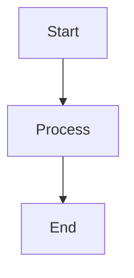

This file is a merged representation of the entire codebase, combined into a single document by Repomix.
The content has been processed where comments have been removed, empty lines have been removed.

# File Summary

## Purpose
This file contains a packed representation of the entire repository's contents.
It is designed to be easily consumable by AI systems for analysis, code review,
or other automated processes.

## File Format
The content is organized as follows:
1. This summary section
2. Repository information
3. Directory structure
4. Multiple file entries, each consisting of:
  a. A header with the file path (## File: path/to/file)
  b. The full contents of the file in a code block

## Usage Guidelines
- This file should be treated as read-only. Any changes should be made to the
  original repository files, not this packed version.
- When processing this file, use the file path to distinguish
  between different files in the repository.
- Be aware that this file may contain sensitive information. Handle it with
  the same level of security as you would the original repository.

## Notes
- Some files may have been excluded based on .gitignore rules and Repomix's configuration
- Binary files are not included in this packed representation. Please refer to the Repository Structure section for a complete list of file paths, including binary files
- Files matching patterns in .gitignore are excluded
- Files matching default ignore patterns are excluded
- Code comments have been removed from supported file types
- Empty lines have been removed from all files
- Files are sorted by Git change count (files with more changes are at the bottom)

## Additional Info

# Directory Structure
```
public/
  markdown/
    ARCHIVED.md
    CONTRIBUTING.md
    README.md
  vite.svg
src/
  api/
    markdownFiles.ts
    server.ts
  components/
    ui/
      accordion.tsx
      alert-dialog.tsx
      alert.tsx
      aspect-ratio.tsx
      avatar.tsx
      badge.tsx
      button.tsx
      calendar.tsx
      card.tsx
      carousel.tsx
      checkbox.tsx
      collapsible.tsx
      command.tsx
      context-menu.tsx
      date-picker-with-range.tsx
      dialog.tsx
      drawer.tsx
      dropdown-menu.tsx
      form.tsx
      hover-card.tsx
      input.tsx
      label.tsx
      menubar.tsx
      navigation-menu.tsx
      pagination.tsx
      popover.tsx
      progress.tsx
      radio-group.tsx
      resizable.tsx
      scroll-area.tsx
      select.tsx
      separator.tsx
      sheet.tsx
      skeleton.tsx
      slider.tsx
      switch.tsx
      table.tsx
      tabs.tsx
      textarea.tsx
      toast.tsx
      toaster.tsx
      toggle.tsx
      tooltip.tsx
      use-toast.ts
    CommentForm.tsx
    CommentPanel.tsx
    CommentThread.tsx
    FileSidebar.tsx
    FileVersionHistory.tsx
    home.tsx
    HoverComment.tsx
    InlineComment.tsx
    Layout.tsx
    LoginPage.tsx
    MarkdownViewer.tsx
    ProtectedRoute.tsx
    UserCursor.tsx
    UserIdentityModal.tsx
    UserPresence.tsx
  context/
    AuthContext.tsx
  lib/
    utils.ts
  stories/
    accordion.stories.tsx
    alert-dialog.stories.tsx
    alert.stories.tsx
    aspect-ratio.stories.tsx
    avatar.stories.tsx
    badge.stories.tsx
    button.stories.tsx
    calendar.stories.tsx
    card.stories.tsx
    carousel.stories.tsx
    checkbox.stories.tsx
    collapsible.stories.tsx
    command.stories.tsx
    context-menu.stories.tsx
    dialog.stories.tsx
    drawer.stories.tsx
    dropdown-menu.stories.tsx
    hover-card.stories.tsx
    input.stories.tsx
    label.stories.tsx
    menubar.stories.tsx
    navigation-menu.stories.tsx
    pagination.stories.tsx
    popover.stories.tsx
    progress.stories.tsx
    radio-group.stories.tsx
    resizable.stories.tsx
    scroll-area.stories.tsx
    select.stories.tsx
    separator.stories.tsx
    sheet.stories.tsx
    skeleton.stories.tsx
    slider.stories.tsx
    switch.stories.tsx
    table.stories.tsx
    tabs.stories.tsx
    textarea.stories.tsx
    toggle.stories.tsx
    tooltip.stories.tsx
  utils/
    fileStorage.ts
    fileWatcher.ts
    serverStorage.ts
    websocketService.ts
  App.tsx
  index.css
  main.tsx
  tempo-routes.ts
  vite-env.d.ts
.gitignore
components.json
index.html
package.json
postcss.config.js
README.md
server.js
tailwind.config.js
tempo.config.json
tsconfig.json
tsconfig.node.json
vite.config.ts
```

# Files

## File: public/markdown/ARCHIVED.md
````markdown
# Archived Document

This is an archived document.
````

## File: public/markdown/CONTRIBUTING.md
````markdown
# Contributing Guidelines

Thank you for your interest in contributing to this project!

## How to Contribute

1. Fork the repository
2. Create a new branch
3. Make your changes
4. Submit a pull request
````

## File: public/markdown/README.md
````markdown
# Sample Markdown

This is a sample markdown file with some content.

## Mermaid Diagram



## SVG Example


````

## File: public/vite.svg
````
<svg xmlns="http://www.w3.org/2000/svg" xmlns:xlink="http://www.w3.org/1999/xlink" aria-hidden="true" role="img" class="iconify iconify--logos" width="31.88" height="32" preserveAspectRatio="xMidYMid meet" viewBox="0 0 256 257"><defs><linearGradient id="IconifyId1813088fe1fbc01fb466" x1="-.828%" x2="57.636%" y1="7.652%" y2="78.411%"><stop offset="0%" stop-color="#41D1FF"></stop><stop offset="100%" stop-color="#BD34FE"></stop></linearGradient><linearGradient id="IconifyId1813088fe1fbc01fb467" x1="43.376%" x2="50.316%" y1="2.242%" y2="89.03%"><stop offset="0%" stop-color="#FFEA83"></stop><stop offset="8.333%" stop-color="#FFDD35"></stop><stop offset="100%" stop-color="#FFA800"></stop></linearGradient></defs><path fill="url(#IconifyId1813088fe1fbc01fb466)" d="M255.153 37.938L134.897 252.976c-2.483 4.44-8.862 4.466-11.382.048L.875 37.958c-2.746-4.814 1.371-10.646 6.827-9.67l120.385 21.517a6.537 6.537 0 0 0 2.322-.004l117.867-21.483c5.438-.991 9.574 4.796 6.877 9.62Z"></path><path fill="url(#IconifyId1813088fe1fbc01fb467)" d="M185.432.063L96.44 17.501a3.268 3.268 0 0 0-2.634 3.014l-5.474 92.456a3.268 3.268 0 0 0 3.997 3.378l24.777-5.718c2.318-.535 4.413 1.507 3.936 3.838l-7.361 36.047c-.495 2.426 1.782 4.5 4.151 3.78l15.304-4.649c2.372-.72 4.652 1.36 4.15 3.788l-11.698 56.621c-.732 3.542 3.979 5.473 5.943 2.437l1.313-2.028l72.516-144.72c1.215-2.423-.88-5.186-3.54-4.672l-25.505 4.922c-2.396.462-4.435-1.77-3.759-4.114l16.646-57.705c.677-2.35-1.37-4.583-3.769-4.113Z"></path></svg>
````

## File: src/api/markdownFiles.ts
````typescript
let cachedFiles: string[] = ["README.md", "CONTRIBUTING.md", "ARCHIVED.md"];
export const getMarkdownFiles = async (): Promise<string[]> => {
  return Promise.resolve(cachedFiles);
};
export const addMockFile = (filename: string): void => {
  if (!cachedFiles.includes(filename)) {
    cachedFiles = [...cachedFiles, filename];
  }
};
export const setupMockApi = (): void => {
  const originalFetch = window.fetch;
  window.fetch = async (input: RequestInfo | URL, init?: RequestInit) => {
    if (input === "/api/markdown-files") {
      return new Response(JSON.stringify(cachedFiles), {
        status: 200,
        headers: { "Content-Type": "application/json" },
      });
    }
    return originalFetch(input, init);
  };
};
````

## File: src/api/server.ts
````typescript
import express from "express";
import fs from "fs-extra";
import path from "path";
import {
  loadFiles,
  saveFiles,
  loadComments,
  saveComments,
} from "../utils/serverStorage";
import { Comment, MarkdownFile } from "../components/Layout";
const app = express();
app.use(express.json());
app.get("/api/files", async (req, res) => {
  try {
    const files = await loadFiles();
    res.json(files);
  } catch (error) {
    console.error("Error fetching files:", error);
    res.status(500).json({ error: "Failed to fetch files" });
  }
});
app.get("/api/comments/:fileId", async (req, res) => {
  try {
    const { fileId } = req.params;
    const comments = await loadComments(fileId);
    res.json(comments);
  } catch (error) {
    console.error("Error fetching comments:", error);
    res.status(500).json({ error: "Failed to fetch comments" });
  }
});
app.post("/api/comments/:fileId", async (req, res) => {
  try {
    const { fileId } = req.params;
    const { text, userName, userId, isInline, x, y } = req.body;
    if (!text || !userName || !userId) {
      return res.status(400).json({ error: "Missing required fields" });
    }
    const comments = await loadComments(fileId);
    const newComment: Comment = {
      id: Date.now().toString(),
      text,
      userName,
      userId,
      timestamp: new Date(),
      replies: [],
      isInline: isInline || false,
      x,
      y
    };
    comments.push(newComment);
    await saveComments(fileId, comments);
    res.status(201).json(newComment);
  } catch (error) {
    console.error("Error adding comment:", error);
    res.status(500).json({ error: "Failed to add comment" });
  }
});
app.post("/api/inline-comments/:fileId", async (req, res) => {
  try {
    const { fileId } = req.params;
    const { text, userName, userId, x, y } = req.body;
    if (!text || !userName || !userId || x === undefined || y === undefined) {
      return res.status(400).json({ error: "Missing required fields" });
    }
    const commentsPath = path.join(COMMENTS_DIR, `${fileId}_inline.json`);
    let comments = [];
    if (fs.existsSync(commentsPath)) {
      const data = await fs.readFile(commentsPath, "utf8");
      comments = JSON.parse(data);
    }
    const newComment: Comment = {
      id: Date.now().toString(),
      text,
      userName,
      userId,
      timestamp: new Date(),
      isInline: true,
      x,
      y
    };
    comments.push(newComment);
    await fs.writeFile(commentsPath, JSON.stringify(comments, null, 2));
    res.status(201).json(newComment);
  } catch (error) {
    console.error("Error adding inline comment:", error);
    res.status(500).json({ error: "Failed to add inline comment" });
  }
});
app.get("/api/inline-comments/:fileId", async (req, res) => {
  try {
    const { fileId } = req.params;
    const commentsPath = path.join(COMMENTS_DIR, `${fileId}_inline.json`);
    if (fs.existsSync(commentsPath)) {
      const data = await fs.readFile(commentsPath, "utf8");
      res.json(JSON.parse(data));
    } else {
      res.json([]);
    }
  } catch (error) {
    console.error("Error fetching inline comments:", error);
    res.status(500).json({ error: "Failed to fetch inline comments" });
  }
});
app.delete("/api/comments/:fileId/:commentId", async (req, res) => {
  try {
    const { fileId, commentId } = req.params;
    const comments = await loadComments(fileId);
    const updatedComments = comments.filter(comment => comment.id !== commentId);
    if (updatedComments.length === comments.length) {
app.post("/api/comments/:fileId/reply/:commentId", async (req, res) => {
  try {
    const { fileId, commentId } = req.params;
    const { text, userName, userId } = req.body;
    if (!text || !userName || !userId) {
      return res.status(400).json({ error: "Missing required fields" });
    }
    const comments = await loadComments(fileId);
    const newReply: Comment = {
      id: Date.now().toString(),
      text,
      userName,
      userId,
      timestamp: new Date(),
    };
    const updatedComments = comments.map((comment) => {
      if (comment.id === commentId) {
        return {
          ...comment,
          replies: [...(comment.replies || []), newReply],
        };
      }
      return comment;
    });
    await saveComments(fileId, updatedComments);
    res.status(201).json(newReply);
  } catch (error) {
    console.error("Error adding reply:", error);
    res.status(500).json({ error: "Failed to add reply" });
  }
});
app.put("/api/files/:fileId/archive", async (req, res) => {
  try {
    const { fileId } = req.params;
    const files = await loadFiles();
    const updatedFiles = files.map((file) => {
      if (file.id === fileId) {
        return { ...file, isArchived: true };
      }
      return file;
    });
    await saveFiles(updatedFiles);
    res.json({ success: true });
  } catch (error) {
    console.error("Error archiving file:", error);
    res.status(500).json({ error: "Failed to archive file" });
  }
});
app.get("/api/files/:fileId/versions", async (req, res) => {
  try {
    const { fileId } = req.params;
    const versions = await loadFileVersions(fileId);
    res.json(versions);
  } catch (error) {
    console.error("Error fetching file versions:", error);
    res.status(500).json({ error: "Failed to fetch file versions" });
  }
});
app.put("/api/files/:fileId/content", async (req, res) => {
  try {
    const { fileId } = req.params;
    const { content } = req.body;
    if (!content) {
      return res.status(400).json({ error: "Content is required" });
    }
    const files = await loadFiles();
    const fileToUpdate = files.find((file) => file.id === fileId);
    if (!fileToUpdate) {
      return res.status(404).json({ error: "File not found" });
    }
    await saveFileVersion({
      id: Date.now().toString(),
      fileId,
      content: fileToUpdate.content,
      version: fileToUpdate.version,
      createdAt: fileToUpdate.updatedAt,
    });
    const updatedFiles = files.map((file) => {
      if (file.id === fileId) {
        return {
          ...file,
          content,
          updatedAt: new Date(),
          version: file.version + 1,
        };
      }
      return file;
    });
    await saveFiles(updatedFiles);
    res.json({ success: true });
  } catch (error) {
    console.error("Error updating file content:", error);
    res.status(500).json({ error: "Failed to update file content" });
  }
});
const PORT = process.env.PORT || 3001;
app.listen(PORT, () => {
  console.log(`Server running on port ${PORT}`);
});
````

## File: src/components/ui/accordion.tsx
````typescript
import * as React from "react"
import * as AccordionPrimitive from "@radix-ui/react-accordion"
import { ChevronDownIcon } from "@radix-ui/react-icons"
import { cn } from "@/lib/utils"
const Accordion = AccordionPrimitive.Root
const AccordionItem = React.forwardRef<
  React.ElementRef<typeof AccordionPrimitive.Item>,
  React.ComponentPropsWithoutRef<typeof AccordionPrimitive.Item>
>(({ className, ...props }, ref) => (
  <AccordionPrimitive.Item
    ref={ref}
    className={cn("border-b", className)}
    {...props}
  />
))
AccordionItem.displayName = "AccordionItem"
const AccordionTrigger = React.forwardRef<
  React.ElementRef<typeof AccordionPrimitive.Trigger>,
  React.ComponentPropsWithoutRef<typeof AccordionPrimitive.Trigger>
>(({ className, children, ...props }, ref) => (
  <AccordionPrimitive.Header className="flex">
    <AccordionPrimitive.Trigger
      ref={ref}
      className={cn(
        "flex flex-1 items-center justify-between py-4 text-sm font-medium transition-all hover:underline [&[data-state=open]>svg]:rotate-180",
        className
      )}
      {...props}
    >
      {children}
      <ChevronDownIcon className="h-4 w-4 shrink-0 text-muted-foreground transition-transform duration-200" />
    </AccordionPrimitive.Trigger>
  </AccordionPrimitive.Header>
))
AccordionTrigger.displayName = AccordionPrimitive.Trigger.displayName
const AccordionContent = React.forwardRef<
  React.ElementRef<typeof AccordionPrimitive.Content>,
  React.ComponentPropsWithoutRef<typeof AccordionPrimitive.Content>
>(({ className, children, ...props }, ref) => (
  <AccordionPrimitive.Content
    ref={ref}
    className="overflow-hidden text-sm data-[state=closed]:animate-accordion-up data-[state=open]:animate-accordion-down"
    {...props}
  >
    <div className={cn("pb-4 pt-0", className)}>{children}</div>
  </AccordionPrimitive.Content>
))
AccordionContent.displayName = AccordionPrimitive.Content.displayName
export { Accordion, AccordionItem, AccordionTrigger, AccordionContent }
````

## File: src/components/ui/alert-dialog.tsx
````typescript
import * as React from "react"
import * as AlertDialogPrimitive from "@radix-ui/react-alert-dialog"
import { cn } from "@/lib/utils"
import { buttonVariants } from "@/components/ui/button"
const AlertDialog = AlertDialogPrimitive.Root
const AlertDialogTrigger = AlertDialogPrimitive.Trigger
const AlertDialogPortal = AlertDialogPrimitive.Portal
const AlertDialogOverlay = React.forwardRef<
  React.ElementRef<typeof AlertDialogPrimitive.Overlay>,
  React.ComponentPropsWithoutRef<typeof AlertDialogPrimitive.Overlay>
>(({ className, ...props }, ref) => (
  <AlertDialogPrimitive.Overlay
    className={cn(
      "fixed inset-0 z-50 bg-black/80 data-[state=open]:animate-in data-[state=closed]:animate-out data-[state=closed]:fade-out-0 data-[state=open]:fade-in-0",
      className
    )}
    {...props}
    ref={ref}
  />
))
AlertDialogOverlay.displayName = AlertDialogPrimitive.Overlay.displayName
const AlertDialogContent = React.forwardRef<
  React.ElementRef<typeof AlertDialogPrimitive.Content>,
  React.ComponentPropsWithoutRef<typeof AlertDialogPrimitive.Content>
>(({ className, ...props }, ref) => (
  <AlertDialogPortal>
    <AlertDialogOverlay />
    <AlertDialogPrimitive.Content
      ref={ref}
      className={cn(
        "fixed left-[50%] top-[50%] z-50 grid w-full max-w-lg translate-x-[-50%] translate-y-[-50%] gap-4 border bg-background p-6 shadow-lg duration-200 data-[state=open]:animate-in data-[state=closed]:animate-out data-[state=closed]:fade-out-0 data-[state=open]:fade-in-0 data-[state=closed]:zoom-out-95 data-[state=open]:zoom-in-95 data-[state=closed]:slide-out-to-left-1/2 data-[state=closed]:slide-out-to-top-[48%] data-[state=open]:slide-in-from-left-1/2 data-[state=open]:slide-in-from-top-[48%] sm:rounded-lg",
        className
      )}
      {...props}
    />
  </AlertDialogPortal>
))
AlertDialogContent.displayName = AlertDialogPrimitive.Content.displayName
const AlertDialogHeader = ({
  className,
  ...props
}: React.HTMLAttributes<HTMLDivElement>) => (
  <div
    className={cn(
      "flex flex-col space-y-2 text-center sm:text-left",
      className
    )}
    {...props}
  />
)
AlertDialogHeader.displayName = "AlertDialogHeader"
const AlertDialogFooter = ({
  className,
  ...props
}: React.HTMLAttributes<HTMLDivElement>) => (
  <div
    className={cn(
      "flex flex-col-reverse sm:flex-row sm:justify-end sm:space-x-2",
      className
    )}
    {...props}
  />
)
AlertDialogFooter.displayName = "AlertDialogFooter"
const AlertDialogTitle = React.forwardRef<
  React.ElementRef<typeof AlertDialogPrimitive.Title>,
  React.ComponentPropsWithoutRef<typeof AlertDialogPrimitive.Title>
>(({ className, ...props }, ref) => (
  <AlertDialogPrimitive.Title
    ref={ref}
    className={cn("text-lg font-semibold", className)}
    {...props}
  />
))
AlertDialogTitle.displayName = AlertDialogPrimitive.Title.displayName
const AlertDialogDescription = React.forwardRef<
  React.ElementRef<typeof AlertDialogPrimitive.Description>,
  React.ComponentPropsWithoutRef<typeof AlertDialogPrimitive.Description>
>(({ className, ...props }, ref) => (
  <AlertDialogPrimitive.Description
    ref={ref}
    className={cn("text-sm text-muted-foreground", className)}
    {...props}
  />
))
AlertDialogDescription.displayName =
  AlertDialogPrimitive.Description.displayName
const AlertDialogAction = React.forwardRef<
  React.ElementRef<typeof AlertDialogPrimitive.Action>,
  React.ComponentPropsWithoutRef<typeof AlertDialogPrimitive.Action>
>(({ className, ...props }, ref) => (
  <AlertDialogPrimitive.Action
    ref={ref}
    className={cn(buttonVariants(), className)}
    {...props}
  />
))
AlertDialogAction.displayName = AlertDialogPrimitive.Action.displayName
const AlertDialogCancel = React.forwardRef<
  React.ElementRef<typeof AlertDialogPrimitive.Cancel>,
  React.ComponentPropsWithoutRef<typeof AlertDialogPrimitive.Cancel>
>(({ className, ...props }, ref) => (
  <AlertDialogPrimitive.Cancel
    ref={ref}
    className={cn(
      buttonVariants({ variant: "outline" }),
      "mt-2 sm:mt-0",
      className
    )}
    {...props}
  />
))
AlertDialogCancel.displayName = AlertDialogPrimitive.Cancel.displayName
export {
  AlertDialog,
  AlertDialogPortal,
  AlertDialogOverlay,
  AlertDialogTrigger,
  AlertDialogContent,
  AlertDialogHeader,
  AlertDialogFooter,
  AlertDialogTitle,
  AlertDialogDescription,
  AlertDialogAction,
  AlertDialogCancel,
}
````

## File: src/components/ui/alert.tsx
````typescript
import * as React from "react"
import { cva, type VariantProps } from "class-variance-authority"
import { cn } from "@/lib/utils"
const alertVariants = cva(
  "relative w-full rounded-lg border px-4 py-3 text-sm [&>svg+div]:translate-y-[-3px] [&>svg]:absolute [&>svg]:left-4 [&>svg]:top-4 [&>svg]:text-foreground [&>svg~*]:pl-7",
  {
    variants: {
      variant: {
        default: "bg-background text-foreground",
        destructive:
          "border-destructive/50 text-destructive dark:border-destructive [&>svg]:text-destructive",
      },
    },
    defaultVariants: {
      variant: "default",
    },
  }
)
const Alert = React.forwardRef<
  HTMLDivElement,
  React.HTMLAttributes<HTMLDivElement> & VariantProps<typeof alertVariants>
>(({ className, variant, ...props }, ref) => (
  <div
    ref={ref}
    role="alert"
    className={cn(alertVariants({ variant }), className)}
    {...props}
  />
))
Alert.displayName = "Alert"
const AlertTitle = React.forwardRef<
  HTMLParagraphElement,
  React.HTMLAttributes<HTMLHeadingElement>
>(({ className, ...props }, ref) => (
  <h5
    ref={ref}
    className={cn("mb-1 font-medium leading-none tracking-tight", className)}
    {...props}
  />
))
AlertTitle.displayName = "AlertTitle"
const AlertDescription = React.forwardRef<
  HTMLParagraphElement,
  React.HTMLAttributes<HTMLParagraphElement>
>(({ className, ...props }, ref) => (
  <div
    ref={ref}
    className={cn("text-sm [&_p]:leading-relaxed", className)}
    {...props}
  />
))
AlertDescription.displayName = "AlertDescription"
export { Alert, AlertTitle, AlertDescription }
````

## File: src/components/ui/aspect-ratio.tsx
````typescript
import * as AspectRatioPrimitive from "@radix-ui/react-aspect-ratio"
const AspectRatio = AspectRatioPrimitive.Root
export { AspectRatio }
````

## File: src/components/ui/avatar.tsx
````typescript
import * as React from "react"
import * as AvatarPrimitive from "@radix-ui/react-avatar"
import { cn } from "@/lib/utils"
const Avatar = React.forwardRef<
  React.ElementRef<typeof AvatarPrimitive.Root>,
  React.ComponentPropsWithoutRef<typeof AvatarPrimitive.Root>
>(({ className, ...props }, ref) => (
  <AvatarPrimitive.Root
    ref={ref}
    className={cn(
      "relative flex h-10 w-10 shrink-0 overflow-hidden rounded-full",
      className
    )}
    {...props}
  />
))
Avatar.displayName = AvatarPrimitive.Root.displayName
const AvatarImage = React.forwardRef<
  React.ElementRef<typeof AvatarPrimitive.Image>,
  React.ComponentPropsWithoutRef<typeof AvatarPrimitive.Image>
>(({ className, ...props }, ref) => (
  <AvatarPrimitive.Image
    ref={ref}
    className={cn("aspect-square h-full w-full", className)}
    {...props}
  />
))
AvatarImage.displayName = AvatarPrimitive.Image.displayName
const AvatarFallback = React.forwardRef<
  React.ElementRef<typeof AvatarPrimitive.Fallback>,
  React.ComponentPropsWithoutRef<typeof AvatarPrimitive.Fallback>
>(({ className, ...props }, ref) => (
  <AvatarPrimitive.Fallback
    ref={ref}
    className={cn(
      "flex h-full w-full items-center justify-center rounded-full bg-muted",
      className
    )}
    {...props}
  />
))
AvatarFallback.displayName = AvatarPrimitive.Fallback.displayName
export { Avatar, AvatarImage, AvatarFallback }
````

## File: src/components/ui/badge.tsx
````typescript
import * as React from "react"
import { cva, type VariantProps } from "class-variance-authority"
import { cn } from "@/lib/utils"
const badgeVariants = cva(
  "inline-flex items-center rounded-md border px-2.5 py-0.5 text-xs font-semibold transition-colors focus:outline-none focus:ring-2 focus:ring-ring focus:ring-offset-2",
  {
    variants: {
      variant: {
        default:
          "border-transparent bg-primary text-primary-foreground shadow hover:bg-primary/80",
        secondary:
          "border-transparent bg-secondary text-secondary-foreground hover:bg-secondary/80",
        destructive:
          "border-transparent bg-destructive text-destructive-foreground shadow hover:bg-destructive/80",
        outline: "text-foreground",
      },
    },
    defaultVariants: {
      variant: "default",
    },
  }
)
export interface BadgeProps
  extends React.HTMLAttributes<HTMLDivElement>,
    VariantProps<typeof badgeVariants> {}
function Badge({ className, variant, ...props }: BadgeProps) {
  return (
    <div className={cn(badgeVariants({ variant }), className)} {...props} />
  )
}
export { Badge, badgeVariants }
````

## File: src/components/ui/button.tsx
````typescript
import * as React from "react"
import { Slot } from "@radix-ui/react-slot"
import { cva, type VariantProps } from "class-variance-authority"
import { cn } from "@/lib/utils"
const buttonVariants = cva(
  "inline-flex items-center justify-center whitespace-nowrap rounded-md text-sm font-medium transition-colors focus-visible:outline-none focus-visible:ring-1 focus-visible:ring-ring disabled:pointer-events-none disabled:opacity-50",
  {
    variants: {
      variant: {
        default:
          "bg-primary text-primary-foreground shadow hover:bg-primary/90",
        destructive:
          "bg-destructive text-destructive-foreground shadow-sm hover:bg-destructive/90",
        outline:
          "border border-input bg-background shadow-sm hover:bg-accent hover:text-accent-foreground",
        secondary:
          "bg-secondary text-secondary-foreground shadow-sm hover:bg-secondary/80",
        ghost: "hover:bg-accent hover:text-accent-foreground",
        link: "text-primary underline-offset-4 hover:underline",
      },
      size: {
        default: "h-9 px-4 py-2",
        sm: "h-8 rounded-md px-3 text-xs",
        lg: "h-10 rounded-md px-8",
        icon: "h-9 w-9",
      },
    },
    defaultVariants: {
      variant: "default",
      size: "default",
    },
  }
)
export interface ButtonProps
  extends React.ButtonHTMLAttributes<HTMLButtonElement>,
    VariantProps<typeof buttonVariants> {
  asChild?: boolean
}
const Button = React.forwardRef<HTMLButtonElement, ButtonProps>(
  ({ className, variant, size, asChild = false, ...props }, ref) => {
    const Comp = asChild ? Slot : "button"
    return (
      <Comp
        className={cn(buttonVariants({ variant, size, className }))}
        ref={ref}
        {...props}
      />
    )
  }
)
Button.displayName = "Button"
export { Button, buttonVariants }
````

## File: src/components/ui/calendar.tsx
````typescript
import * as React from "react"
import { ChevronLeftIcon, ChevronRightIcon } from "@radix-ui/react-icons"
import { DayPicker } from "react-day-picker"
import { cn } from "@/lib/utils"
import { buttonVariants } from "@/components/ui/button"
export type CalendarProps = React.ComponentProps<typeof DayPicker>
function Calendar({
  className,
  classNames,
  showOutsideDays = true,
  ...props
}: CalendarProps) {
  return (
    <DayPicker
      showOutsideDays={showOutsideDays}
      className={cn("p-3", className)}
      classNames={{
        months: "flex flex-col sm:flex-row space-y-4 sm:space-x-4 sm:space-y-0",
        month: "space-y-4",
        caption: "flex justify-center pt-1 relative items-center",
        caption_label: "text-sm font-medium",
        nav: "space-x-1 flex items-center",
        nav_button: cn(
          buttonVariants({ variant: "outline" }),
          "h-7 w-7 bg-transparent p-0 opacity-50 hover:opacity-100"
        ),
        nav_button_previous: "absolute left-1",
        nav_button_next: "absolute right-1",
        table: "w-full border-collapse space-y-1",
        head_row: "flex",
        head_cell:
          "text-muted-foreground rounded-md w-8 font-normal text-[0.8rem]",
        row: "flex w-full mt-2",
        cell: cn(
          "relative p-0 text-center text-sm focus-within:relative focus-within:z-20 [&:has([aria-selected])]:bg-accent [&:has([aria-selected].day-outside)]:bg-accent/50 [&:has([aria-selected].day-range-end)]:rounded-r-md",
          props.mode === "range"
            ? "[&:has(>.day-range-end)]:rounded-r-md [&:has(>.day-range-start)]:rounded-l-md first:[&:has([aria-selected])]:rounded-l-md last:[&:has([aria-selected])]:rounded-r-md"
            : "[&:has([aria-selected])]:rounded-md"
        ),
        day: cn(
          buttonVariants({ variant: "ghost" }),
          "h-8 w-8 p-0 font-normal aria-selected:opacity-100"
        ),
        day_range_start: "day-range-start",
        day_range_end: "day-range-end",
        day_selected:
          "bg-primary text-primary-foreground hover:bg-primary hover:text-primary-foreground focus:bg-primary focus:text-primary-foreground",
        day_today: "bg-accent text-accent-foreground",
        day_outside:
          "day-outside text-muted-foreground opacity-50  aria-selected:bg-accent/50 aria-selected:text-muted-foreground aria-selected:opacity-30",
        day_disabled: "text-muted-foreground opacity-50",
        day_range_middle:
          "aria-selected:bg-accent aria-selected:text-accent-foreground",
        day_hidden: "invisible",
        ...classNames,
      }}
      components={{
        IconLeft: ({ ...props }) => <ChevronLeftIcon className="h-4 w-4" />,
        IconRight: ({ ...props }) => <ChevronRightIcon className="h-4 w-4" />,
      }}
      {...props}
    />
  )
}
Calendar.displayName = "Calendar"
export { Calendar }
````

## File: src/components/ui/card.tsx
````typescript
import * as React from "react"
import { cn } from "@/lib/utils"
const Card = React.forwardRef<
  HTMLDivElement,
  React.HTMLAttributes<HTMLDivElement>
>(({ className, ...props }, ref) => (
  <div
    ref={ref}
    className={cn(
      "rounded-xl border bg-card text-card-foreground shadow",
      className
    )}
    {...props}
  />
))
Card.displayName = "Card"
const CardHeader = React.forwardRef<
  HTMLDivElement,
  React.HTMLAttributes<HTMLDivElement>
>(({ className, ...props }, ref) => (
  <div
    ref={ref}
    className={cn("flex flex-col space-y-1.5 p-6", className)}
    {...props}
  />
))
CardHeader.displayName = "CardHeader"
const CardTitle = React.forwardRef<
  HTMLParagraphElement,
  React.HTMLAttributes<HTMLHeadingElement>
>(({ className, ...props }, ref) => (
  <h3
    ref={ref}
    className={cn("font-semibold leading-none tracking-tight", className)}
    {...props}
  />
))
CardTitle.displayName = "CardTitle"
const CardDescription = React.forwardRef<
  HTMLParagraphElement,
  React.HTMLAttributes<HTMLParagraphElement>
>(({ className, ...props }, ref) => (
  <p
    ref={ref}
    className={cn("text-sm text-muted-foreground", className)}
    {...props}
  />
))
CardDescription.displayName = "CardDescription"
const CardContent = React.forwardRef<
  HTMLDivElement,
  React.HTMLAttributes<HTMLDivElement>
>(({ className, ...props }, ref) => (
  <div ref={ref} className={cn("p-6 pt-0", className)} {...props} />
))
CardContent.displayName = "CardContent"
const CardFooter = React.forwardRef<
  HTMLDivElement,
  React.HTMLAttributes<HTMLDivElement>
>(({ className, ...props }, ref) => (
  <div
    ref={ref}
    className={cn("flex items-center p-6 pt-0", className)}
    {...props}
  />
))
CardFooter.displayName = "CardFooter"
export { Card, CardHeader, CardFooter, CardTitle, CardDescription, CardContent }
````

## File: src/components/ui/carousel.tsx
````typescript
import * as React from "react"
import { ArrowLeftIcon, ArrowRightIcon } from "@radix-ui/react-icons"
import useEmblaCarousel, {
  type UseEmblaCarouselType,
} from "embla-carousel-react"
import { cn } from "@/lib/utils"
import { Button } from "@/components/ui/button"
type CarouselApi = UseEmblaCarouselType[1]
type UseCarouselParameters = Parameters<typeof useEmblaCarousel>
type CarouselOptions = UseCarouselParameters[0]
type CarouselPlugin = UseCarouselParameters[1]
type CarouselProps = {
  opts?: CarouselOptions
  plugins?: CarouselPlugin
  orientation?: "horizontal" | "vertical"
  setApi?: (api: CarouselApi) => void
}
type CarouselContextProps = {
  carouselRef: ReturnType<typeof useEmblaCarousel>[0]
  api: ReturnType<typeof useEmblaCarousel>[1]
  scrollPrev: () => void
  scrollNext: () => void
  canScrollPrev: boolean
  canScrollNext: boolean
} & CarouselProps
const CarouselContext = React.createContext<CarouselContextProps | null>(null)
function useCarousel() {
  const context = React.useContext(CarouselContext)
  if (!context) {
    throw new Error("useCarousel must be used within a <Carousel />")
  }
  return context
}
const Carousel = React.forwardRef<
  HTMLDivElement,
  React.HTMLAttributes<HTMLDivElement> & CarouselProps
>(
  (
    {
      orientation = "horizontal",
      opts,
      setApi,
      plugins,
      className,
      children,
      ...props
    },
    ref
  ) => {
    const [carouselRef, api] = useEmblaCarousel(
      {
        ...opts,
        axis: orientation === "horizontal" ? "x" : "y",
      },
      plugins
    )
    const [canScrollPrev, setCanScrollPrev] = React.useState(false)
    const [canScrollNext, setCanScrollNext] = React.useState(false)
    const onSelect = React.useCallback((api: CarouselApi) => {
      if (!api) {
        return
      }
      setCanScrollPrev(api.canScrollPrev())
      setCanScrollNext(api.canScrollNext())
    }, [])
    const scrollPrev = React.useCallback(() => {
      api?.scrollPrev()
    }, [api])
    const scrollNext = React.useCallback(() => {
      api?.scrollNext()
    }, [api])
    const handleKeyDown = React.useCallback(
      (event: React.KeyboardEvent<HTMLDivElement>) => {
        if (event.key === "ArrowLeft") {
          event.preventDefault()
          scrollPrev()
        } else if (event.key === "ArrowRight") {
          event.preventDefault()
          scrollNext()
        }
      },
      [scrollPrev, scrollNext]
    )
    React.useEffect(() => {
      if (!api || !setApi) {
        return
      }
      setApi(api)
    }, [api, setApi])
    React.useEffect(() => {
      if (!api) {
        return
      }
      onSelect(api)
      api.on("reInit", onSelect)
      api.on("select", onSelect)
      return () => {
        api?.off("select", onSelect)
      }
    }, [api, onSelect])
    return (
      <CarouselContext.Provider
        value={{
          carouselRef,
          api: api,
          opts,
          orientation:
            orientation || (opts?.axis === "y" ? "vertical" : "horizontal"),
          scrollPrev,
          scrollNext,
          canScrollPrev,
          canScrollNext,
        }}
      >
        <div
          ref={ref}
          onKeyDownCapture={handleKeyDown}
          className={cn("relative", className)}
          role="region"
          aria-roledescription="carousel"
          {...props}
        >
          {children}
        </div>
      </CarouselContext.Provider>
    )
  }
)
Carousel.displayName = "Carousel"
const CarouselContent = React.forwardRef<
  HTMLDivElement,
  React.HTMLAttributes<HTMLDivElement>
>(({ className, ...props }, ref) => {
  const { carouselRef, orientation } = useCarousel()
  return (
    <div ref={carouselRef} className="overflow-hidden">
      <div
        ref={ref}
        className={cn(
          "flex",
          orientation === "horizontal" ? "-ml-4" : "-mt-4 flex-col",
          className
        )}
        {...props}
      />
    </div>
  )
})
CarouselContent.displayName = "CarouselContent"
const CarouselItem = React.forwardRef<
  HTMLDivElement,
  React.HTMLAttributes<HTMLDivElement>
>(({ className, ...props }, ref) => {
  const { orientation } = useCarousel()
  return (
    <div
      ref={ref}
      role="group"
      aria-roledescription="slide"
      className={cn(
        "min-w-0 shrink-0 grow-0 basis-full",
        orientation === "horizontal" ? "pl-4" : "pt-4",
        className
      )}
      {...props}
    />
  )
})
CarouselItem.displayName = "CarouselItem"
const CarouselPrevious = React.forwardRef<
  HTMLButtonElement,
  React.ComponentProps<typeof Button>
>(({ className, variant = "outline", size = "icon", ...props }, ref) => {
  const { orientation, scrollPrev, canScrollPrev } = useCarousel()
  return (
    <Button
      ref={ref}
      variant={variant}
      size={size}
      className={cn(
        "absolute  h-8 w-8 rounded-full",
        orientation === "horizontal"
          ? "-left-12 top-1/2 -translate-y-1/2"
          : "-top-12 left-1/2 -translate-x-1/2 rotate-90",
        className
      )}
      disabled={!canScrollPrev}
      onClick={scrollPrev}
      {...props}
    >
      <ArrowLeftIcon className="h-4 w-4" />
      <span className="sr-only">Previous slide</span>
    </Button>
  )
})
CarouselPrevious.displayName = "CarouselPrevious"
const CarouselNext = React.forwardRef<
  HTMLButtonElement,
  React.ComponentProps<typeof Button>
>(({ className, variant = "outline", size = "icon", ...props }, ref) => {
  const { orientation, scrollNext, canScrollNext } = useCarousel()
  return (
    <Button
      ref={ref}
      variant={variant}
      size={size}
      className={cn(
        "absolute h-8 w-8 rounded-full",
        orientation === "horizontal"
          ? "-right-12 top-1/2 -translate-y-1/2"
          : "-bottom-12 left-1/2 -translate-x-1/2 rotate-90",
        className
      )}
      disabled={!canScrollNext}
      onClick={scrollNext}
      {...props}
    >
      <ArrowRightIcon className="h-4 w-4" />
      <span className="sr-only">Next slide</span>
    </Button>
  )
})
CarouselNext.displayName = "CarouselNext"
export {
  type CarouselApi,
  Carousel,
  CarouselContent,
  CarouselItem,
  CarouselPrevious,
  CarouselNext,
}
````

## File: src/components/ui/checkbox.tsx
````typescript
import * as React from "react";
import * as CheckboxPrimitive from "@radix-ui/react-checkbox";
import { CheckIcon } from "@radix-ui/react-icons";
import { cn } from "../../lib/utils";
const Checkbox = React.forwardRef<
  React.ElementRef<typeof CheckboxPrimitive.Root>,
  React.ComponentPropsWithoutRef<typeof CheckboxPrimitive.Root>
>(({ className, ...props }, ref) => (
  <CheckboxPrimitive.Root
    ref={ref}
    className={cn(
      "peer h-4 w-4 shrink-0 rounded-sm border border-primary shadow focus-visible:outline-none focus-visible:ring-1 focus-visible:ring-ring disabled:cursor-not-allowed disabled:opacity-50 data-[state=checked]:bg-primary data-[state=checked]:text-primary-foreground",
      className,
    )}
    {...props}
  >
    <CheckboxPrimitive.Indicator
      className={cn("flex items-center justify-center text-current")}
    >
      <CheckIcon className="h-4 w-4" />
    </CheckboxPrimitive.Indicator>
  </CheckboxPrimitive.Root>
));
Checkbox.displayName = CheckboxPrimitive.Root.displayName;
export { Checkbox };
````

## File: src/components/ui/collapsible.tsx
````typescript
import * as CollapsiblePrimitive from "@radix-ui/react-collapsible"
const Collapsible = CollapsiblePrimitive.Root
const CollapsibleTrigger = CollapsiblePrimitive.CollapsibleTrigger
const CollapsibleContent = CollapsiblePrimitive.CollapsibleContent
export { Collapsible, CollapsibleTrigger, CollapsibleContent }
````

## File: src/components/ui/command.tsx
````typescript
import * as React from "react"
import { type DialogProps } from "@radix-ui/react-dialog"
import { MagnifyingGlassIcon } from "@radix-ui/react-icons"
import { Command as CommandPrimitive } from "cmdk"
import { cn } from "@/lib/utils"
import { Dialog, DialogContent } from "@/components/ui/dialog"
const Command = React.forwardRef<
  React.ElementRef<typeof CommandPrimitive>,
  React.ComponentPropsWithoutRef<typeof CommandPrimitive>
>(({ className, ...props }, ref) => (
  <CommandPrimitive
    ref={ref}
    className={cn(
      "flex h-full w-full flex-col overflow-hidden rounded-md bg-popover text-popover-foreground",
      className
    )}
    {...props}
  />
))
Command.displayName = CommandPrimitive.displayName
interface CommandDialogProps extends DialogProps {}
const CommandDialog = ({ children, ...props }: CommandDialogProps) => {
  return (
    <Dialog {...props}>
      <DialogContent className="overflow-hidden p-0">
        <Command className="[&_[cmdk-group-heading]]:px-2 [&_[cmdk-group-heading]]:font-medium [&_[cmdk-group-heading]]:text-muted-foreground [&_[cmdk-group]:not([hidden])_~[cmdk-group]]:pt-0 [&_[cmdk-group]]:px-2 [&_[cmdk-input-wrapper]_svg]:h-5 [&_[cmdk-input-wrapper]_svg]:w-5 [&_[cmdk-input]]:h-12 [&_[cmdk-item]]:px-2 [&_[cmdk-item]]:py-3 [&_[cmdk-item]_svg]:h-5 [&_[cmdk-item]_svg]:w-5">
          {children}
        </Command>
      </DialogContent>
    </Dialog>
  )
}
const CommandInput = React.forwardRef<
  React.ElementRef<typeof CommandPrimitive.Input>,
  React.ComponentPropsWithoutRef<typeof CommandPrimitive.Input>
>(({ className, ...props }, ref) => (
  <div className="flex items-center border-b px-3" cmdk-input-wrapper="">
    <MagnifyingGlassIcon className="mr-2 h-4 w-4 shrink-0 opacity-50" />
    <CommandPrimitive.Input
      ref={ref}
      className={cn(
        "flex h-10 w-full rounded-md bg-transparent py-3 text-sm outline-none placeholder:text-muted-foreground disabled:cursor-not-allowed disabled:opacity-50",
        className
      )}
      {...props}
    />
  </div>
))
CommandInput.displayName = CommandPrimitive.Input.displayName
const CommandList = React.forwardRef<
  React.ElementRef<typeof CommandPrimitive.List>,
  React.ComponentPropsWithoutRef<typeof CommandPrimitive.List>
>(({ className, ...props }, ref) => (
  <CommandPrimitive.List
    ref={ref}
    className={cn("max-h-[300px] overflow-y-auto overflow-x-hidden", className)}
    {...props}
  />
))
CommandList.displayName = CommandPrimitive.List.displayName
const CommandEmpty = React.forwardRef<
  React.ElementRef<typeof CommandPrimitive.Empty>,
  React.ComponentPropsWithoutRef<typeof CommandPrimitive.Empty>
>((props, ref) => (
  <CommandPrimitive.Empty
    ref={ref}
    className="py-6 text-center text-sm"
    {...props}
  />
))
CommandEmpty.displayName = CommandPrimitive.Empty.displayName
const CommandGroup = React.forwardRef<
  React.ElementRef<typeof CommandPrimitive.Group>,
  React.ComponentPropsWithoutRef<typeof CommandPrimitive.Group>
>(({ className, ...props }, ref) => (
  <CommandPrimitive.Group
    ref={ref}
    className={cn(
      "overflow-hidden p-1 text-foreground [&_[cmdk-group-heading]]:px-2 [&_[cmdk-group-heading]]:py-1.5 [&_[cmdk-group-heading]]:text-xs [&_[cmdk-group-heading]]:font-medium [&_[cmdk-group-heading]]:text-muted-foreground",
      className
    )}
    {...props}
  />
))
CommandGroup.displayName = CommandPrimitive.Group.displayName
const CommandSeparator = React.forwardRef<
  React.ElementRef<typeof CommandPrimitive.Separator>,
  React.ComponentPropsWithoutRef<typeof CommandPrimitive.Separator>
>(({ className, ...props }, ref) => (
  <CommandPrimitive.Separator
    ref={ref}
    className={cn("-mx-1 h-px bg-border", className)}
    {...props}
  />
))
CommandSeparator.displayName = CommandPrimitive.Separator.displayName
const CommandItem = React.forwardRef<
  React.ElementRef<typeof CommandPrimitive.Item>,
  React.ComponentPropsWithoutRef<typeof CommandPrimitive.Item>
>(({ className, ...props }, ref) => (
  <CommandPrimitive.Item
    ref={ref}
    className={cn(
      "relative flex cursor-default select-none items-center rounded-sm px-2 py-1.5 text-sm outline-none data-[disabled=true]:pointer-events-none data-[selected=true]:bg-accent data-[selected=true]:text-accent-foreground data-[disabled=true]:opacity-50",
      className
    )}
    {...props}
  />
))
CommandItem.displayName = CommandPrimitive.Item.displayName
const CommandShortcut = ({
  className,
  ...props
}: React.HTMLAttributes<HTMLSpanElement>) => {
  return (
    <span
      className={cn(
        "ml-auto text-xs tracking-widest text-muted-foreground",
        className
      )}
      {...props}
    />
  )
}
CommandShortcut.displayName = "CommandShortcut"
export {
  Command,
  CommandDialog,
  CommandInput,
  CommandList,
  CommandEmpty,
  CommandGroup,
  CommandItem,
  CommandShortcut,
  CommandSeparator,
}
````

## File: src/components/ui/context-menu.tsx
````typescript
import * as React from "react"
import * as ContextMenuPrimitive from "@radix-ui/react-context-menu"
import {
  CheckIcon,
  ChevronRightIcon,
  DotFilledIcon,
} from "@radix-ui/react-icons"
import { cn } from "@/lib/utils"
const ContextMenu = ContextMenuPrimitive.Root
const ContextMenuTrigger = ContextMenuPrimitive.Trigger
const ContextMenuGroup = ContextMenuPrimitive.Group
const ContextMenuPortal = ContextMenuPrimitive.Portal
const ContextMenuSub = ContextMenuPrimitive.Sub
const ContextMenuRadioGroup = ContextMenuPrimitive.RadioGroup
const ContextMenuSubTrigger = React.forwardRef<
  React.ElementRef<typeof ContextMenuPrimitive.SubTrigger>,
  React.ComponentPropsWithoutRef<typeof ContextMenuPrimitive.SubTrigger> & {
    inset?: boolean
  }
>(({ className, inset, children, ...props }, ref) => (
  <ContextMenuPrimitive.SubTrigger
    ref={ref}
    className={cn(
      "flex cursor-default select-none items-center rounded-sm px-2 py-1.5 text-sm outline-none focus:bg-accent focus:text-accent-foreground data-[state=open]:bg-accent data-[state=open]:text-accent-foreground",
      inset && "pl-8",
      className
    )}
    {...props}
  >
    {children}
    <ChevronRightIcon className="ml-auto h-4 w-4" />
  </ContextMenuPrimitive.SubTrigger>
))
ContextMenuSubTrigger.displayName = ContextMenuPrimitive.SubTrigger.displayName
const ContextMenuSubContent = React.forwardRef<
  React.ElementRef<typeof ContextMenuPrimitive.SubContent>,
  React.ComponentPropsWithoutRef<typeof ContextMenuPrimitive.SubContent>
>(({ className, ...props }, ref) => (
  <ContextMenuPrimitive.SubContent
    ref={ref}
    className={cn(
      "z-50 min-w-[8rem] overflow-hidden rounded-md border bg-popover p-1 text-popover-foreground shadow-lg data-[state=open]:animate-in data-[state=closed]:animate-out data-[state=closed]:fade-out-0 data-[state=open]:fade-in-0 data-[state=closed]:zoom-out-95 data-[state=open]:zoom-in-95 data-[side=bottom]:slide-in-from-top-2 data-[side=left]:slide-in-from-right-2 data-[side=right]:slide-in-from-left-2 data-[side=top]:slide-in-from-bottom-2",
      className
    )}
    {...props}
  />
))
ContextMenuSubContent.displayName = ContextMenuPrimitive.SubContent.displayName
const ContextMenuContent = React.forwardRef<
  React.ElementRef<typeof ContextMenuPrimitive.Content>,
  React.ComponentPropsWithoutRef<typeof ContextMenuPrimitive.Content>
>(({ className, ...props }, ref) => (
  <ContextMenuPrimitive.Portal>
    <ContextMenuPrimitive.Content
      ref={ref}
      className={cn(
        "z-50 min-w-[8rem] overflow-hidden rounded-md border bg-popover p-1 text-popover-foreground shadow-md data-[state=open]:animate-in data-[state=closed]:animate-out data-[state=closed]:fade-out-0 data-[state=open]:fade-in-0 data-[state=closed]:zoom-out-95 data-[state=open]:zoom-in-95 data-[side=bottom]:slide-in-from-top-2 data-[side=left]:slide-in-from-right-2 data-[side=right]:slide-in-from-left-2 data-[side=top]:slide-in-from-bottom-2",
        className
      )}
      {...props}
    />
  </ContextMenuPrimitive.Portal>
))
ContextMenuContent.displayName = ContextMenuPrimitive.Content.displayName
const ContextMenuItem = React.forwardRef<
  React.ElementRef<typeof ContextMenuPrimitive.Item>,
  React.ComponentPropsWithoutRef<typeof ContextMenuPrimitive.Item> & {
    inset?: boolean
  }
>(({ className, inset, ...props }, ref) => (
  <ContextMenuPrimitive.Item
    ref={ref}
    className={cn(
      "relative flex cursor-default select-none items-center rounded-sm px-2 py-1.5 text-sm outline-none focus:bg-accent focus:text-accent-foreground data-[disabled]:pointer-events-none data-[disabled]:opacity-50",
      inset && "pl-8",
      className
    )}
    {...props}
  />
))
ContextMenuItem.displayName = ContextMenuPrimitive.Item.displayName
const ContextMenuCheckboxItem = React.forwardRef<
  React.ElementRef<typeof ContextMenuPrimitive.CheckboxItem>,
  React.ComponentPropsWithoutRef<typeof ContextMenuPrimitive.CheckboxItem>
>(({ className, children, checked, ...props }, ref) => (
  <ContextMenuPrimitive.CheckboxItem
    ref={ref}
    className={cn(
      "relative flex cursor-default select-none items-center rounded-sm py-1.5 pl-8 pr-2 text-sm outline-none focus:bg-accent focus:text-accent-foreground data-[disabled]:pointer-events-none data-[disabled]:opacity-50",
      className
    )}
    checked={checked}
    {...props}
  >
    <span className="absolute left-2 flex h-3.5 w-3.5 items-center justify-center">
      <ContextMenuPrimitive.ItemIndicator>
        <CheckIcon className="h-4 w-4" />
      </ContextMenuPrimitive.ItemIndicator>
    </span>
    {children}
  </ContextMenuPrimitive.CheckboxItem>
))
ContextMenuCheckboxItem.displayName =
  ContextMenuPrimitive.CheckboxItem.displayName
const ContextMenuRadioItem = React.forwardRef<
  React.ElementRef<typeof ContextMenuPrimitive.RadioItem>,
  React.ComponentPropsWithoutRef<typeof ContextMenuPrimitive.RadioItem>
>(({ className, children, ...props }, ref) => (
  <ContextMenuPrimitive.RadioItem
    ref={ref}
    className={cn(
      "relative flex cursor-default select-none items-center rounded-sm py-1.5 pl-8 pr-2 text-sm outline-none focus:bg-accent focus:text-accent-foreground data-[disabled]:pointer-events-none data-[disabled]:opacity-50",
      className
    )}
    {...props}
  >
    <span className="absolute left-2 flex h-3.5 w-3.5 items-center justify-center">
      <ContextMenuPrimitive.ItemIndicator>
        <DotFilledIcon className="h-4 w-4 fill-current" />
      </ContextMenuPrimitive.ItemIndicator>
    </span>
    {children}
  </ContextMenuPrimitive.RadioItem>
))
ContextMenuRadioItem.displayName = ContextMenuPrimitive.RadioItem.displayName
const ContextMenuLabel = React.forwardRef<
  React.ElementRef<typeof ContextMenuPrimitive.Label>,
  React.ComponentPropsWithoutRef<typeof ContextMenuPrimitive.Label> & {
    inset?: boolean
  }
>(({ className, inset, ...props }, ref) => (
  <ContextMenuPrimitive.Label
    ref={ref}
    className={cn(
      "px-2 py-1.5 text-sm font-semibold text-foreground",
      inset && "pl-8",
      className
    )}
    {...props}
  />
))
ContextMenuLabel.displayName = ContextMenuPrimitive.Label.displayName
const ContextMenuSeparator = React.forwardRef<
  React.ElementRef<typeof ContextMenuPrimitive.Separator>,
  React.ComponentPropsWithoutRef<typeof ContextMenuPrimitive.Separator>
>(({ className, ...props }, ref) => (
  <ContextMenuPrimitive.Separator
    ref={ref}
    className={cn("-mx-1 my-1 h-px bg-border", className)}
    {...props}
  />
))
ContextMenuSeparator.displayName = ContextMenuPrimitive.Separator.displayName
const ContextMenuShortcut = ({
  className,
  ...props
}: React.HTMLAttributes<HTMLSpanElement>) => {
  return (
    <span
      className={cn(
        "ml-auto text-xs tracking-widest text-muted-foreground",
        className
      )}
      {...props}
    />
  )
}
ContextMenuShortcut.displayName = "ContextMenuShortcut"
export {
  ContextMenu,
  ContextMenuTrigger,
  ContextMenuContent,
  ContextMenuItem,
  ContextMenuCheckboxItem,
  ContextMenuRadioItem,
  ContextMenuLabel,
  ContextMenuSeparator,
  ContextMenuShortcut,
  ContextMenuGroup,
  ContextMenuPortal,
  ContextMenuSub,
  ContextMenuSubContent,
  ContextMenuSubTrigger,
  ContextMenuRadioGroup,
}
````

## File: src/components/ui/date-picker-with-range.tsx
````typescript
"use client";
import * as React from "react";
import { addDays, format } from "date-fns";
import { Calendar as CalendarIcon } from "lucide-react";
import { DateRange } from "react-day-picker";
import { cn } from "@/lib/utils";
import { Button } from "@/components/ui/button";
import { Calendar } from "@/components/ui/calendar";
import {
  Popover,
  PopoverContent,
  PopoverTrigger,
} from "@/components/ui/popover";
export default function DatePickerWithRange({
  className,
}: React.HTMLAttributes<HTMLDivElement>) {
  const [date, setDate] = React.useState<DateRange | undefined>({
    from: new Date(2022, 0, 20),
    to: addDays(new Date(2022, 0, 20), 20),
  });
  return (
    <div className={cn("grid gap-2", className)}>
      <Popover>
        <PopoverTrigger asChild>
          <Button
            id="date"
            variant={"outline"}
            className={cn(
              "w-[300px] justify-start text-left font-normal",
              !date && "text-muted-foreground",
            )}
          >
            <CalendarIcon className="mr-2 h-4 w-4" />
            {date?.from ? (
              date.to ? (
                <>
                  {format(date.from, "LLL dd, y")} -{" "}
                  {format(date.to, "LLL dd, y")}
                </>
              ) : (
                format(date.from, "LLL dd, y")
              )
            ) : (
              <span>Pick a date</span>
            )}
          </Button>
        </PopoverTrigger>
        <PopoverContent className="w-auto p-0" align="start">
          <Calendar
            initialFocus
            mode="range"
            defaultMonth={date?.from}
            selected={date}
            onSelect={setDate}
            numberOfMonths={2}
          />
        </PopoverContent>
      </Popover>
    </div>
  );
}
````

## File: src/components/ui/dialog.tsx
````typescript
import * as React from "react"
import * as DialogPrimitive from "@radix-ui/react-dialog"
import { Cross2Icon } from "@radix-ui/react-icons"
import { cn } from "@/lib/utils"
const Dialog = DialogPrimitive.Root
const DialogTrigger = DialogPrimitive.Trigger
const DialogPortal = DialogPrimitive.Portal
const DialogClose = DialogPrimitive.Close
const DialogOverlay = React.forwardRef<
  React.ElementRef<typeof DialogPrimitive.Overlay>,
  React.ComponentPropsWithoutRef<typeof DialogPrimitive.Overlay>
>(({ className, ...props }, ref) => (
  <DialogPrimitive.Overlay
    ref={ref}
    className={cn(
      "fixed inset-0 z-50 bg-black/80  data-[state=open]:animate-in data-[state=closed]:animate-out data-[state=closed]:fade-out-0 data-[state=open]:fade-in-0",
      className
    )}
    {...props}
  />
))
DialogOverlay.displayName = DialogPrimitive.Overlay.displayName
const DialogContent = React.forwardRef<
  React.ElementRef<typeof DialogPrimitive.Content>,
  React.ComponentPropsWithoutRef<typeof DialogPrimitive.Content>
>(({ className, children, ...props }, ref) => (
  <DialogPortal>
    <DialogOverlay />
    <DialogPrimitive.Content
      ref={ref}
      className={cn(
        "fixed left-[50%] top-[50%] z-50 grid w-full max-w-lg translate-x-[-50%] translate-y-[-50%] gap-4 border bg-background p-6 shadow-lg duration-200 data-[state=open]:animate-in data-[state=closed]:animate-out data-[state=closed]:fade-out-0 data-[state=open]:fade-in-0 data-[state=closed]:zoom-out-95 data-[state=open]:zoom-in-95 data-[state=closed]:slide-out-to-left-1/2 data-[state=closed]:slide-out-to-top-[48%] data-[state=open]:slide-in-from-left-1/2 data-[state=open]:slide-in-from-top-[48%] sm:rounded-lg",
        className
      )}
      {...props}
    >
      {children}
      <DialogPrimitive.Close className="absolute right-4 top-4 rounded-sm opacity-70 ring-offset-background transition-opacity hover:opacity-100 focus:outline-none focus:ring-2 focus:ring-ring focus:ring-offset-2 disabled:pointer-events-none data-[state=open]:bg-accent data-[state=open]:text-muted-foreground">
        <Cross2Icon className="h-4 w-4" />
        <span className="sr-only">Close</span>
      </DialogPrimitive.Close>
    </DialogPrimitive.Content>
  </DialogPortal>
))
DialogContent.displayName = DialogPrimitive.Content.displayName
const DialogHeader = ({
  className,
  ...props
}: React.HTMLAttributes<HTMLDivElement>) => (
  <div
    className={cn(
      "flex flex-col space-y-1.5 text-center sm:text-left",
      className
    )}
    {...props}
  />
)
DialogHeader.displayName = "DialogHeader"
const DialogFooter = ({
  className,
  ...props
}: React.HTMLAttributes<HTMLDivElement>) => (
  <div
    className={cn(
      "flex flex-col-reverse sm:flex-row sm:justify-end sm:space-x-2",
      className
    )}
    {...props}
  />
)
DialogFooter.displayName = "DialogFooter"
const DialogTitle = React.forwardRef<
  React.ElementRef<typeof DialogPrimitive.Title>,
  React.ComponentPropsWithoutRef<typeof DialogPrimitive.Title>
>(({ className, ...props }, ref) => (
  <DialogPrimitive.Title
    ref={ref}
    className={cn(
      "text-lg font-semibold leading-none tracking-tight",
      className
    )}
    {...props}
  />
))
DialogTitle.displayName = DialogPrimitive.Title.displayName
const DialogDescription = React.forwardRef<
  React.ElementRef<typeof DialogPrimitive.Description>,
  React.ComponentPropsWithoutRef<typeof DialogPrimitive.Description>
>(({ className, ...props }, ref) => (
  <DialogPrimitive.Description
    ref={ref}
    className={cn("text-sm text-muted-foreground", className)}
    {...props}
  />
))
DialogDescription.displayName = DialogPrimitive.Description.displayName
export {
  Dialog,
  DialogPortal,
  DialogOverlay,
  DialogTrigger,
  DialogClose,
  DialogContent,
  DialogHeader,
  DialogFooter,
  DialogTitle,
  DialogDescription,
}
````

## File: src/components/ui/drawer.tsx
````typescript
import * as React from "react"
import { Drawer as DrawerPrimitive } from "vaul"
import { cn } from "@/lib/utils"
const Drawer = ({
  shouldScaleBackground = true,
  ...props
}: React.ComponentProps<typeof DrawerPrimitive.Root>) => (
  <DrawerPrimitive.Root
    shouldScaleBackground={shouldScaleBackground}
    {...props}
  />
)
Drawer.displayName = "Drawer"
const DrawerTrigger = DrawerPrimitive.Trigger
const DrawerPortal = DrawerPrimitive.Portal
const DrawerClose = DrawerPrimitive.Close
const DrawerOverlay = React.forwardRef<
  React.ElementRef<typeof DrawerPrimitive.Overlay>,
  React.ComponentPropsWithoutRef<typeof DrawerPrimitive.Overlay>
>(({ className, ...props }, ref) => (
  <DrawerPrimitive.Overlay
    ref={ref}
    className={cn("fixed inset-0 z-50 bg-black/80", className)}
    {...props}
  />
))
DrawerOverlay.displayName = DrawerPrimitive.Overlay.displayName
const DrawerContent = React.forwardRef<
  React.ElementRef<typeof DrawerPrimitive.Content>,
  React.ComponentPropsWithoutRef<typeof DrawerPrimitive.Content>
>(({ className, children, ...props }, ref) => (
  <DrawerPortal>
    <DrawerOverlay />
    <DrawerPrimitive.Content
      ref={ref}
      className={cn(
        "fixed inset-x-0 bottom-0 z-50 mt-24 flex h-auto flex-col rounded-t-[10px] border bg-background",
        className
      )}
      {...props}
    >
      <div className="mx-auto mt-4 h-2 w-[100px] rounded-full bg-muted" />
      {children}
    </DrawerPrimitive.Content>
  </DrawerPortal>
))
DrawerContent.displayName = "DrawerContent"
const DrawerHeader = ({
  className,
  ...props
}: React.HTMLAttributes<HTMLDivElement>) => (
  <div
    className={cn("grid gap-1.5 p-4 text-center sm:text-left", className)}
    {...props}
  />
)
DrawerHeader.displayName = "DrawerHeader"
const DrawerFooter = ({
  className,
  ...props
}: React.HTMLAttributes<HTMLDivElement>) => (
  <div
    className={cn("mt-auto flex flex-col gap-2 p-4", className)}
    {...props}
  />
)
DrawerFooter.displayName = "DrawerFooter"
const DrawerTitle = React.forwardRef<
  React.ElementRef<typeof DrawerPrimitive.Title>,
  React.ComponentPropsWithoutRef<typeof DrawerPrimitive.Title>
>(({ className, ...props }, ref) => (
  <DrawerPrimitive.Title
    ref={ref}
    className={cn(
      "text-lg font-semibold leading-none tracking-tight",
      className
    )}
    {...props}
  />
))
DrawerTitle.displayName = DrawerPrimitive.Title.displayName
const DrawerDescription = React.forwardRef<
  React.ElementRef<typeof DrawerPrimitive.Description>,
  React.ComponentPropsWithoutRef<typeof DrawerPrimitive.Description>
>(({ className, ...props }, ref) => (
  <DrawerPrimitive.Description
    ref={ref}
    className={cn("text-sm text-muted-foreground", className)}
    {...props}
  />
))
DrawerDescription.displayName = DrawerPrimitive.Description.displayName
export {
  Drawer,
  DrawerPortal,
  DrawerOverlay,
  DrawerTrigger,
  DrawerClose,
  DrawerContent,
  DrawerHeader,
  DrawerFooter,
  DrawerTitle,
  DrawerDescription,
}
````

## File: src/components/ui/dropdown-menu.tsx
````typescript
import * as React from "react"
import * as DropdownMenuPrimitive from "@radix-ui/react-dropdown-menu"
import {
  CheckIcon,
  ChevronRightIcon,
  DotFilledIcon,
} from "@radix-ui/react-icons"
import { cn } from "@/lib/utils"
const DropdownMenu = DropdownMenuPrimitive.Root
const DropdownMenuTrigger = DropdownMenuPrimitive.Trigger
const DropdownMenuGroup = DropdownMenuPrimitive.Group
const DropdownMenuPortal = DropdownMenuPrimitive.Portal
const DropdownMenuSub = DropdownMenuPrimitive.Sub
const DropdownMenuRadioGroup = DropdownMenuPrimitive.RadioGroup
const DropdownMenuSubTrigger = React.forwardRef<
  React.ElementRef<typeof DropdownMenuPrimitive.SubTrigger>,
  React.ComponentPropsWithoutRef<typeof DropdownMenuPrimitive.SubTrigger> & {
    inset?: boolean
  }
>(({ className, inset, children, ...props }, ref) => (
  <DropdownMenuPrimitive.SubTrigger
    ref={ref}
    className={cn(
      "flex cursor-default select-none items-center rounded-sm px-2 py-1.5 text-sm outline-none focus:bg-accent data-[state=open]:bg-accent",
      inset && "pl-8",
      className
    )}
    {...props}
  >
    {children}
    <ChevronRightIcon className="ml-auto h-4 w-4" />
  </DropdownMenuPrimitive.SubTrigger>
))
DropdownMenuSubTrigger.displayName =
  DropdownMenuPrimitive.SubTrigger.displayName
const DropdownMenuSubContent = React.forwardRef<
  React.ElementRef<typeof DropdownMenuPrimitive.SubContent>,
  React.ComponentPropsWithoutRef<typeof DropdownMenuPrimitive.SubContent>
>(({ className, ...props }, ref) => (
  <DropdownMenuPrimitive.SubContent
    ref={ref}
    className={cn(
      "z-50 min-w-[8rem] overflow-hidden rounded-md border bg-popover p-1 text-popover-foreground shadow-lg data-[state=open]:animate-in data-[state=closed]:animate-out data-[state=closed]:fade-out-0 data-[state=open]:fade-in-0 data-[state=closed]:zoom-out-95 data-[state=open]:zoom-in-95 data-[side=bottom]:slide-in-from-top-2 data-[side=left]:slide-in-from-right-2 data-[side=right]:slide-in-from-left-2 data-[side=top]:slide-in-from-bottom-2",
      className
    )}
    {...props}
  />
))
DropdownMenuSubContent.displayName =
  DropdownMenuPrimitive.SubContent.displayName
const DropdownMenuContent = React.forwardRef<
  React.ElementRef<typeof DropdownMenuPrimitive.Content>,
  React.ComponentPropsWithoutRef<typeof DropdownMenuPrimitive.Content>
>(({ className, sideOffset = 4, ...props }, ref) => (
  <DropdownMenuPrimitive.Portal>
    <DropdownMenuPrimitive.Content
      ref={ref}
      sideOffset={sideOffset}
      className={cn(
        "z-50 min-w-[8rem] overflow-hidden rounded-md border bg-popover p-1 text-popover-foreground shadow-md",
        "data-[state=open]:animate-in data-[state=closed]:animate-out data-[state=closed]:fade-out-0 data-[state=open]:fade-in-0 data-[state=closed]:zoom-out-95 data-[state=open]:zoom-in-95 data-[side=bottom]:slide-in-from-top-2 data-[side=left]:slide-in-from-right-2 data-[side=right]:slide-in-from-left-2 data-[side=top]:slide-in-from-bottom-2",
        className
      )}
      {...props}
    />
  </DropdownMenuPrimitive.Portal>
))
DropdownMenuContent.displayName = DropdownMenuPrimitive.Content.displayName
const DropdownMenuItem = React.forwardRef<
  React.ElementRef<typeof DropdownMenuPrimitive.Item>,
  React.ComponentPropsWithoutRef<typeof DropdownMenuPrimitive.Item> & {
    inset?: boolean
  }
>(({ className, inset, ...props }, ref) => (
  <DropdownMenuPrimitive.Item
    ref={ref}
    className={cn(
      "relative flex cursor-default select-none items-center rounded-sm px-2 py-1.5 text-sm outline-none transition-colors focus:bg-accent focus:text-accent-foreground data-[disabled]:pointer-events-none data-[disabled]:opacity-50",
      inset && "pl-8",
      className
    )}
    {...props}
  />
))
DropdownMenuItem.displayName = DropdownMenuPrimitive.Item.displayName
const DropdownMenuCheckboxItem = React.forwardRef<
  React.ElementRef<typeof DropdownMenuPrimitive.CheckboxItem>,
  React.ComponentPropsWithoutRef<typeof DropdownMenuPrimitive.CheckboxItem>
>(({ className, children, checked, ...props }, ref) => (
  <DropdownMenuPrimitive.CheckboxItem
    ref={ref}
    className={cn(
      "relative flex cursor-default select-none items-center rounded-sm py-1.5 pl-8 pr-2 text-sm outline-none transition-colors focus:bg-accent focus:text-accent-foreground data-[disabled]:pointer-events-none data-[disabled]:opacity-50",
      className
    )}
    checked={checked}
    {...props}
  >
    <span className="absolute left-2 flex h-3.5 w-3.5 items-center justify-center">
      <DropdownMenuPrimitive.ItemIndicator>
        <CheckIcon className="h-4 w-4" />
      </DropdownMenuPrimitive.ItemIndicator>
    </span>
    {children}
  </DropdownMenuPrimitive.CheckboxItem>
))
DropdownMenuCheckboxItem.displayName =
  DropdownMenuPrimitive.CheckboxItem.displayName
const DropdownMenuRadioItem = React.forwardRef<
  React.ElementRef<typeof DropdownMenuPrimitive.RadioItem>,
  React.ComponentPropsWithoutRef<typeof DropdownMenuPrimitive.RadioItem>
>(({ className, children, ...props }, ref) => (
  <DropdownMenuPrimitive.RadioItem
    ref={ref}
    className={cn(
      "relative flex cursor-default select-none items-center rounded-sm py-1.5 pl-8 pr-2 text-sm outline-none transition-colors focus:bg-accent focus:text-accent-foreground data-[disabled]:pointer-events-none data-[disabled]:opacity-50",
      className
    )}
    {...props}
  >
    <span className="absolute left-2 flex h-3.5 w-3.5 items-center justify-center">
      <DropdownMenuPrimitive.ItemIndicator>
        <DotFilledIcon className="h-4 w-4 fill-current" />
      </DropdownMenuPrimitive.ItemIndicator>
    </span>
    {children}
  </DropdownMenuPrimitive.RadioItem>
))
DropdownMenuRadioItem.displayName = DropdownMenuPrimitive.RadioItem.displayName
const DropdownMenuLabel = React.forwardRef<
  React.ElementRef<typeof DropdownMenuPrimitive.Label>,
  React.ComponentPropsWithoutRef<typeof DropdownMenuPrimitive.Label> & {
    inset?: boolean
  }
>(({ className, inset, ...props }, ref) => (
  <DropdownMenuPrimitive.Label
    ref={ref}
    className={cn(
      "px-2 py-1.5 text-sm font-semibold",
      inset && "pl-8",
      className
    )}
    {...props}
  />
))
DropdownMenuLabel.displayName = DropdownMenuPrimitive.Label.displayName
const DropdownMenuSeparator = React.forwardRef<
  React.ElementRef<typeof DropdownMenuPrimitive.Separator>,
  React.ComponentPropsWithoutRef<typeof DropdownMenuPrimitive.Separator>
>(({ className, ...props }, ref) => (
  <DropdownMenuPrimitive.Separator
    ref={ref}
    className={cn("-mx-1 my-1 h-px bg-muted", className)}
    {...props}
  />
))
DropdownMenuSeparator.displayName = DropdownMenuPrimitive.Separator.displayName
const DropdownMenuShortcut = ({
  className,
  ...props
}: React.HTMLAttributes<HTMLSpanElement>) => {
  return (
    <span
      className={cn("ml-auto text-xs tracking-widest opacity-60", className)}
      {...props}
    />
  )
}
DropdownMenuShortcut.displayName = "DropdownMenuShortcut"
export {
  DropdownMenu,
  DropdownMenuTrigger,
  DropdownMenuContent,
  DropdownMenuItem,
  DropdownMenuCheckboxItem,
  DropdownMenuRadioItem,
  DropdownMenuLabel,
  DropdownMenuSeparator,
  DropdownMenuShortcut,
  DropdownMenuGroup,
  DropdownMenuPortal,
  DropdownMenuSub,
  DropdownMenuSubContent,
  DropdownMenuSubTrigger,
  DropdownMenuRadioGroup,
}
````

## File: src/components/ui/form.tsx
````typescript
import * as React from "react"
import * as LabelPrimitive from "@radix-ui/react-label"
import { Slot } from "@radix-ui/react-slot"
import {
  Controller,
  ControllerProps,
  FieldPath,
  FieldValues,
  FormProvider,
  useFormContext,
} from "react-hook-form"
import { cn } from "@/lib/utils"
import { Label } from "@/components/ui/label"
const Form = FormProvider
type FormFieldContextValue<
  TFieldValues extends FieldValues = FieldValues,
  TName extends FieldPath<TFieldValues> = FieldPath<TFieldValues>
> = {
  name: TName
}
const FormFieldContext = React.createContext<FormFieldContextValue>(
  {} as FormFieldContextValue
)
const FormField = <
  TFieldValues extends FieldValues = FieldValues,
  TName extends FieldPath<TFieldValues> = FieldPath<TFieldValues>
>({
  ...props
}: ControllerProps<TFieldValues, TName>) => {
  return (
    <FormFieldContext.Provider value={{ name: props.name }}>
      <Controller {...props} />
    </FormFieldContext.Provider>
  )
}
const useFormField = () => {
  const fieldContext = React.useContext(FormFieldContext)
  const itemContext = React.useContext(FormItemContext)
  const { getFieldState, formState } = useFormContext()
  const fieldState = getFieldState(fieldContext.name, formState)
  if (!fieldContext) {
    throw new Error("useFormField should be used within <FormField>")
  }
  const { id } = itemContext
  return {
    id,
    name: fieldContext.name,
    formItemId: `${id}-form-item`,
    formDescriptionId: `${id}-form-item-description`,
    formMessageId: `${id}-form-item-message`,
    ...fieldState,
  }
}
type FormItemContextValue = {
  id: string
}
const FormItemContext = React.createContext<FormItemContextValue>(
  {} as FormItemContextValue
)
const FormItem = React.forwardRef<
  HTMLDivElement,
  React.HTMLAttributes<HTMLDivElement>
>(({ className, ...props }, ref) => {
  const id = React.useId()
  return (
    <FormItemContext.Provider value={{ id }}>
      <div ref={ref} className={cn("space-y-2", className)} {...props} />
    </FormItemContext.Provider>
  )
})
FormItem.displayName = "FormItem"
const FormLabel = React.forwardRef<
  React.ElementRef<typeof LabelPrimitive.Root>,
  React.ComponentPropsWithoutRef<typeof LabelPrimitive.Root>
>(({ className, ...props }, ref) => {
  const { error, formItemId } = useFormField()
  return (
    <Label
      ref={ref}
      className={cn(error && "text-destructive", className)}
      htmlFor={formItemId}
      {...props}
    />
  )
})
FormLabel.displayName = "FormLabel"
const FormControl = React.forwardRef<
  React.ElementRef<typeof Slot>,
  React.ComponentPropsWithoutRef<typeof Slot>
>(({ ...props }, ref) => {
  const { error, formItemId, formDescriptionId, formMessageId } = useFormField()
  return (
    <Slot
      ref={ref}
      id={formItemId}
      aria-describedby={
        !error
          ? `${formDescriptionId}`
          : `${formDescriptionId} ${formMessageId}`
      }
      aria-invalid={!!error}
      {...props}
    />
  )
})
FormControl.displayName = "FormControl"
const FormDescription = React.forwardRef<
  HTMLParagraphElement,
  React.HTMLAttributes<HTMLParagraphElement>
>(({ className, ...props }, ref) => {
  const { formDescriptionId } = useFormField()
  return (
    <p
      ref={ref}
      id={formDescriptionId}
      className={cn("text-[0.8rem] text-muted-foreground", className)}
      {...props}
    />
  )
})
FormDescription.displayName = "FormDescription"
const FormMessage = React.forwardRef<
  HTMLParagraphElement,
  React.HTMLAttributes<HTMLParagraphElement>
>(({ className, children, ...props }, ref) => {
  const { error, formMessageId } = useFormField()
  const body = error ? String(error?.message) : children
  if (!body) {
    return null
  }
  return (
    <p
      ref={ref}
      id={formMessageId}
      className={cn("text-[0.8rem] font-medium text-destructive", className)}
      {...props}
    >
      {body}
    </p>
  )
})
FormMessage.displayName = "FormMessage"
export {
  useFormField,
  Form,
  FormItem,
  FormLabel,
  FormControl,
  FormDescription,
  FormMessage,
  FormField,
}
````

## File: src/components/ui/hover-card.tsx
````typescript
import * as React from "react"
import * as HoverCardPrimitive from "@radix-ui/react-hover-card"
import { cn } from "@/lib/utils"
const HoverCard = HoverCardPrimitive.Root
const HoverCardTrigger = HoverCardPrimitive.Trigger
const HoverCardContent = React.forwardRef<
  React.ElementRef<typeof HoverCardPrimitive.Content>,
  React.ComponentPropsWithoutRef<typeof HoverCardPrimitive.Content>
>(({ className, align = "center", sideOffset = 4, ...props }, ref) => (
  <HoverCardPrimitive.Content
    ref={ref}
    align={align}
    sideOffset={sideOffset}
    className={cn(
      "z-50 w-64 rounded-md border bg-popover p-4 text-popover-foreground shadow-md outline-none data-[state=open]:animate-in data-[state=closed]:animate-out data-[state=closed]:fade-out-0 data-[state=open]:fade-in-0 data-[state=closed]:zoom-out-95 data-[state=open]:zoom-in-95 data-[side=bottom]:slide-in-from-top-2 data-[side=left]:slide-in-from-right-2 data-[side=right]:slide-in-from-left-2 data-[side=top]:slide-in-from-bottom-2",
      className
    )}
    {...props}
  />
))
HoverCardContent.displayName = HoverCardPrimitive.Content.displayName
export { HoverCard, HoverCardTrigger, HoverCardContent }
````

## File: src/components/ui/input.tsx
````typescript
import * as React from "react"
import { cn } from "@/lib/utils"
export interface InputProps
  extends React.InputHTMLAttributes<HTMLInputElement> {}
const Input = React.forwardRef<HTMLInputElement, InputProps>(
  ({ className, type, ...props }, ref) => {
    return (
      <input
        type={type}
        className={cn(
          "flex h-9 w-full rounded-md border border-input bg-transparent px-3 py-1 text-sm shadow-sm transition-colors file:border-0 file:bg-transparent file:text-sm file:font-medium placeholder:text-muted-foreground focus-visible:outline-none focus-visible:ring-1 focus-visible:ring-ring disabled:cursor-not-allowed disabled:opacity-50",
          className
        )}
        ref={ref}
        {...props}
      />
    )
  }
)
Input.displayName = "Input"
export { Input }
````

## File: src/components/ui/label.tsx
````typescript
import * as React from "react"
import * as LabelPrimitive from "@radix-ui/react-label"
import { cva, type VariantProps } from "class-variance-authority"
import { cn } from "@/lib/utils"
const labelVariants = cva(
  "text-sm font-medium leading-none peer-disabled:cursor-not-allowed peer-disabled:opacity-70"
)
const Label = React.forwardRef<
  React.ElementRef<typeof LabelPrimitive.Root>,
  React.ComponentPropsWithoutRef<typeof LabelPrimitive.Root> &
    VariantProps<typeof labelVariants>
>(({ className, ...props }, ref) => (
  <LabelPrimitive.Root
    ref={ref}
    className={cn(labelVariants(), className)}
    {...props}
  />
))
Label.displayName = LabelPrimitive.Root.displayName
export { Label }
````

## File: src/components/ui/menubar.tsx
````typescript
import * as React from "react"
import {
  CheckIcon,
  ChevronRightIcon,
  DotFilledIcon,
} from "@radix-ui/react-icons"
import * as MenubarPrimitive from "@radix-ui/react-menubar"
import { cn } from "@/lib/utils"
const MenubarMenu = MenubarPrimitive.Menu
const MenubarGroup = MenubarPrimitive.Group
const MenubarPortal = MenubarPrimitive.Portal
const MenubarSub = MenubarPrimitive.Sub
const MenubarRadioGroup = MenubarPrimitive.RadioGroup
const Menubar = React.forwardRef<
  React.ElementRef<typeof MenubarPrimitive.Root>,
  React.ComponentPropsWithoutRef<typeof MenubarPrimitive.Root>
>(({ className, ...props }, ref) => (
  <MenubarPrimitive.Root
    ref={ref}
    className={cn(
      "flex h-9 items-center space-x-1 rounded-md border bg-background p-1 shadow-sm",
      className
    )}
    {...props}
  />
))
Menubar.displayName = MenubarPrimitive.Root.displayName
const MenubarTrigger = React.forwardRef<
  React.ElementRef<typeof MenubarPrimitive.Trigger>,
  React.ComponentPropsWithoutRef<typeof MenubarPrimitive.Trigger>
>(({ className, ...props }, ref) => (
  <MenubarPrimitive.Trigger
    ref={ref}
    className={cn(
      "flex cursor-default select-none items-center rounded-sm px-3 py-1 text-sm font-medium outline-none focus:bg-accent focus:text-accent-foreground data-[state=open]:bg-accent data-[state=open]:text-accent-foreground",
      className
    )}
    {...props}
  />
))
MenubarTrigger.displayName = MenubarPrimitive.Trigger.displayName
const MenubarSubTrigger = React.forwardRef<
  React.ElementRef<typeof MenubarPrimitive.SubTrigger>,
  React.ComponentPropsWithoutRef<typeof MenubarPrimitive.SubTrigger> & {
    inset?: boolean
  }
>(({ className, inset, children, ...props }, ref) => (
  <MenubarPrimitive.SubTrigger
    ref={ref}
    className={cn(
      "flex cursor-default select-none items-center rounded-sm px-2 py-1.5 text-sm outline-none focus:bg-accent focus:text-accent-foreground data-[state=open]:bg-accent data-[state=open]:text-accent-foreground",
      inset && "pl-8",
      className
    )}
    {...props}
  >
    {children}
    <ChevronRightIcon className="ml-auto h-4 w-4" />
  </MenubarPrimitive.SubTrigger>
))
MenubarSubTrigger.displayName = MenubarPrimitive.SubTrigger.displayName
const MenubarSubContent = React.forwardRef<
  React.ElementRef<typeof MenubarPrimitive.SubContent>,
  React.ComponentPropsWithoutRef<typeof MenubarPrimitive.SubContent>
>(({ className, ...props }, ref) => (
  <MenubarPrimitive.SubContent
    ref={ref}
    className={cn(
      "z-50 min-w-[8rem] overflow-hidden rounded-md border bg-popover p-1 text-popover-foreground shadow-lg data-[state=open]:animate-in data-[state=closed]:animate-out data-[state=closed]:fade-out-0 data-[state=open]:fade-in-0 data-[state=closed]:zoom-out-95 data-[state=open]:zoom-in-95 data-[side=bottom]:slide-in-from-top-2 data-[side=left]:slide-in-from-right-2 data-[side=right]:slide-in-from-left-2 data-[side=top]:slide-in-from-bottom-2",
      className
    )}
    {...props}
  />
))
MenubarSubContent.displayName = MenubarPrimitive.SubContent.displayName
const MenubarContent = React.forwardRef<
  React.ElementRef<typeof MenubarPrimitive.Content>,
  React.ComponentPropsWithoutRef<typeof MenubarPrimitive.Content>
>(
  (
    { className, align = "start", alignOffset = -4, sideOffset = 8, ...props },
    ref
  ) => (
    <MenubarPrimitive.Portal>
      <MenubarPrimitive.Content
        ref={ref}
        align={align}
        alignOffset={alignOffset}
        sideOffset={sideOffset}
        className={cn(
          "z-50 min-w-[12rem] overflow-hidden rounded-md border bg-popover p-1 text-popover-foreground shadow-md data-[state=open]:animate-in data-[state=closed]:fade-out-0 data-[state=open]:fade-in-0 data-[state=closed]:zoom-out-95 data-[state=open]:zoom-in-95 data-[side=bottom]:slide-in-from-top-2 data-[side=left]:slide-in-from-right-2 data-[side=right]:slide-in-from-left-2 data-[side=top]:slide-in-from-bottom-2",
          className
        )}
        {...props}
      />
    </MenubarPrimitive.Portal>
  )
)
MenubarContent.displayName = MenubarPrimitive.Content.displayName
const MenubarItem = React.forwardRef<
  React.ElementRef<typeof MenubarPrimitive.Item>,
  React.ComponentPropsWithoutRef<typeof MenubarPrimitive.Item> & {
    inset?: boolean
  }
>(({ className, inset, ...props }, ref) => (
  <MenubarPrimitive.Item
    ref={ref}
    className={cn(
      "relative flex cursor-default select-none items-center rounded-sm px-2 py-1.5 text-sm outline-none focus:bg-accent focus:text-accent-foreground data-[disabled]:pointer-events-none data-[disabled]:opacity-50",
      inset && "pl-8",
      className
    )}
    {...props}
  />
))
MenubarItem.displayName = MenubarPrimitive.Item.displayName
const MenubarCheckboxItem = React.forwardRef<
  React.ElementRef<typeof MenubarPrimitive.CheckboxItem>,
  React.ComponentPropsWithoutRef<typeof MenubarPrimitive.CheckboxItem>
>(({ className, children, checked, ...props }, ref) => (
  <MenubarPrimitive.CheckboxItem
    ref={ref}
    className={cn(
      "relative flex cursor-default select-none items-center rounded-sm py-1.5 pl-8 pr-2 text-sm outline-none focus:bg-accent focus:text-accent-foreground data-[disabled]:pointer-events-none data-[disabled]:opacity-50",
      className
    )}
    checked={checked}
    {...props}
  >
    <span className="absolute left-2 flex h-3.5 w-3.5 items-center justify-center">
      <MenubarPrimitive.ItemIndicator>
        <CheckIcon className="h-4 w-4" />
      </MenubarPrimitive.ItemIndicator>
    </span>
    {children}
  </MenubarPrimitive.CheckboxItem>
))
MenubarCheckboxItem.displayName = MenubarPrimitive.CheckboxItem.displayName
const MenubarRadioItem = React.forwardRef<
  React.ElementRef<typeof MenubarPrimitive.RadioItem>,
  React.ComponentPropsWithoutRef<typeof MenubarPrimitive.RadioItem>
>(({ className, children, ...props }, ref) => (
  <MenubarPrimitive.RadioItem
    ref={ref}
    className={cn(
      "relative flex cursor-default select-none items-center rounded-sm py-1.5 pl-8 pr-2 text-sm outline-none focus:bg-accent focus:text-accent-foreground data-[disabled]:pointer-events-none data-[disabled]:opacity-50",
      className
    )}
    {...props}
  >
    <span className="absolute left-2 flex h-3.5 w-3.5 items-center justify-center">
      <MenubarPrimitive.ItemIndicator>
        <DotFilledIcon className="h-4 w-4 fill-current" />
      </MenubarPrimitive.ItemIndicator>
    </span>
    {children}
  </MenubarPrimitive.RadioItem>
))
MenubarRadioItem.displayName = MenubarPrimitive.RadioItem.displayName
const MenubarLabel = React.forwardRef<
  React.ElementRef<typeof MenubarPrimitive.Label>,
  React.ComponentPropsWithoutRef<typeof MenubarPrimitive.Label> & {
    inset?: boolean
  }
>(({ className, inset, ...props }, ref) => (
  <MenubarPrimitive.Label
    ref={ref}
    className={cn(
      "px-2 py-1.5 text-sm font-semibold",
      inset && "pl-8",
      className
    )}
    {...props}
  />
))
MenubarLabel.displayName = MenubarPrimitive.Label.displayName
const MenubarSeparator = React.forwardRef<
  React.ElementRef<typeof MenubarPrimitive.Separator>,
  React.ComponentPropsWithoutRef<typeof MenubarPrimitive.Separator>
>(({ className, ...props }, ref) => (
  <MenubarPrimitive.Separator
    ref={ref}
    className={cn("-mx-1 my-1 h-px bg-muted", className)}
    {...props}
  />
))
MenubarSeparator.displayName = MenubarPrimitive.Separator.displayName
const MenubarShortcut = ({
  className,
  ...props
}: React.HTMLAttributes<HTMLSpanElement>) => {
  return (
    <span
      className={cn(
        "ml-auto text-xs tracking-widest text-muted-foreground",
        className
      )}
      {...props}
    />
  )
}
MenubarShortcut.displayname = "MenubarShortcut"
export {
  Menubar,
  MenubarMenu,
  MenubarTrigger,
  MenubarContent,
  MenubarItem,
  MenubarSeparator,
  MenubarLabel,
  MenubarCheckboxItem,
  MenubarRadioGroup,
  MenubarRadioItem,
  MenubarPortal,
  MenubarSubContent,
  MenubarSubTrigger,
  MenubarGroup,
  MenubarSub,
  MenubarShortcut,
}
````

## File: src/components/ui/navigation-menu.tsx
````typescript
import * as React from "react"
import { ChevronDownIcon } from "@radix-ui/react-icons"
import * as NavigationMenuPrimitive from "@radix-ui/react-navigation-menu"
import { cva } from "class-variance-authority"
import { cn } from "@/lib/utils"
const NavigationMenu = React.forwardRef<
  React.ElementRef<typeof NavigationMenuPrimitive.Root>,
  React.ComponentPropsWithoutRef<typeof NavigationMenuPrimitive.Root>
>(({ className, children, ...props }, ref) => (
  <NavigationMenuPrimitive.Root
    ref={ref}
    className={cn(
      "relative z-10 flex max-w-max flex-1 items-center justify-center",
      className
    )}
    {...props}
  >
    {children}
    <NavigationMenuViewport />
  </NavigationMenuPrimitive.Root>
))
NavigationMenu.displayName = NavigationMenuPrimitive.Root.displayName
const NavigationMenuList = React.forwardRef<
  React.ElementRef<typeof NavigationMenuPrimitive.List>,
  React.ComponentPropsWithoutRef<typeof NavigationMenuPrimitive.List>
>(({ className, ...props }, ref) => (
  <NavigationMenuPrimitive.List
    ref={ref}
    className={cn(
      "group flex flex-1 list-none items-center justify-center space-x-1",
      className
    )}
    {...props}
  />
))
NavigationMenuList.displayName = NavigationMenuPrimitive.List.displayName
const NavigationMenuItem = NavigationMenuPrimitive.Item
const navigationMenuTriggerStyle = cva(
  "group inline-flex h-9 w-max items-center justify-center rounded-md bg-background px-4 py-2 text-sm font-medium transition-colors hover:bg-accent hover:text-accent-foreground focus:bg-accent focus:text-accent-foreground focus:outline-none disabled:pointer-events-none disabled:opacity-50 data-[active]:bg-accent/50 data-[state=open]:bg-accent/50"
)
const NavigationMenuTrigger = React.forwardRef<
  React.ElementRef<typeof NavigationMenuPrimitive.Trigger>,
  React.ComponentPropsWithoutRef<typeof NavigationMenuPrimitive.Trigger>
>(({ className, children, ...props }, ref) => (
  <NavigationMenuPrimitive.Trigger
    ref={ref}
    className={cn(navigationMenuTriggerStyle(), "group", className)}
    {...props}
  >
    {children}{" "}
    <ChevronDownIcon
      className="relative top-[1px] ml-1 h-3 w-3 transition duration-300 group-data-[state=open]:rotate-180"
      aria-hidden="true"
    />
  </NavigationMenuPrimitive.Trigger>
))
NavigationMenuTrigger.displayName = NavigationMenuPrimitive.Trigger.displayName
const NavigationMenuContent = React.forwardRef<
  React.ElementRef<typeof NavigationMenuPrimitive.Content>,
  React.ComponentPropsWithoutRef<typeof NavigationMenuPrimitive.Content>
>(({ className, ...props }, ref) => (
  <NavigationMenuPrimitive.Content
    ref={ref}
    className={cn(
      "left-0 top-0 w-full data-[motion^=from-]:animate-in data-[motion^=to-]:animate-out data-[motion^=from-]:fade-in data-[motion^=to-]:fade-out data-[motion=from-end]:slide-in-from-right-52 data-[motion=from-start]:slide-in-from-left-52 data-[motion=to-end]:slide-out-to-right-52 data-[motion=to-start]:slide-out-to-left-52 md:absolute md:w-auto ",
      className
    )}
    {...props}
  />
))
NavigationMenuContent.displayName = NavigationMenuPrimitive.Content.displayName
const NavigationMenuLink = NavigationMenuPrimitive.Link
const NavigationMenuViewport = React.forwardRef<
  React.ElementRef<typeof NavigationMenuPrimitive.Viewport>,
  React.ComponentPropsWithoutRef<typeof NavigationMenuPrimitive.Viewport>
>(({ className, ...props }, ref) => (
  <div className={cn("absolute left-0 top-full flex justify-center")}>
    <NavigationMenuPrimitive.Viewport
      className={cn(
        "origin-top-center relative mt-1.5 h-[var(--radix-navigation-menu-viewport-height)] w-full overflow-hidden rounded-md border bg-popover text-popover-foreground shadow data-[state=open]:animate-in data-[state=closed]:animate-out data-[state=closed]:zoom-out-95 data-[state=open]:zoom-in-90 md:w-[var(--radix-navigation-menu-viewport-width)]",
        className
      )}
      ref={ref}
      {...props}
    />
  </div>
))
NavigationMenuViewport.displayName =
  NavigationMenuPrimitive.Viewport.displayName
const NavigationMenuIndicator = React.forwardRef<
  React.ElementRef<typeof NavigationMenuPrimitive.Indicator>,
  React.ComponentPropsWithoutRef<typeof NavigationMenuPrimitive.Indicator>
>(({ className, ...props }, ref) => (
  <NavigationMenuPrimitive.Indicator
    ref={ref}
    className={cn(
      "top-full z-[1] flex h-1.5 items-end justify-center overflow-hidden data-[state=visible]:animate-in data-[state=hidden]:animate-out data-[state=hidden]:fade-out data-[state=visible]:fade-in",
      className
    )}
    {...props}
  >
    <div className="relative top-[60%] h-2 w-2 rotate-45 rounded-tl-sm bg-border shadow-md" />
  </NavigationMenuPrimitive.Indicator>
))
NavigationMenuIndicator.displayName =
  NavigationMenuPrimitive.Indicator.displayName
export {
  navigationMenuTriggerStyle,
  NavigationMenu,
  NavigationMenuList,
  NavigationMenuItem,
  NavigationMenuContent,
  NavigationMenuTrigger,
  NavigationMenuLink,
  NavigationMenuIndicator,
  NavigationMenuViewport,
}
````

## File: src/components/ui/pagination.tsx
````typescript
import * as React from "react"
import {
  ChevronLeftIcon,
  ChevronRightIcon,
  DotsHorizontalIcon,
} from "@radix-ui/react-icons"
import { cn } from "@/lib/utils"
import { ButtonProps, buttonVariants } from "@/components/ui/button"
const Pagination = ({ className, ...props }: React.ComponentProps<"nav">) => (
  <nav
    role="navigation"
    aria-label="pagination"
    className={cn("mx-auto flex w-full justify-center", className)}
    {...props}
  />
)
Pagination.displayName = "Pagination"
const PaginationContent = React.forwardRef<
  HTMLUListElement,
  React.ComponentProps<"ul">
>(({ className, ...props }, ref) => (
  <ul
    ref={ref}
    className={cn("flex flex-row items-center gap-1", className)}
    {...props}
  />
))
PaginationContent.displayName = "PaginationContent"
const PaginationItem = React.forwardRef<
  HTMLLIElement,
  React.ComponentProps<"li">
>(({ className, ...props }, ref) => (
  <li ref={ref} className={cn("", className)} {...props} />
))
PaginationItem.displayName = "PaginationItem"
type PaginationLinkProps = {
  isActive?: boolean
} & Pick<ButtonProps, "size"> &
  React.ComponentProps<"a">
const PaginationLink = ({
  className,
  isActive,
  size = "icon",
  ...props
}: PaginationLinkProps) => (
  <a
    aria-current={isActive ? "page" : undefined}
    className={cn(
      buttonVariants({
        variant: isActive ? "outline" : "ghost",
        size,
      }),
      className
    )}
    {...props}
  />
)
PaginationLink.displayName = "PaginationLink"
const PaginationPrevious = ({
  className,
  ...props
}: React.ComponentProps<typeof PaginationLink>) => (
  <PaginationLink
    aria-label="Go to previous page"
    size="default"
    className={cn("gap-1 pl-2.5", className)}
    {...props}
  >
    <ChevronLeftIcon className="h-4 w-4" />
    <span>Previous</span>
  </PaginationLink>
)
PaginationPrevious.displayName = "PaginationPrevious"
const PaginationNext = ({
  className,
  ...props
}: React.ComponentProps<typeof PaginationLink>) => (
  <PaginationLink
    aria-label="Go to next page"
    size="default"
    className={cn("gap-1 pr-2.5", className)}
    {...props}
  >
    <span>Next</span>
    <ChevronRightIcon className="h-4 w-4" />
  </PaginationLink>
)
PaginationNext.displayName = "PaginationNext"
const PaginationEllipsis = ({
  className,
  ...props
}: React.ComponentProps<"span">) => (
  <span
    aria-hidden
    className={cn("flex h-9 w-9 items-center justify-center", className)}
    {...props}
  >
    <DotsHorizontalIcon className="h-4 w-4" />
    <span className="sr-only">More pages</span>
  </span>
)
PaginationEllipsis.displayName = "PaginationEllipsis"
export {
  Pagination,
  PaginationContent,
  PaginationLink,
  PaginationItem,
  PaginationPrevious,
  PaginationNext,
  PaginationEllipsis,
}
````

## File: src/components/ui/popover.tsx
````typescript
import * as React from "react"
import * as PopoverPrimitive from "@radix-ui/react-popover"
import { cn } from "@/lib/utils"
const Popover = PopoverPrimitive.Root
const PopoverTrigger = PopoverPrimitive.Trigger
const PopoverAnchor = PopoverPrimitive.Anchor
const PopoverContent = React.forwardRef<
  React.ElementRef<typeof PopoverPrimitive.Content>,
  React.ComponentPropsWithoutRef<typeof PopoverPrimitive.Content>
>(({ className, align = "center", sideOffset = 4, ...props }, ref) => (
  <PopoverPrimitive.Portal>
    <PopoverPrimitive.Content
      ref={ref}
      align={align}
      sideOffset={sideOffset}
      className={cn(
        "z-50 w-72 rounded-md border bg-popover p-4 text-popover-foreground shadow-md outline-none data-[state=open]:animate-in data-[state=closed]:animate-out data-[state=closed]:fade-out-0 data-[state=open]:fade-in-0 data-[state=closed]:zoom-out-95 data-[state=open]:zoom-in-95 data-[side=bottom]:slide-in-from-top-2 data-[side=left]:slide-in-from-right-2 data-[side=right]:slide-in-from-left-2 data-[side=top]:slide-in-from-bottom-2",
        className
      )}
      {...props}
    />
  </PopoverPrimitive.Portal>
))
PopoverContent.displayName = PopoverPrimitive.Content.displayName
export { Popover, PopoverTrigger, PopoverContent, PopoverAnchor }
````

## File: src/components/ui/progress.tsx
````typescript
import * as React from "react"
import * as ProgressPrimitive from "@radix-ui/react-progress"
import { cn } from "@/lib/utils"
const Progress = React.forwardRef<
  React.ElementRef<typeof ProgressPrimitive.Root>,
  React.ComponentPropsWithoutRef<typeof ProgressPrimitive.Root>
>(({ className, value, ...props }, ref) => (
  <ProgressPrimitive.Root
    ref={ref}
    className={cn(
      "relative h-2 w-full overflow-hidden rounded-full bg-primary/20",
      className
    )}
    {...props}
  >
    <ProgressPrimitive.Indicator
      className="h-full w-full flex-1 bg-primary transition-all"
      style={{ transform: `translateX(-${100 - (value || 0)}%)` }}
    />
  </ProgressPrimitive.Root>
))
Progress.displayName = ProgressPrimitive.Root.displayName
export { Progress }
````

## File: src/components/ui/radio-group.tsx
````typescript
import * as React from "react"
import { CheckIcon } from "@radix-ui/react-icons"
import * as RadioGroupPrimitive from "@radix-ui/react-radio-group"
import { cn } from "@/lib/utils"
const RadioGroup = React.forwardRef<
  React.ElementRef<typeof RadioGroupPrimitive.Root>,
  React.ComponentPropsWithoutRef<typeof RadioGroupPrimitive.Root>
>(({ className, ...props }, ref) => {
  return (
    <RadioGroupPrimitive.Root
      className={cn("grid gap-2", className)}
      {...props}
      ref={ref}
    />
  )
})
RadioGroup.displayName = RadioGroupPrimitive.Root.displayName
const RadioGroupItem = React.forwardRef<
  React.ElementRef<typeof RadioGroupPrimitive.Item>,
  React.ComponentPropsWithoutRef<typeof RadioGroupPrimitive.Item>
>(({ className, ...props }, ref) => {
  return (
    <RadioGroupPrimitive.Item
      ref={ref}
      className={cn(
        "aspect-square h-4 w-4 rounded-full border border-primary text-primary shadow focus:outline-none focus-visible:ring-1 focus-visible:ring-ring disabled:cursor-not-allowed disabled:opacity-50",
        className
      )}
      {...props}
    >
      <RadioGroupPrimitive.Indicator className="flex items-center justify-center">
        <CheckIcon className="h-3.5 w-3.5 fill-primary" />
      </RadioGroupPrimitive.Indicator>
    </RadioGroupPrimitive.Item>
  )
})
RadioGroupItem.displayName = RadioGroupPrimitive.Item.displayName
export { RadioGroup, RadioGroupItem }
````

## File: src/components/ui/resizable.tsx
````typescript
import { DragHandleDots2Icon } from "@radix-ui/react-icons"
import * as ResizablePrimitive from "react-resizable-panels"
import { cn } from "@/lib/utils"
const ResizablePanelGroup = ({
  className,
  ...props
}: React.ComponentProps<typeof ResizablePrimitive.PanelGroup>) => (
  <ResizablePrimitive.PanelGroup
    className={cn(
      "flex h-full w-full data-[panel-group-direction=vertical]:flex-col",
      className
    )}
    {...props}
  />
)
const ResizablePanel = ResizablePrimitive.Panel
const ResizableHandle = ({
  withHandle,
  className,
  ...props
}: React.ComponentProps<typeof ResizablePrimitive.PanelResizeHandle> & {
  withHandle?: boolean
}) => (
  <ResizablePrimitive.PanelResizeHandle
    className={cn(
      "relative flex w-px items-center justify-center bg-border after:absolute after:inset-y-0 after:left-1/2 after:w-1 after:-translate-x-1/2 focus-visible:outline-none focus-visible:ring-1 focus-visible:ring-ring focus-visible:ring-offset-1 data-[panel-group-direction=vertical]:h-px data-[panel-group-direction=vertical]:w-full data-[panel-group-direction=vertical]:after:left-0 data-[panel-group-direction=vertical]:after:h-1 data-[panel-group-direction=vertical]:after:w-full data-[panel-group-direction=vertical]:after:-translate-y-1/2 data-[panel-group-direction=vertical]:after:translate-x-0 [&[data-panel-group-direction=vertical]>div]:rotate-90",
      className
    )}
    {...props}
  >
    {withHandle && (
      <div className="z-10 flex h-4 w-3 items-center justify-center rounded-sm border bg-border">
        <DragHandleDots2Icon className="h-2.5 w-2.5" />
      </div>
    )}
  </ResizablePrimitive.PanelResizeHandle>
)
export { ResizablePanelGroup, ResizablePanel, ResizableHandle }
````

## File: src/components/ui/scroll-area.tsx
````typescript
import * as React from "react"
import * as ScrollAreaPrimitive from "@radix-ui/react-scroll-area"
import { cn } from "@/lib/utils"
const ScrollArea = React.forwardRef<
  React.ElementRef<typeof ScrollAreaPrimitive.Root>,
  React.ComponentPropsWithoutRef<typeof ScrollAreaPrimitive.Root>
>(({ className, children, ...props }, ref) => (
  <ScrollAreaPrimitive.Root
    ref={ref}
    className={cn("relative overflow-hidden", className)}
    {...props}
  >
    <ScrollAreaPrimitive.Viewport className="h-full w-full rounded-[inherit]">
      {children}
    </ScrollAreaPrimitive.Viewport>
    <ScrollBar />
    <ScrollAreaPrimitive.Corner />
  </ScrollAreaPrimitive.Root>
))
ScrollArea.displayName = ScrollAreaPrimitive.Root.displayName
const ScrollBar = React.forwardRef<
  React.ElementRef<typeof ScrollAreaPrimitive.ScrollAreaScrollbar>,
  React.ComponentPropsWithoutRef<typeof ScrollAreaPrimitive.ScrollAreaScrollbar>
>(({ className, orientation = "vertical", ...props }, ref) => (
  <ScrollAreaPrimitive.ScrollAreaScrollbar
    ref={ref}
    orientation={orientation}
    className={cn(
      "flex touch-none select-none transition-colors",
      orientation === "vertical" &&
        "h-full w-2.5 border-l border-l-transparent p-[1px]",
      orientation === "horizontal" &&
        "h-2.5 flex-col border-t border-t-transparent p-[1px]",
      className
    )}
    {...props}
  >
    <ScrollAreaPrimitive.ScrollAreaThumb className="relative flex-1 rounded-full bg-border" />
  </ScrollAreaPrimitive.ScrollAreaScrollbar>
))
ScrollBar.displayName = ScrollAreaPrimitive.ScrollAreaScrollbar.displayName
export { ScrollArea, ScrollBar }
````

## File: src/components/ui/select.tsx
````typescript
import * as React from "react"
import {
  CaretSortIcon,
  CheckIcon,
  ChevronDownIcon,
  ChevronUpIcon,
} from "@radix-ui/react-icons"
import * as SelectPrimitive from "@radix-ui/react-select"
import { cn } from "@/lib/utils"
const Select = SelectPrimitive.Root
const SelectGroup = SelectPrimitive.Group
const SelectValue = SelectPrimitive.Value
const SelectTrigger = React.forwardRef<
  React.ElementRef<typeof SelectPrimitive.Trigger>,
  React.ComponentPropsWithoutRef<typeof SelectPrimitive.Trigger>
>(({ className, children, ...props }, ref) => (
  <SelectPrimitive.Trigger
    ref={ref}
    className={cn(
      "flex h-9 w-full items-center justify-between whitespace-nowrap rounded-md border border-input bg-transparent px-3 py-2 text-sm shadow-sm ring-offset-background placeholder:text-muted-foreground focus:outline-none focus:ring-1 focus:ring-ring disabled:cursor-not-allowed disabled:opacity-50 [&>span]:line-clamp-1",
      className
    )}
    {...props}
  >
    {children}
    <SelectPrimitive.Icon asChild>
      <CaretSortIcon className="h-4 w-4 opacity-50" />
    </SelectPrimitive.Icon>
  </SelectPrimitive.Trigger>
))
SelectTrigger.displayName = SelectPrimitive.Trigger.displayName
const SelectScrollUpButton = React.forwardRef<
  React.ElementRef<typeof SelectPrimitive.ScrollUpButton>,
  React.ComponentPropsWithoutRef<typeof SelectPrimitive.ScrollUpButton>
>(({ className, ...props }, ref) => (
  <SelectPrimitive.ScrollUpButton
    ref={ref}
    className={cn(
      "flex cursor-default items-center justify-center py-1",
      className
    )}
    {...props}
  >
    <ChevronUpIcon />
  </SelectPrimitive.ScrollUpButton>
))
SelectScrollUpButton.displayName = SelectPrimitive.ScrollUpButton.displayName
const SelectScrollDownButton = React.forwardRef<
  React.ElementRef<typeof SelectPrimitive.ScrollDownButton>,
  React.ComponentPropsWithoutRef<typeof SelectPrimitive.ScrollDownButton>
>(({ className, ...props }, ref) => (
  <SelectPrimitive.ScrollDownButton
    ref={ref}
    className={cn(
      "flex cursor-default items-center justify-center py-1",
      className
    )}
    {...props}
  >
    <ChevronDownIcon />
  </SelectPrimitive.ScrollDownButton>
))
SelectScrollDownButton.displayName =
  SelectPrimitive.ScrollDownButton.displayName
const SelectContent = React.forwardRef<
  React.ElementRef<typeof SelectPrimitive.Content>,
  React.ComponentPropsWithoutRef<typeof SelectPrimitive.Content>
>(({ className, children, position = "popper", ...props }, ref) => (
  <SelectPrimitive.Portal>
    <SelectPrimitive.Content
      ref={ref}
      className={cn(
        "relative z-50 max-h-96 min-w-[8rem] overflow-hidden rounded-md border bg-popover text-popover-foreground shadow-md data-[state=open]:animate-in data-[state=closed]:animate-out data-[state=closed]:fade-out-0 data-[state=open]:fade-in-0 data-[state=closed]:zoom-out-95 data-[state=open]:zoom-in-95 data-[side=bottom]:slide-in-from-top-2 data-[side=left]:slide-in-from-right-2 data-[side=right]:slide-in-from-left-2 data-[side=top]:slide-in-from-bottom-2",
        position === "popper" &&
          "data-[side=bottom]:translate-y-1 data-[side=left]:-translate-x-1 data-[side=right]:translate-x-1 data-[side=top]:-translate-y-1",
        className
      )}
      position={position}
      {...props}
    >
      <SelectScrollUpButton />
      <SelectPrimitive.Viewport
        className={cn(
          "p-1",
          position === "popper" &&
            "h-[var(--radix-select-trigger-height)] w-full min-w-[var(--radix-select-trigger-width)]"
        )}
      >
        {children}
      </SelectPrimitive.Viewport>
      <SelectScrollDownButton />
    </SelectPrimitive.Content>
  </SelectPrimitive.Portal>
))
SelectContent.displayName = SelectPrimitive.Content.displayName
const SelectLabel = React.forwardRef<
  React.ElementRef<typeof SelectPrimitive.Label>,
  React.ComponentPropsWithoutRef<typeof SelectPrimitive.Label>
>(({ className, ...props }, ref) => (
  <SelectPrimitive.Label
    ref={ref}
    className={cn("px-2 py-1.5 text-sm font-semibold", className)}
    {...props}
  />
))
SelectLabel.displayName = SelectPrimitive.Label.displayName
const SelectItem = React.forwardRef<
  React.ElementRef<typeof SelectPrimitive.Item>,
  React.ComponentPropsWithoutRef<typeof SelectPrimitive.Item>
>(({ className, children, ...props }, ref) => (
  <SelectPrimitive.Item
    ref={ref}
    className={cn(
      "relative flex w-full cursor-default select-none items-center rounded-sm py-1.5 pl-2 pr-8 text-sm outline-none focus:bg-accent focus:text-accent-foreground data-[disabled]:pointer-events-none data-[disabled]:opacity-50",
      className
    )}
    {...props}
  >
    <span className="absolute right-2 flex h-3.5 w-3.5 items-center justify-center">
      <SelectPrimitive.ItemIndicator>
        <CheckIcon className="h-4 w-4" />
      </SelectPrimitive.ItemIndicator>
    </span>
    <SelectPrimitive.ItemText>{children}</SelectPrimitive.ItemText>
  </SelectPrimitive.Item>
))
SelectItem.displayName = SelectPrimitive.Item.displayName
const SelectSeparator = React.forwardRef<
  React.ElementRef<typeof SelectPrimitive.Separator>,
  React.ComponentPropsWithoutRef<typeof SelectPrimitive.Separator>
>(({ className, ...props }, ref) => (
  <SelectPrimitive.Separator
    ref={ref}
    className={cn("-mx-1 my-1 h-px bg-muted", className)}
    {...props}
  />
))
SelectSeparator.displayName = SelectPrimitive.Separator.displayName
export {
  Select,
  SelectGroup,
  SelectValue,
  SelectTrigger,
  SelectContent,
  SelectLabel,
  SelectItem,
  SelectSeparator,
  SelectScrollUpButton,
  SelectScrollDownButton,
}
````

## File: src/components/ui/separator.tsx
````typescript
import * as React from "react"
import * as SeparatorPrimitive from "@radix-ui/react-separator"
import { cn } from "@/lib/utils"
const Separator = React.forwardRef<
  React.ElementRef<typeof SeparatorPrimitive.Root>,
  React.ComponentPropsWithoutRef<typeof SeparatorPrimitive.Root>
>(
  (
    { className, orientation = "horizontal", decorative = true, ...props },
    ref
  ) => (
    <SeparatorPrimitive.Root
      ref={ref}
      decorative={decorative}
      orientation={orientation}
      className={cn(
        "shrink-0 bg-border",
        orientation === "horizontal" ? "h-[1px] w-full" : "h-full w-[1px]",
        className
      )}
      {...props}
    />
  )
)
Separator.displayName = SeparatorPrimitive.Root.displayName
export { Separator }
````

## File: src/components/ui/sheet.tsx
````typescript
import * as React from "react"
import * as SheetPrimitive from "@radix-ui/react-dialog"
import { Cross2Icon } from "@radix-ui/react-icons"
import { cva, type VariantProps } from "class-variance-authority"
import { cn } from "@/lib/utils"
const Sheet = SheetPrimitive.Root
const SheetTrigger = SheetPrimitive.Trigger
const SheetClose = SheetPrimitive.Close
const SheetPortal = SheetPrimitive.Portal
const SheetOverlay = React.forwardRef<
  React.ElementRef<typeof SheetPrimitive.Overlay>,
  React.ComponentPropsWithoutRef<typeof SheetPrimitive.Overlay>
>(({ className, ...props }, ref) => (
  <SheetPrimitive.Overlay
    className={cn(
      "fixed inset-0 z-50 bg-black/80  data-[state=open]:animate-in data-[state=closed]:animate-out data-[state=closed]:fade-out-0 data-[state=open]:fade-in-0",
      className
    )}
    {...props}
    ref={ref}
  />
))
SheetOverlay.displayName = SheetPrimitive.Overlay.displayName
const sheetVariants = cva(
  "fixed z-50 gap-4 bg-background p-6 shadow-lg transition ease-in-out data-[state=open]:animate-in data-[state=closed]:animate-out data-[state=closed]:duration-300 data-[state=open]:duration-500",
  {
    variants: {
      side: {
        top: "inset-x-0 top-0 border-b data-[state=closed]:slide-out-to-top data-[state=open]:slide-in-from-top",
        bottom:
          "inset-x-0 bottom-0 border-t data-[state=closed]:slide-out-to-bottom data-[state=open]:slide-in-from-bottom",
        left: "inset-y-0 left-0 h-full w-3/4 border-r data-[state=closed]:slide-out-to-left data-[state=open]:slide-in-from-left sm:max-w-sm",
        right:
          "inset-y-0 right-0 h-full w-3/4 border-l data-[state=closed]:slide-out-to-right data-[state=open]:slide-in-from-right sm:max-w-sm",
      },
    },
    defaultVariants: {
      side: "right",
    },
  }
)
interface SheetContentProps
  extends React.ComponentPropsWithoutRef<typeof SheetPrimitive.Content>,
    VariantProps<typeof sheetVariants> {}
const SheetContent = React.forwardRef<
  React.ElementRef<typeof SheetPrimitive.Content>,
  SheetContentProps
>(({ side = "right", className, children, ...props }, ref) => (
  <SheetPortal>
    <SheetOverlay />
    <SheetPrimitive.Content
      ref={ref}
      className={cn(sheetVariants({ side }), className)}
      {...props}
    >
      {children}
      <SheetPrimitive.Close className="absolute right-4 top-4 rounded-sm opacity-70 ring-offset-background transition-opacity hover:opacity-100 focus:outline-none focus:ring-2 focus:ring-ring focus:ring-offset-2 disabled:pointer-events-none data-[state=open]:bg-secondary">
        <Cross2Icon className="h-4 w-4" />
        <span className="sr-only">Close</span>
      </SheetPrimitive.Close>
    </SheetPrimitive.Content>
  </SheetPortal>
))
SheetContent.displayName = SheetPrimitive.Content.displayName
const SheetHeader = ({
  className,
  ...props
}: React.HTMLAttributes<HTMLDivElement>) => (
  <div
    className={cn(
      "flex flex-col space-y-2 text-center sm:text-left",
      className
    )}
    {...props}
  />
)
SheetHeader.displayName = "SheetHeader"
const SheetFooter = ({
  className,
  ...props
}: React.HTMLAttributes<HTMLDivElement>) => (
  <div
    className={cn(
      "flex flex-col-reverse sm:flex-row sm:justify-end sm:space-x-2",
      className
    )}
    {...props}
  />
)
SheetFooter.displayName = "SheetFooter"
const SheetTitle = React.forwardRef<
  React.ElementRef<typeof SheetPrimitive.Title>,
  React.ComponentPropsWithoutRef<typeof SheetPrimitive.Title>
>(({ className, ...props }, ref) => (
  <SheetPrimitive.Title
    ref={ref}
    className={cn("text-lg font-semibold text-foreground", className)}
    {...props}
  />
))
SheetTitle.displayName = SheetPrimitive.Title.displayName
const SheetDescription = React.forwardRef<
  React.ElementRef<typeof SheetPrimitive.Description>,
  React.ComponentPropsWithoutRef<typeof SheetPrimitive.Description>
>(({ className, ...props }, ref) => (
  <SheetPrimitive.Description
    ref={ref}
    className={cn("text-sm text-muted-foreground", className)}
    {...props}
  />
))
SheetDescription.displayName = SheetPrimitive.Description.displayName
export {
  Sheet,
  SheetPortal,
  SheetOverlay,
  SheetTrigger,
  SheetClose,
  SheetContent,
  SheetHeader,
  SheetFooter,
  SheetTitle,
  SheetDescription,
}
````

## File: src/components/ui/skeleton.tsx
````typescript
import { cn } from "@/lib/utils"
function Skeleton({
  className,
  ...props
}: React.HTMLAttributes<HTMLDivElement>) {
  return (
    <div
      className={cn("animate-pulse rounded-md bg-primary/10", className)}
      {...props}
    />
  )
}
export { Skeleton }
````

## File: src/components/ui/slider.tsx
````typescript
import * as React from "react"
import * as SliderPrimitive from "@radix-ui/react-slider"
import { cn } from "@/lib/utils"
const Slider = React.forwardRef<
  React.ElementRef<typeof SliderPrimitive.Root>,
  React.ComponentPropsWithoutRef<typeof SliderPrimitive.Root>
>(({ className, ...props }, ref) => (
  <SliderPrimitive.Root
    ref={ref}
    className={cn(
      "relative flex w-full touch-none select-none items-center",
      className
    )}
    {...props}
  >
    <SliderPrimitive.Track className="relative h-1.5 w-full grow overflow-hidden rounded-full bg-primary/20">
      <SliderPrimitive.Range className="absolute h-full bg-primary" />
    </SliderPrimitive.Track>
    <SliderPrimitive.Thumb className="block h-4 w-4 rounded-full border border-primary/50 bg-background shadow transition-colors focus-visible:outline-none focus-visible:ring-1 focus-visible:ring-ring disabled:pointer-events-none disabled:opacity-50" />
  </SliderPrimitive.Root>
))
Slider.displayName = SliderPrimitive.Root.displayName
export { Slider }
````

## File: src/components/ui/switch.tsx
````typescript
import * as React from "react"
import * as SwitchPrimitives from "@radix-ui/react-switch"
import { cn } from "@/lib/utils"
const Switch = React.forwardRef<
  React.ElementRef<typeof SwitchPrimitives.Root>,
  React.ComponentPropsWithoutRef<typeof SwitchPrimitives.Root>
>(({ className, ...props }, ref) => (
  <SwitchPrimitives.Root
    className={cn(
      "peer inline-flex h-5 w-9 shrink-0 cursor-pointer items-center rounded-full border-2 border-transparent shadow-sm transition-colors focus-visible:outline-none focus-visible:ring-2 focus-visible:ring-ring focus-visible:ring-offset-2 focus-visible:ring-offset-background disabled:cursor-not-allowed disabled:opacity-50 data-[state=checked]:bg-primary data-[state=unchecked]:bg-input",
      className
    )}
    {...props}
    ref={ref}
  >
    <SwitchPrimitives.Thumb
      className={cn(
        "pointer-events-none block h-4 w-4 rounded-full bg-background shadow-lg ring-0 transition-transform data-[state=checked]:translate-x-4 data-[state=unchecked]:translate-x-0"
      )}
    />
  </SwitchPrimitives.Root>
))
Switch.displayName = SwitchPrimitives.Root.displayName
export { Switch }
````

## File: src/components/ui/table.tsx
````typescript
import * as React from "react"
import { cn } from "@/lib/utils"
const Table = React.forwardRef<
  HTMLTableElement,
  React.HTMLAttributes<HTMLTableElement>
>(({ className, ...props }, ref) => (
  <div className="relative w-full overflow-auto">
    <table
      ref={ref}
      className={cn("w-full caption-bottom text-sm", className)}
      {...props}
    />
  </div>
))
Table.displayName = "Table"
const TableHeader = React.forwardRef<
  HTMLTableSectionElement,
  React.HTMLAttributes<HTMLTableSectionElement>
>(({ className, ...props }, ref) => (
  <thead ref={ref} className={cn("[&_tr]:border-b", className)} {...props} />
))
TableHeader.displayName = "TableHeader"
const TableBody = React.forwardRef<
  HTMLTableSectionElement,
  React.HTMLAttributes<HTMLTableSectionElement>
>(({ className, ...props }, ref) => (
  <tbody
    ref={ref}
    className={cn("[&_tr:last-child]:border-0", className)}
    {...props}
  />
))
TableBody.displayName = "TableBody"
const TableFooter = React.forwardRef<
  HTMLTableSectionElement,
  React.HTMLAttributes<HTMLTableSectionElement>
>(({ className, ...props }, ref) => (
  <tfoot
    ref={ref}
    className={cn(
      "border-t bg-muted/50 font-medium [&>tr]:last:border-b-0",
      className
    )}
    {...props}
  />
))
TableFooter.displayName = "TableFooter"
const TableRow = React.forwardRef<
  HTMLTableRowElement,
  React.HTMLAttributes<HTMLTableRowElement>
>(({ className, ...props }, ref) => (
  <tr
    ref={ref}
    className={cn(
      "border-b transition-colors hover:bg-muted/50 data-[state=selected]:bg-muted",
      className
    )}
    {...props}
  />
))
TableRow.displayName = "TableRow"
const TableHead = React.forwardRef<
  HTMLTableCellElement,
  React.ThHTMLAttributes<HTMLTableCellElement>
>(({ className, ...props }, ref) => (
  <th
    ref={ref}
    className={cn(
      "h-10 px-2 text-left align-middle font-medium text-muted-foreground [&:has([role=checkbox])]:pr-0 [&>[role=checkbox]]:translate-y-[2px]",
      className
    )}
    {...props}
  />
))
TableHead.displayName = "TableHead"
const TableCell = React.forwardRef<
  HTMLTableCellElement,
  React.TdHTMLAttributes<HTMLTableCellElement>
>(({ className, ...props }, ref) => (
  <td
    ref={ref}
    className={cn(
      "p-2 align-middle [&:has([role=checkbox])]:pr-0 [&>[role=checkbox]]:translate-y-[2px]",
      className
    )}
    {...props}
  />
))
TableCell.displayName = "TableCell"
const TableCaption = React.forwardRef<
  HTMLTableCaptionElement,
  React.HTMLAttributes<HTMLTableCaptionElement>
>(({ className, ...props }, ref) => (
  <caption
    ref={ref}
    className={cn("mt-4 text-sm text-muted-foreground", className)}
    {...props}
  />
))
TableCaption.displayName = "TableCaption"
export {
  Table,
  TableHeader,
  TableBody,
  TableFooter,
  TableHead,
  TableRow,
  TableCell,
  TableCaption,
}
````

## File: src/components/ui/tabs.tsx
````typescript
import * as React from "react"
import * as TabsPrimitive from "@radix-ui/react-tabs"
import { cn } from "@/lib/utils"
const Tabs = TabsPrimitive.Root
const TabsList = React.forwardRef<
  React.ElementRef<typeof TabsPrimitive.List>,
  React.ComponentPropsWithoutRef<typeof TabsPrimitive.List>
>(({ className, ...props }, ref) => (
  <TabsPrimitive.List
    ref={ref}
    className={cn(
      "inline-flex h-9 items-center justify-center rounded-lg bg-muted p-1 text-muted-foreground",
      className
    )}
    {...props}
  />
))
TabsList.displayName = TabsPrimitive.List.displayName
const TabsTrigger = React.forwardRef<
  React.ElementRef<typeof TabsPrimitive.Trigger>,
  React.ComponentPropsWithoutRef<typeof TabsPrimitive.Trigger>
>(({ className, ...props }, ref) => (
  <TabsPrimitive.Trigger
    ref={ref}
    className={cn(
      "inline-flex items-center justify-center whitespace-nowrap rounded-md px-3 py-1 text-sm font-medium ring-offset-background transition-all focus-visible:outline-none focus-visible:ring-2 focus-visible:ring-ring focus-visible:ring-offset-2 disabled:pointer-events-none disabled:opacity-50 data-[state=active]:bg-background data-[state=active]:text-foreground data-[state=active]:shadow",
      className
    )}
    {...props}
  />
))
TabsTrigger.displayName = TabsPrimitive.Trigger.displayName
const TabsContent = React.forwardRef<
  React.ElementRef<typeof TabsPrimitive.Content>,
  React.ComponentPropsWithoutRef<typeof TabsPrimitive.Content>
>(({ className, ...props }, ref) => (
  <TabsPrimitive.Content
    ref={ref}
    className={cn(
      "mt-2 ring-offset-background focus-visible:outline-none focus-visible:ring-2 focus-visible:ring-ring focus-visible:ring-offset-2",
      className
    )}
    {...props}
  />
))
TabsContent.displayName = TabsPrimitive.Content.displayName
export { Tabs, TabsList, TabsTrigger, TabsContent }
````

## File: src/components/ui/textarea.tsx
````typescript
import * as React from "react";
import { cn } from "../../lib/utils";
export interface TextareaProps
  extends React.TextareaHTMLAttributes<HTMLTextAreaElement> {}
const Textarea = React.forwardRef<HTMLTextAreaElement, TextareaProps>(
  ({ className, ...props }, ref) => {
    return (
      <textarea
        className={cn(
          "flex min-h-[60px] w-full rounded-md border border-input bg-transparent px-3 py-2 text-sm shadow-sm placeholder:text-muted-foreground focus-visible:outline-none focus-visible:ring-1 focus-visible:ring-ring disabled:cursor-not-allowed disabled:opacity-50",
          className,
        )}
        ref={ref}
        {...props}
      />
    );
  },
);
Textarea.displayName = "Textarea";
export { Textarea };
````

## File: src/components/ui/toast.tsx
````typescript
import * as React from "react"
import { Cross2Icon } from "@radix-ui/react-icons"
import * as ToastPrimitives from "@radix-ui/react-toast"
import { cva, type VariantProps } from "class-variance-authority"
import { cn } from "@/lib/utils"
const ToastProvider = ToastPrimitives.Provider
const ToastViewport = React.forwardRef<
  React.ElementRef<typeof ToastPrimitives.Viewport>,
  React.ComponentPropsWithoutRef<typeof ToastPrimitives.Viewport>
>(({ className, ...props }, ref) => (
  <ToastPrimitives.Viewport
    ref={ref}
    className={cn(
      "fixed top-0 z-[100] flex max-h-screen w-full flex-col-reverse p-4 sm:bottom-0 sm:right-0 sm:top-auto sm:flex-col md:max-w-[420px]",
      className
    )}
    {...props}
  />
))
ToastViewport.displayName = ToastPrimitives.Viewport.displayName
const toastVariants = cva(
  "group pointer-events-auto relative flex w-full items-center justify-between space-x-2 overflow-hidden rounded-md border p-4 pr-6 shadow-lg transition-all data-[swipe=cancel]:translate-x-0 data-[swipe=end]:translate-x-[var(--radix-toast-swipe-end-x)] data-[swipe=move]:translate-x-[var(--radix-toast-swipe-move-x)] data-[swipe=move]:transition-none data-[state=open]:animate-in data-[state=closed]:animate-out data-[swipe=end]:animate-out data-[state=closed]:fade-out-80 data-[state=closed]:slide-out-to-right-full data-[state=open]:slide-in-from-top-full data-[state=open]:sm:slide-in-from-bottom-full",
  {
    variants: {
      variant: {
        default: "border bg-background text-foreground",
        destructive:
          "destructive group border-destructive bg-destructive text-destructive-foreground",
      },
    },
    defaultVariants: {
      variant: "default",
    },
  }
)
const Toast = React.forwardRef<
  React.ElementRef<typeof ToastPrimitives.Root>,
  React.ComponentPropsWithoutRef<typeof ToastPrimitives.Root> &
    VariantProps<typeof toastVariants>
>(({ className, variant, ...props }, ref) => {
  return (
    <ToastPrimitives.Root
      ref={ref}
      className={cn(toastVariants({ variant }), className)}
      {...props}
    />
  )
})
Toast.displayName = ToastPrimitives.Root.displayName
const ToastAction = React.forwardRef<
  React.ElementRef<typeof ToastPrimitives.Action>,
  React.ComponentPropsWithoutRef<typeof ToastPrimitives.Action>
>(({ className, ...props }, ref) => (
  <ToastPrimitives.Action
    ref={ref}
    className={cn(
      "inline-flex h-8 shrink-0 items-center justify-center rounded-md border bg-transparent px-3 text-sm font-medium transition-colors hover:bg-secondary focus:outline-none focus:ring-1 focus:ring-ring disabled:pointer-events-none disabled:opacity-50 group-[.destructive]:border-muted/40 group-[.destructive]:hover:border-destructive/30 group-[.destructive]:hover:bg-destructive group-[.destructive]:hover:text-destructive-foreground group-[.destructive]:focus:ring-destructive",
      className
    )}
    {...props}
  />
))
ToastAction.displayName = ToastPrimitives.Action.displayName
const ToastClose = React.forwardRef<
  React.ElementRef<typeof ToastPrimitives.Close>,
  React.ComponentPropsWithoutRef<typeof ToastPrimitives.Close>
>(({ className, ...props }, ref) => (
  <ToastPrimitives.Close
    ref={ref}
    className={cn(
      "absolute right-1 top-1 rounded-md p-1 text-foreground/50 opacity-0 transition-opacity hover:text-foreground focus:opacity-100 focus:outline-none focus:ring-1 group-hover:opacity-100 group-[.destructive]:text-red-300 group-[.destructive]:hover:text-red-50 group-[.destructive]:focus:ring-red-400 group-[.destructive]:focus:ring-offset-red-600",
      className
    )}
    toast-close=""
    {...props}
  >
    <Cross2Icon className="h-4 w-4" />
  </ToastPrimitives.Close>
))
ToastClose.displayName = ToastPrimitives.Close.displayName
const ToastTitle = React.forwardRef<
  React.ElementRef<typeof ToastPrimitives.Title>,
  React.ComponentPropsWithoutRef<typeof ToastPrimitives.Title>
>(({ className, ...props }, ref) => (
  <ToastPrimitives.Title
    ref={ref}
    className={cn("text-sm font-semibold [&+div]:text-xs", className)}
    {...props}
  />
))
ToastTitle.displayName = ToastPrimitives.Title.displayName
const ToastDescription = React.forwardRef<
  React.ElementRef<typeof ToastPrimitives.Description>,
  React.ComponentPropsWithoutRef<typeof ToastPrimitives.Description>
>(({ className, ...props }, ref) => (
  <ToastPrimitives.Description
    ref={ref}
    className={cn("text-sm opacity-90", className)}
    {...props}
  />
))
ToastDescription.displayName = ToastPrimitives.Description.displayName
type ToastProps = React.ComponentPropsWithoutRef<typeof Toast>
type ToastActionElement = React.ReactElement<typeof ToastAction>
export {
  type ToastProps,
  type ToastActionElement,
  ToastProvider,
  ToastViewport,
  Toast,
  ToastTitle,
  ToastDescription,
  ToastClose,
  ToastAction,
}
````

## File: src/components/ui/toaster.tsx
````typescript
import {
  Toast,
  ToastClose,
  ToastDescription,
  ToastProvider,
  ToastTitle,
  ToastViewport,
} from "@/components/ui/toast"
import { useToast } from "@/components/ui/use-toast"
export function Toaster() {
  const { toasts } = useToast()
  return (
    <ToastProvider>
      {toasts.map(function ({ id, title, description, action, ...props }) {
        return (
          <Toast key={id} {...props}>
            <div className="grid gap-1">
              {title && <ToastTitle>{title}</ToastTitle>}
              {description && (
                <ToastDescription>{description}</ToastDescription>
              )}
            </div>
            {action}
            <ToastClose />
          </Toast>
        )
      })}
      <ToastViewport />
    </ToastProvider>
  )
}
````

## File: src/components/ui/toggle.tsx
````typescript
import * as React from "react"
import * as TogglePrimitive from "@radix-ui/react-toggle"
import { cva, type VariantProps } from "class-variance-authority"
import { cn } from "@/lib/utils"
const toggleVariants = cva(
  "inline-flex items-center justify-center rounded-md text-sm font-medium transition-colors hover:bg-muted hover:text-muted-foreground focus-visible:outline-none focus-visible:ring-1 focus-visible:ring-ring disabled:pointer-events-none disabled:opacity-50 data-[state=on]:bg-accent data-[state=on]:text-accent-foreground",
  {
    variants: {
      variant: {
        default: "bg-transparent",
        outline:
          "border border-input bg-transparent shadow-sm hover:bg-accent hover:text-accent-foreground",
      },
      size: {
        default: "h-9 px-3",
        sm: "h-8 px-2",
        lg: "h-10 px-3",
      },
    },
    defaultVariants: {
      variant: "default",
      size: "default",
    },
  }
)
const Toggle = React.forwardRef<
  React.ElementRef<typeof TogglePrimitive.Root>,
  React.ComponentPropsWithoutRef<typeof TogglePrimitive.Root> &
    VariantProps<typeof toggleVariants>
>(({ className, variant, size, ...props }, ref) => (
  <TogglePrimitive.Root
    ref={ref}
    className={cn(toggleVariants({ variant, size, className }))}
    {...props}
  />
))
Toggle.displayName = TogglePrimitive.Root.displayName
export { Toggle, toggleVariants }
````

## File: src/components/ui/tooltip.tsx
````typescript
import * as React from "react";
import * as TooltipPrimitive from "@radix-ui/react-tooltip";
import { cn } from "@/lib/utils";
const TooltipProvider = TooltipPrimitive.Provider;
const Tooltip = TooltipPrimitive.Root;
const TooltipTrigger = TooltipPrimitive.Trigger;
const TooltipContent = React.forwardRef<
  React.ElementRef<typeof TooltipPrimitive.Content>,
  React.ComponentPropsWithoutRef<typeof TooltipPrimitive.Content>
>(({ className, sideOffset = 4, ...props }, ref) => (
  <TooltipPrimitive.Content
    ref={ref}
    sideOffset={sideOffset}
    className={cn(
      "z-50 overflow-hidden rounded-md bg-primary px-3 py-1.5 text-xs text-primary-foreground animate-in fade-in-0 zoom-in-95 data-[state=closed]:animate-out data-[state=closed]:fade-out-0 data-[state=closed]:zoom-out-95 data-[side=bottom]:slide-in-from-top-2 data-[side=left]:slide-in-from-right-2 data-[side=right]:slide-in-from-left-2 data-[side=top]:slide-in-from-bottom-2",
      className,
    )}
    {...props}
  />
));
TooltipContent.displayName = TooltipPrimitive.Content.displayName;
export { Tooltip, TooltipTrigger, TooltipContent, TooltipProvider };
````

## File: src/components/ui/use-toast.ts
````typescript
import * as React from "react"
import type {
  ToastActionElement,
  ToastProps,
} from "@/components/ui/toast"
const TOAST_LIMIT = 1
const TOAST_REMOVE_DELAY = 1000000
type ToasterToast = ToastProps & {
  id: string
  title?: React.ReactNode
  description?: React.ReactNode
  action?: ToastActionElement
}
const actionTypes = {
  ADD_TOAST: "ADD_TOAST",
  UPDATE_TOAST: "UPDATE_TOAST",
  DISMISS_TOAST: "DISMISS_TOAST",
  REMOVE_TOAST: "REMOVE_TOAST",
} as const
let count = 0
function genId() {
  count = (count + 1) % Number.MAX_SAFE_INTEGER
  return count.toString()
}
type ActionType = typeof actionTypes
type Action =
  | {
      type: ActionType["ADD_TOAST"]
      toast: ToasterToast
    }
  | {
      type: ActionType["UPDATE_TOAST"]
      toast: Partial<ToasterToast>
    }
  | {
      type: ActionType["DISMISS_TOAST"]
      toastId?: ToasterToast["id"]
    }
  | {
      type: ActionType["REMOVE_TOAST"]
      toastId?: ToasterToast["id"]
    }
interface State {
  toasts: ToasterToast[]
}
const toastTimeouts = new Map<string, ReturnType<typeof setTimeout>>()
const addToRemoveQueue = (toastId: string) => {
  if (toastTimeouts.has(toastId)) {
    return
  }
  const timeout = setTimeout(() => {
    toastTimeouts.delete(toastId)
    dispatch({
      type: "REMOVE_TOAST",
      toastId: toastId,
    })
  }, TOAST_REMOVE_DELAY)
  toastTimeouts.set(toastId, timeout)
}
export const reducer = (state: State, action: Action): State => {
  switch (action.type) {
    case "ADD_TOAST":
      return {
        ...state,
        toasts: [action.toast, ...state.toasts].slice(0, TOAST_LIMIT),
      }
    case "UPDATE_TOAST":
      return {
        ...state,
        toasts: state.toasts.map((t) =>
          t.id === action.toast.id ? { ...t, ...action.toast } : t
        ),
      }
    case "DISMISS_TOAST": {
      const { toastId } = action
      if (toastId) {
        addToRemoveQueue(toastId)
      } else {
        state.toasts.forEach((toast) => {
          addToRemoveQueue(toast.id)
        })
      }
      return {
        ...state,
        toasts: state.toasts.map((t) =>
          t.id === toastId || toastId === undefined
            ? {
                ...t,
                open: false,
              }
            : t
        ),
      }
    }
    case "REMOVE_TOAST":
      if (action.toastId === undefined) {
        return {
          ...state,
          toasts: [],
        }
      }
      return {
        ...state,
        toasts: state.toasts.filter((t) => t.id !== action.toastId),
      }
  }
}
const listeners: Array<(state: State) => void> = []
let memoryState: State = { toasts: [] }
function dispatch(action: Action) {
  memoryState = reducer(memoryState, action)
  listeners.forEach((listener) => {
    listener(memoryState)
  })
}
type Toast = Omit<ToasterToast, "id">
function toast({ ...props }: Toast) {
  const id = genId()
  const update = (props: ToasterToast) =>
    dispatch({
      type: "UPDATE_TOAST",
      toast: { ...props, id },
    })
  const dismiss = () => dispatch({ type: "DISMISS_TOAST", toastId: id })
  dispatch({
    type: "ADD_TOAST",
    toast: {
      ...props,
      id,
      open: true,
      onOpenChange: (open) => {
        if (!open) dismiss()
      },
    },
  })
  return {
    id: id,
    dismiss,
    update,
  }
}
function useToast() {
  const [state, setState] = React.useState<State>(memoryState)
  React.useEffect(() => {
    listeners.push(setState)
    return () => {
      const index = listeners.indexOf(setState)
      if (index > -1) {
        listeners.splice(index, 1)
      }
    }
  }, [state])
  return {
    ...state,
    toast,
    dismiss: (toastId?: string) => dispatch({ type: "DISMISS_TOAST", toastId }),
  }
}
export { useToast, toast }
````

## File: src/components/CommentForm.tsx
````typescript
import React, { useState } from "react";
import { Button } from "./ui/button";
import { Textarea } from "./ui/textarea";
import { Avatar, AvatarFallback } from "./ui/avatar";
interface CommentFormProps {
  onSubmit?: (comment: string) => void;
  onCancel?: () => void;
  initialValue?: string;
  isReply?: boolean;
  isEditing?: boolean;
  placeholder?: string;
  userName?: string;
}
const CommentForm = ({
  onSubmit = () => {},
  onCancel = () => {},
  initialValue = "",
  isReply = false,
  isEditing = false,
  placeholder = "Add a comment...",
  userName = "Anonymous User",
}: CommentFormProps) => {
  const [comment, setComment] = useState(initialValue);
  const handleSubmit = (e: React.FormEvent) => {
    e.preventDefault();
    if (comment.trim()) {
      onSubmit(comment);
      setComment("");
    }
  };
  return (
    <div className="bg-white p-4 rounded-lg shadow-sm border border-gray-200 w-full">
      <form onSubmit={handleSubmit}>
        <div className="flex items-start gap-3">
          <Avatar className="h-8 w-8 bg-primary/10">
            <AvatarFallback className="text-xs font-medium">
              {userName
                .split(" ")
                .map((name) => name[0])
                .join("")
                .toUpperCase()}
            </AvatarFallback>
          </Avatar>
          <div className="flex-1">
            <Textarea
              value={comment}
              onChange={(e) => setComment(e.target.value)}
              placeholder={placeholder}
              className="min-h-[80px] w-full resize-none focus:ring-1 focus:ring-primary"
            />
            <div className="mt-3 flex justify-end gap-2">
              {(isReply || isEditing) && (
                <Button type="button" variant="outline" onClick={onCancel}>
                  Cancel
                </Button>
              )}
              <Button type="submit" disabled={!comment.trim()}>
                {isEditing ? "Update" : isReply ? "Reply" : "Comment"}
              </Button>
            </div>
          </div>
        </div>
      </form>
    </div>
  );
};
export default CommentForm;
````

## File: src/components/CommentPanel.tsx
````typescript
import React, { useState } from "react";
import { ScrollArea } from "./ui/scroll-area";
import CommentForm from "./CommentForm";
import CommentThread from "./CommentThread";
import { Comment } from "./Layout";
interface CommentPanelProps {
  comments: Comment[];
  onAddComment: (text: string) => void;
  onAddReply: (parentId: string, text: string) => void;
  onDeleteComment: (commentId: string) => void;
  onDeleteReply: (commentId: string, replyId: string) => void;
  userName: string;
}
const CommentPanel = ({
  comments,
  onAddComment,
  onAddReply,
  onDeleteComment,
  onDeleteReply,
  userName,
}: CommentPanelProps) => {
  return (
    <div className="h-full border-l bg-gray-50 flex flex-col">
      <div className="p-4 border-b bg-card">
        <h2 className="text-xl font-semibold">Comments</h2>
      </div>
      <div className="flex-1 overflow-hidden">
        <ScrollArea className="h-[calc(100vh-14rem)]">
          <div className="p-4 space-y-4">
            {comments.length > 0 ? (
              comments.map((comment) => (
                <CommentThread
                  key={comment.id}
                  comment={comment}
                  onAddReply={(text) => onAddReply(comment.id, text)}
                  onDeleteComment={onDeleteComment}
                  onDeleteReply={onDeleteReply}
                  userName={userName}
                />
              ))
            ) : (
              <div className="text-center py-8">
                <p className="text-muted-foreground">No comments yet</p>
                <p className="text-sm text-muted-foreground mt-1">
                  Be the first to add a comment
                </p>
              </div>
            )}
          </div>
        </ScrollArea>
      </div>
      <div className="p-4 border-t bg-card">
        <CommentForm
          onSubmit={onAddComment}
          placeholder="Add a comment..."
          userName={userName || "Anonymous User"}
        />
      </div>
    </div>
  );
};
export default CommentPanel;
````

## File: src/components/CommentThread.tsx
````typescript
import React, { useState } from "react";
import { Comment } from "./Layout";
import { Avatar, AvatarFallback } from "./ui/avatar";
import { Button } from "./ui/button";
import { MessageSquare, Trash2 } from "lucide-react";
import CommentForm from "./CommentForm";
import { useAuth } from "../context/AuthContext";
interface CommentThreadProps {
  comment: Comment;
  onAddReply: (text: string) => void;
  onDeleteComment?: (commentId: string) => void;
  onDeleteReply?: (commentId: string, replyId: string) => void;
  userName: string;
}
const CommentThread = ({
  comment,
  onAddReply,
  onDeleteComment,
  onDeleteReply,
  userName,
}: CommentThreadProps) => {
  const [isReplying, setIsReplying] = useState(false);
  const { user } = useAuth();
  const formatDate = (date: Date) => {
    return new Intl.DateTimeFormat("en-US", {
      month: "short",
      day: "numeric",
      hour: "2-digit",
      minute: "2-digit",
    }).format(new Date(date));
  };
  const handleReplySubmit = (text: string) => {
    onAddReply(text);
    setIsReplying(false);
  };
  const canDeleteComment = user?.id === comment.userId && onDeleteComment;
  return (
    <div className="space-y-3">
      <div className="bg-white p-4 rounded-lg shadow-sm border border-gray-200">
        <div className="flex items-start gap-3">
          <Avatar className="h-8 w-8 bg-primary/10">
            <AvatarFallback className="text-xs font-medium">
              {comment.userName
                .split(" ")
                .map((name) => name[0])
                .join("")
                .toUpperCase()}
            </AvatarFallback>
          </Avatar>
          <div className="flex-1">
            <div className="flex items-center justify-between">
              <div>
                <span className="font-medium">{comment.userName}</span>
                <span className="text-xs text-muted-foreground ml-2">
                  {formatDate(comment.timestamp)}
                </span>
              </div>
              <div className="flex items-center gap-1">
                {canDeleteComment && (
                  <Button
                    variant="ghost"
                    size="sm"
                    className="h-8 px-2 text-destructive hover:text-destructive/80"
                    onClick={() => onDeleteComment(comment.id)}
                  >
                    <Trash2 className="h-4 w-4" />
                  </Button>
                )}
                <Button
                  variant="ghost"
                  size="sm"
                  className="h-8 px-2 text-muted-foreground hover:text-foreground"
                  onClick={() => setIsReplying(!isReplying)}
                >
                  <MessageSquare className="h-4 w-4 mr-1" />
                  Reply
                </Button>
              </div>
            </div>
            <div className="mt-2">
              <p className="text-sm">{comment.text}</p>
            </div>
          </div>
        </div>
      </div>
      {isReplying && (
        <div className="ml-8">
          <CommentForm
            onSubmit={handleReplySubmit}
            onCancel={() => setIsReplying(false)}
            isReply={true}
            placeholder="Write a reply..."
            userName={userName || "Anonymous User"}
          />
        </div>
      )}
      {comment.replies && comment.replies.length > 0 && (
        <div className="ml-8 space-y-3">
          {comment.replies.map((reply) => (
            <div
              key={reply.id}
              className="bg-white p-4 rounded-lg shadow-sm border border-gray-200"
            >
              <div className="flex items-start gap-3">
                <Avatar className="h-7 w-7 bg-primary/10">
                  <AvatarFallback className="text-xs font-medium">
                    {reply.userName
                      .split(" ")
                      .map((name) => name[0])
                      .join("")
                      .toUpperCase()}
                  </AvatarFallback>
                </Avatar>
                <div className="flex-1">
                  <div className="flex items-center justify-between">
                    <div>
                      <span className="font-medium">{reply.userName}</span>
                      <span className="text-xs text-muted-foreground ml-2">
                        {formatDate(reply.timestamp)}
                      </span>
                    </div>
                    {user?.id === reply.userId && onDeleteReply && (
                      <Button
                        variant="ghost"
                        size="sm"
                        className="h-6 w-6 text-destructive hover:text-destructive/80"
                        onClick={() => onDeleteReply(comment.id, reply.id)}
                      >
                        <Trash2 className="h-3 w-3" />
                      </Button>
                    )}
                  </div>
                  <div className="mt-2">
                    <p className="text-sm">{reply.text}</p>
                  </div>
                </div>
              </div>
            </div>
          ))}
        </div>
      )}
    </div>
  );
};
export default CommentThread;
````

## File: src/components/FileSidebar.tsx
````typescript
import React from "react";
import { ScrollArea } from "./ui/scroll-area";
import { Button } from "./ui/button";
import { Tabs, TabsContent, TabsList, TabsTrigger } from "./ui/tabs";
import { MarkdownFile } from "./Layout";
import { FileText, Archive, RefreshCw } from "lucide-react";
interface FileSidebarProps {
  files: MarkdownFile[];
  onSelectFile: (file: MarkdownFile) => void;
  onArchiveFile: (fileId: string) => void;
  showArchived: boolean;
  onToggleArchived: () => void;
}
const FileSidebar = ({
  files,
  onSelectFile,
  onArchiveFile,
  showArchived,
  onToggleArchived,
}: FileSidebarProps) => {
  const activeFiles = files.filter((file) => !file.isArchived);
  const archivedFiles = files.filter((file) => file.isArchived);
  return (
    <div className="h-full border-r bg-card p-4">
      <div className="flex items-center justify-between mb-4">
        <h2 className="text-xl font-semibold">Files</h2>
        <Button
          variant="outline"
          size="sm"
          onClick={onToggleArchived}
          className="flex items-center gap-1"
        >
          {showArchived ? (
            <>
              <FileText className="h-4 w-4" />
              <span>Active</span>
            </>
          ) : (
            <>
              <Archive className="h-4 w-4" />
              <span>Archived</span>
            </>
          )}
        </Button>
      </div>
      <ScrollArea className="h-[calc(100vh-8rem)]">
        {showArchived ? (
          <div className="space-y-1">
            {archivedFiles.length > 0 ? (
              archivedFiles.map((file) => (
                <FileItem
                  key={file.id}
                  file={file}
                  onSelect={onSelectFile}
                  onArchive={onArchiveFile}
                  isArchived={true}
                />
              ))
            ) : (
              <p className="text-muted-foreground text-sm p-2">
                No archived files
              </p>
            )}
          </div>
        ) : (
          <div className="space-y-1">
            {activeFiles.map((file) => (
              <FileItem
                key={file.id}
                file={file}
                onSelect={onSelectFile}
                onArchive={onArchiveFile}
                isArchived={false}
              />
            ))}
          </div>
        )}
      </ScrollArea>
    </div>
  );
};
interface FileItemProps {
  file: MarkdownFile;
  onSelect: (file: MarkdownFile) => void;
  onArchive: (fileId: string) => void;
  isArchived: boolean;
}
const FileItem = ({ file, onSelect, onArchive, isArchived }: FileItemProps) => {
  const formatDate = (date: Date) => {
    if (!(date instanceof Date)) {
      return "Unknown";
    }
    return new Date(date).toLocaleDateString(undefined, {
      year: "numeric",
      month: "short",
      day: "numeric",
    });
  };
  return (
    <div
      className="flex flex-col p-2 rounded-md hover:bg-accent cursor-pointer group"
      onClick={() => onSelect(file)}
    >
      <div className="flex items-center justify-between">
        <div className="flex items-center gap-2">
          <FileText className="h-4 w-4 text-muted-foreground" />
          <span>{file.name}</span>
          {file.version > 1 && (
            <span className="text-xs text-muted-foreground ml-1">
              v{file.version}
            </span>
          )}
        </div>
        <div className="flex items-center gap-1">
          {!isArchived && (
            <Button
              variant="ghost"
              size="icon"
              className="h-6 w-6 opacity-0 group-hover:opacity-100"
              onClick={(e) => {
                e.stopPropagation();
                onArchive(file.id);
              }}
            >
              <Archive className="h-3 w-3" />
            </Button>
          )}
          {isArchived && (
            <Button
              variant="ghost"
              size="icon"
              className="h-6 w-6 opacity-0 group-hover:opacity-100"
              onClick={(e) => {
                e.stopPropagation();
              }}
            >
              <RefreshCw className="h-3 w-3" />
            </Button>
          )}
        </div>
      </div>
      <div className="text-xs text-muted-foreground mt-1 flex flex-col">
        <span>Created: {formatDate(file.createdAt)}</span>
        <span>Updated: {formatDate(file.updatedAt)}</span>
      </div>
    </div>
  );
};
export default FileSidebar;
````

## File: src/components/FileVersionHistory.tsx
````typescript
import React, { useState, useEffect } from "react";
import { ScrollArea } from "./ui/scroll-area";
import { Button } from "./ui/button";
import { Dialog, DialogContent, DialogHeader, DialogTitle } from "./ui/dialog";
import { Clock, ArrowLeft } from "lucide-react";
import { MarkdownFile } from "./Layout";
import axios from "axios";
interface FileVersion {
  id: string;
  fileId: string;
  content: string;
  version: number;
  createdAt: Date;
}
interface FileVersionHistoryProps {
  file: MarkdownFile | null;
  isOpen: boolean;
  onClose: () => void;
  onSelectVersion: (version: FileVersion) => void;
}
const FileVersionHistory = ({
  file,
  isOpen,
  onClose,
  onSelectVersion,
}: FileVersionHistoryProps) => {
  const [versions, setVersions] = useState<FileVersion[]>([]);
  const [isLoading, setIsLoading] = useState<boolean>(false);
  useEffect(() => {
    if (isOpen && file) {
      loadVersionHistory(file.id);
    }
  }, [isOpen, file]);
  const loadVersionHistory = async (fileId: string) => {
    setIsLoading(true);
    try {
      const response = await axios.get(`/api/files/${fileId}/versions`);
      setVersions(response.data);
    } catch (error) {
      console.error("Error loading version history:", error);
      setVersions([]);
    } finally {
      setIsLoading(false);
    }
  };
  const formatDate = (date: Date) => {
    if (!date) return "Unknown";
    return new Date(date).toLocaleString();
  };
  if (!file) return null;
  return (
    <Dialog open={isOpen} onOpenChange={(open) => !open && onClose()}>
      <DialogContent className="sm:max-w-md">
        <DialogHeader>
          <DialogTitle className="flex items-center gap-2">
            <Clock className="h-5 w-5" />
            Version History - {file.name}
          </DialogTitle>
        </DialogHeader>
        {isLoading ? (
          <div className="py-6 text-center">Loading version history...</div>
        ) : (
          <ScrollArea className="h-[400px] pr-4">
            {versions.length === 0 ? (
              <div className="py-6 text-center text-muted-foreground">
                No previous versions found
              </div>
            ) : (
              <div className="space-y-4">
                {versions.map((version) => (
                  <div
                    key={version.id}
                    className="border rounded-md p-3 hover:bg-accent cursor-pointer"
                    onClick={() => onSelectVersion(version)}
                  >
                    <div className="flex justify-between items-center">
                      <div className="font-medium">
                        Version {version.version}
                      </div>
                      <div className="text-sm text-muted-foreground">
                        {formatDate(version.createdAt)}
                      </div>
                    </div>
                  </div>
                ))}
              </div>
            )}
          </ScrollArea>
        )}
        <div className="flex justify-end">
          <Button variant="outline" onClick={onClose}>
            <ArrowLeft className="h-4 w-4 mr-2" />
            Back to Current Version
          </Button>
        </div>
      </DialogContent>
    </Dialog>
  );
};
export default FileVersionHistory;
````

## File: src/components/home.tsx
````typescript
import Layout from "./Layout";
function Home() {
  return (
    <div className="w-screen h-screen">
      <Layout />
    </div>
  );
}
export default Home;
````

## File: src/components/HoverComment.tsx
````typescript
import React, { useState } from "react";
import { Button } from "./ui/button";
import { Textarea } from "./ui/textarea";
import { X } from "lucide-react";
import { useAuth } from "../context/AuthContext";
interface HoverCommentProps {
  x: number;
  y: number;
  onSubmit: (text: string, x: number, y: number) => void;
  onCancel: () => void;
}
const HoverComment = ({ x, y, onSubmit, onCancel }: HoverCommentProps) => {
  const [text, setText] = useState("");
  const { user } = useAuth();
  const handleSubmit = (e: React.FormEvent) => {
    e.preventDefault();
    if (text.trim()) {
      onSubmit(text, x, y);
      setText("");
    }
  };
  return (
    <div
      className="absolute bg-white border shadow-lg rounded-md p-3 w-64 z-50"
      style={{ top: y + 20, left: x }}
    >
      <div className="flex justify-between items-center mb-2">
        <span className="text-sm font-medium">
          Add comment as {user?.name || "Anonymous"}
        </span>
        <Button
          variant="ghost"
          size="icon"
          className="h-6 w-6"
          onClick={onCancel}
        >
          <X className="h-4 w-4" />
        </Button>
      </div>
      <form onSubmit={handleSubmit}>
        <Textarea
          value={text}
          onChange={(e) => setText(e.target.value)}
          placeholder="Add your comment..."
          className="min-h-[80px] mb-2"
          autoFocus
        />
        <div className="flex justify-end gap-2">
          <Button type="button" variant="outline" size="sm" onClick={onCancel}>
            Cancel
          </Button>
          <Button type="submit" size="sm" disabled={!text.trim()}>
            Submit
          </Button>
        </div>
      </form>
    </div>
  );
};
export default HoverComment;
````

## File: src/components/InlineComment.tsx
````typescript
import React, { useState } from "react";
import { Button } from "./ui/button";
import { Avatar, AvatarFallback } from "./ui/avatar";
import { MessageSquare, Trash2 } from "lucide-react";
import { useAuth } from "../context/AuthContext";
import { Comment } from "./Layout";
interface InlineCommentProps {
  comment: Comment;
  onDelete: (commentId: string) => void;
}
const InlineComment = ({ comment, onDelete }: InlineCommentProps) => {
  const [isExpanded, setIsExpanded] = useState(false);
  const { user } = useAuth();
  const formatDate = (date: Date) => {
    return new Intl.DateTimeFormat("en-US", {
      month: "short",
      day: "numeric",
      hour: "2-digit",
      minute: "2-digit",
    }).format(new Date(date));
  };
  const canDelete = user?.id === comment.userId;
  return (
    <div className="absolute z-40" style={{ top: comment.y, left: comment.x }}>
      {isExpanded ? (
        <div className="bg-white border shadow-md rounded-md p-3 w-64">
          <div className="flex items-start gap-2">
            <Avatar className="h-6 w-6 bg-primary/10">
              <AvatarFallback className="text-xs font-medium">
                {comment.userName
                  .split(" ")
                  .map((name) => name[0])
                  .join("")
                  .toUpperCase()}
              </AvatarFallback>
            </Avatar>
            <div className="flex-1">
              <div className="flex items-center justify-between">
                <span className="text-sm font-medium">{comment.userName}</span>
                <div className="flex items-center gap-1">
                  {canDelete && (
                    <Button
                      variant="ghost"
                      size="icon"
                      className="h-6 w-6 text-destructive hover:text-destructive/80"
                      onClick={() => onDelete(comment.id)}
                    >
                      <Trash2 className="h-3 w-3" />
                    </Button>
                  )}
                  <Button
                    variant="ghost"
                    size="icon"
                    className="h-6 w-6"
                    onClick={() => setIsExpanded(false)}
                  >
                    <span className="text-xs">×</span>
                  </Button>
                </div>
              </div>
              <p className="text-sm mt-1">{comment.text}</p>
              <div className="text-xs text-muted-foreground mt-1">
                {formatDate(comment.timestamp)}
              </div>
            </div>
          </div>
        </div>
      ) : (
        <Button
          variant="outline"
          size="icon"
          className="h-6 w-6 rounded-full bg-primary text-primary-foreground hover:bg-primary/90 inline-comment-marker"
          onClick={() => setIsExpanded(true)}
        >
          <MessageSquare className="h-3 w-3" />
        </Button>
      )}
    </div>
  );
};
export default InlineComment;
````

## File: src/components/Layout.tsx
````typescript
import React, { useState, useEffect } from "react";
import FileSidebar from "./FileSidebar";
import MarkdownViewer from "./MarkdownViewer";
import CommentPanel from "./CommentPanel";
import {
  ResizableHandle,
  ResizablePanel,
  ResizablePanelGroup,
} from "./ui/resizable";
import { useAuth } from "../context/AuthContext";
import { Button } from "./ui/button";
import { LogOut } from "lucide-react";
import axios from "axios";
import { loadMarkdownFile } from "../utils/fileStorage";
import { startWatching, stopWatching } from "../utils/fileWatcher";
import { setupMockApi } from "../api/markdownFiles";
export interface MarkdownFile {
  id: string;
  name: string;
  content: string;
  isArchived: boolean;
  createdAt: Date;
  updatedAt: Date;
  version: number;
}
export interface Comment {
  id: string;
  text: string;
  userName: string;
  userId: string;
  timestamp: Date;
  replies?: Comment[];
  x?: number;
  y?: number;
  isInline?: boolean;
}
const Layout = () => {
  const [selectedFile, setSelectedFile] = useState<MarkdownFile | null>(null);
  const [comments, setComments] = useState<Comment[]>([]);
  const [inlineComments, setInlineComments] = useState<Comment[]>([]);
  const [showArchivedFiles, setShowArchivedFiles] = useState<boolean>(false);
  const [files, setFiles] = useState<MarkdownFile[]>([]);
  const [isLoading, setIsLoading] = useState<boolean>(true);
  const { user, logout } = useAuth();
  useEffect(() => {
    setupMockApi();
    loadStoredFiles();
    startWatching(handleFileChanges);
    return () => {
      stopWatching();
    };
  }, []);
  const loadStoredFiles = async () => {
    setIsLoading(true);
    try {
      const response = await axios.get("/api/files");
      const storedFiles = response.data;
      if (storedFiles.length === 0) {
        const newFiles = await initializeFilesFromPublic();
        setFiles(newFiles);
      } else {
        setFiles(storedFiles);
      }
    } catch (error) {
      console.error("Error loading files:", error);
      const newFiles = await initializeFilesFromPublic();
      setFiles(newFiles);
    } finally {
      setIsLoading(false);
    }
  };
  const initializeFilesFromPublic = async () => {
    try {
      const response = await fetch("/api/markdown-files");
      if (!response.ok) {
        throw new Error("Failed to load markdown files");
      }
      const filenames = await response.json();
      const newFiles: MarkdownFile[] = [];
      for (const filename of filenames) {
        const content = await loadMarkdownFile(filename);
        newFiles.push({
          id: Date.now() + Math.random().toString(36).substring(2, 9),
          name: filename,
          content,
          isArchived: false,
          createdAt: new Date(),
          updatedAt: new Date(),
          version: 1,
        });
      }
      saveFiles(newFiles);
      return newFiles;
    } catch (error) {
      console.error("Error initializing files:", error);
      return [];
    }
  };
  const handleFileChanges = async (filenames: string[]) => {
    const currentFilenames = files.map((file) => file.name);
    const newFilenames = filenames.filter(
      (name) => !currentFilenames.includes(name),
    );
    if (newFilenames.length > 0) {
      const newFiles: MarkdownFile[] = [];
      for (const filename of newFilenames) {
        const content = await loadMarkdownFile(filename);
        newFiles.push({
          id: Date.now() + Math.random().toString(36).substring(2, 9),
          name: filename,
          content,
          isArchived: false,
          createdAt: new Date(),
          updatedAt: new Date(),
          version: 1,
        });
      }
      const updatedFiles = [...files, ...newFiles];
      setFiles(updatedFiles);
      saveFiles(updatedFiles);
    }
  };
  useEffect(() => {
    if (selectedFile) {
      loadFileComments(selectedFile.id);
      loadInlineComments(selectedFile.id);
    } else {
      setComments([]);
      setInlineComments([]);
    }
  }, [selectedFile]);
  const loadFileComments = async (fileId: string) => {
    try {
      const response = await axios.get(`/api/comments/${fileId}`);
      const regularComments = response.data.filter(
        (comment: Comment) => !comment.isInline,
      );
      setComments(regularComments);
    } catch (error) {
      console.error("Error loading comments:", error);
      setComments([]);
    }
  };
  const loadInlineComments = async (fileId: string) => {
    try {
      const response = await axios.get(`/api/inline-comments/${fileId}`);
      setInlineComments(response.data || []);
    } catch (error) {
      console.error("Error loading inline comments:", error);
      setInlineComments([]);
    }
  };
  const handleFileSelect = (file: MarkdownFile) => {
    setSelectedFile(file);
  };
  const handleArchiveFile = async (fileId: string) => {
    try {
      await axios.put(`/api/files/${fileId}/archive`);
      const updatedFiles = files.map((file) =>
        file.id === fileId ? { ...file, isArchived: true } : file,
      );
      setFiles(updatedFiles);
    } catch (error) {
      console.error("Error archiving file:", error);
    }
  };
  const handleAddComment = async (text: string) => {
    if (!user || !selectedFile) return;
    try {
      const response = await axios.post(`/api/comments/${selectedFile.id}`, {
        text,
        userName: user.name,
        userId: user.id,
        isInline: false,
      });
      const newComment = response.data;
      setComments([...comments, newComment]);
    } catch (error) {
      console.error("Error adding comment:", error);
    }
  };
  const handleAddInlineComment = async (text: string, x: number, y: number) => {
    if (!user || !selectedFile) return;
    try {
      const response = await axios.post(
        `/api/inline-comments/${selectedFile.id}`,
        {
          text,
          userName: user.name,
          userId: user.id,
          x,
          y,
          isInline: true,
        },
      );
      const newComment = response.data;
      setInlineComments([...inlineComments, newComment]);
    } catch (error) {
      console.error("Error adding inline comment:", error);
      const newComment: Comment = {
        id: Date.now().toString(),
        text,
        userName: user.name,
        userId: user.id,
        timestamp: new Date(),
        x,
        y,
        isInline: true,
      };
      setInlineComments([...inlineComments, newComment]);
    }
  };
  const handleAddReply = async (parentId: string, text: string) => {
    if (!user || !selectedFile) return;
    try {
      const response = await axios.post(
        `/api/comments/${selectedFile.id}/reply/${parentId}`,
        {
          text,
          userName: user.name,
          userId: user.id,
        },
      );
      const newReply = response.data;
      const updatedComments = comments.map((comment) => {
        if (comment.id === parentId) {
          return {
            ...comment,
            replies: [...(comment.replies || []), newReply],
          };
        }
        return comment;
      });
      setComments(updatedComments);
    } catch (error) {
      console.error("Error adding reply:", error);
    }
  };
  const handleDeleteComment = async (commentId: string) => {
    if (!user || !selectedFile) return;
    try {
      await axios.delete(`/api/comments/${selectedFile.id}/${commentId}`);
      const updatedComments = comments.filter(
        (comment) => comment.id !== commentId,
      );
      setComments(updatedComments);
    } catch (error) {
      console.error("Error deleting comment:", error);
    }
  };
  const handleDeleteReply = async (commentId: string, replyId: string) => {
    if (!user || !selectedFile) return;
    try {
      await axios.delete(
        `/api/comments/${selectedFile.id}/reply/${commentId}/${replyId}`,
      );
      const updatedComments = comments.map((comment) => {
        if (comment.id === commentId) {
          return {
            ...comment,
            replies: (comment.replies || []).filter(
              (reply) => reply.id !== replyId,
            ),
          };
        }
        return comment;
      });
      setComments(updatedComments);
    } catch (error) {
      console.error("Error deleting reply:", error);
    }
  };
  const handleDeleteInlineComment = async (commentId: string) => {
    if (!user || !selectedFile) return;
    try {
      await axios.delete(
        `/api/inline-comments/${selectedFile.id}/${commentId}`,
      );
      const updatedComments = inlineComments.filter(
        (comment) => comment.id !== commentId,
      );
      setInlineComments(updatedComments);
    } catch (error) {
      console.error("Error deleting inline comment:", error);
      const updatedComments = inlineComments.filter(
        (comment) => comment.id !== commentId,
      );
      setInlineComments(updatedComments);
    }
  };
  const toggleArchivedFiles = () => {
    setShowArchivedFiles(!showArchivedFiles);
  };
  if (isLoading) {
    return (
      <div className="h-screen flex items-center justify-center bg-background">
        <p className="text-lg">Loading files...</p>
      </div>
    );
  }
  return (
    <div className="h-screen bg-background">
      <div className="w-full bg-card p-2 flex justify-between items-center border-b">
        <h1 className="text-xl font-bold">Markdown Viewer</h1>
        <div className="flex items-center gap-2">
          {user && (
            <div className="flex items-center gap-2">
              <span className="text-sm">{user.name}</span>
              <Button variant="ghost" size="sm" onClick={logout}>
                <LogOut className="h-4 w-4 mr-1" />
                Logout
              </Button>
            </div>
          )}
        </div>
      </div>
      <div className="h-[calc(100vh-3rem)]">
        <ResizablePanelGroup direction="horizontal">
          <ResizablePanel defaultSize={20} minSize={15} maxSize={30}>
            <FileSidebar
              files={files}
              onSelectFile={handleFileSelect}
              onArchiveFile={handleArchiveFile}
              showArchived={showArchivedFiles}
              onToggleArchived={toggleArchivedFiles}
            />
          </ResizablePanel>
          <ResizableHandle />
          <ResizablePanel defaultSize={55}>
            <MarkdownViewer
              file={selectedFile}
              onAddInlineComment={handleAddInlineComment}
              onDeleteInlineComment={handleDeleteInlineComment}
              inlineComments={inlineComments}
            />
          </ResizablePanel>
          <ResizableHandle />
          <ResizablePanel defaultSize={25} minSize={20} maxSize={40}>
            <CommentPanel
              comments={comments}
              onAddComment={handleAddComment}
              onAddReply={handleAddReply}
              onDeleteComment={handleDeleteComment}
              onDeleteReply={handleDeleteReply}
              userName={user?.name || ""}
            />
          </ResizablePanel>
        </ResizablePanelGroup>
      </div>
    </div>
  );
};
export default Layout;
````

## File: src/components/LoginPage.tsx
````typescript
import React from "react";
import { GoogleLogin, CredentialResponse } from "@react-oauth/google";
import { useAuth } from "../context/AuthContext";
const LoginPage = () => {
  const { login } = useAuth();
  const handleSuccess = (credentialResponse: CredentialResponse) => {
    login(credentialResponse);
  };
  const handleError = () => {
    console.error("Login Failed");
  };
  return (
    <div className="h-screen w-screen flex items-center justify-center bg-gray-50">
      <div className="max-w-md w-full p-8 bg-white rounded-lg shadow-lg">
        <div className="text-center mb-8">
          <h1 className="text-3xl font-bold mb-2">Markdown Viewer</h1>
          <p className="text-gray-600">
            Sign in to access markdown files and comments
          </p>
        </div>
        <div className="flex flex-col items-center">
          <div className="w-full max-w-xs mb-4">
            <GoogleLogin
              onSuccess={handleSuccess}
              onError={handleError}
              useOneTap
              theme="filled_blue"
              text="continue_with"
              shape="rectangular"
              locale="en"
            />
          </div>
          <p className="text-sm text-gray-500 mt-4">
            By signing in, you agree to our Terms of Service and Privacy Policy.
          </p>
        </div>
      </div>
    </div>
  );
};
export default LoginPage;
````

## File: src/components/MarkdownViewer.tsx
````typescript
import React, { useState, useRef, useEffect } from "react";
import { ScrollArea } from "./ui/scroll-area";
import { Button } from "./ui/button";
import { MarkdownFile, Comment } from "./Layout";
import { Clock, Calendar, Users } from "lucide-react";
import FileVersionHistory from "./FileVersionHistory";
import HoverComment from "./HoverComment";
import InlineComment from "./InlineComment";
import UserCursor from "./UserCursor";
import UserPresence from "./UserPresence";
import { useAuth } from "../context/AuthContext";
import { useWebSocket } from "../utils/websocketService";
interface MarkdownViewerProps {
  file: MarkdownFile | null;
  onAddInlineComment?: (text: string, x: number, y: number) => void;
  onDeleteInlineComment?: (commentId: string) => void;
  inlineComments?: Comment[];
}
interface FileVersion {
  id: string;
  fileId: string;
  content: string;
  version: number;
  createdAt: Date;
}
interface CursorPosition {
  x: number;
  y: number;
}
interface ActiveUser {
  id: string;
  name: string;
  color: string;
  position: CursorPosition;
  lastActive: Date;
}
const MarkdownViewer = ({
  file,
  onAddInlineComment,
  onDeleteInlineComment,
  inlineComments = [],
}: MarkdownViewerProps) => {
  const [showVersionHistory, setShowVersionHistory] = useState<boolean>(false);
  const [viewingVersion, setViewingVersion] = useState<FileVersion | null>(
    null,
  );
  const [hoverPosition, setHoverPosition] = useState<CursorPosition | null>(
    null,
  );
  const [isAddingComment, setIsAddingComment] = useState<boolean>(false);
  const [activeUsers, setActiveUsers] = useState<ActiveUser[]>([]);
  const contentRef = useRef<HTMLDivElement>(null);
  const { user } = useAuth();
  const wsService =
    user && file ? useWebSocket(user.id, user.name, file.id) : null;
  useEffect(() => {
    if (!wsService || !contentRef.current) return;
    const handleMouseMove = (e: MouseEvent) => {
      if (!contentRef.current) return;
      const rect = contentRef.current.getBoundingClientRect();
      const x = e.clientX - rect.left;
      const y = e.clientY - rect.top;
      if (wsService) {
        wsService.updateCursorPosition(x, y);
      }
    };
    const handleCursorUpdates = (users: ActiveUser[]) => {
      setActiveUsers(users.filter((u) => u.id !== user?.id));
    };
    if (wsService) {
      wsService.on("cursor_positions", handleCursorUpdates);
      wsService.on("user_presence", handleCursorUpdates);
    }
    contentRef.current.addEventListener("mousemove", handleMouseMove);
    return () => {
      if (contentRef.current) {
        contentRef.current.removeEventListener("mousemove", handleMouseMove);
      }
      if (wsService) {
        wsService.off("cursor_positions", handleCursorUpdates);
        wsService.off("user_presence", handleCursorUpdates);
      }
    };
  }, [wsService, user, contentRef.current]);
  if (!file) {
    return (
      <div className="h-full flex items-center justify-center bg-white p-6">
        <div className="text-center">
          <h3 className="text-lg font-medium text-gray-500">
            No file selected
          </h3>
          <p className="text-sm text-muted-foreground mt-1">
            Select a file from the sidebar to view its content
          </p>
        </div>
      </div>
    );
  }
  const formatDate = (date: Date) => {
    if (!(date instanceof Date)) {
      return "Unknown";
    }
    return new Date(date).toLocaleString();
  };
  const handleSelectVersion = (version: FileVersion) => {
    setViewingVersion(version);
    setShowVersionHistory(false);
  };
  const handleBackToCurrent = () => {
    setViewingVersion(null);
  };
  const handleContentClick = (e: React.MouseEvent) => {
    if (!user || !onAddInlineComment) return;
    if ((e.target as HTMLElement).closest(".inline-comment-marker")) {
      return;
    }
    const rect = contentRef.current?.getBoundingClientRect();
    if (!rect) return;
    const x = e.clientX - rect.left;
    const y = e.clientY - rect.top;
    setHoverPosition({ x, y });
    setIsAddingComment(true);
  };
  const handleAddInlineComment = (text: string, x: number, y: number) => {
    if (onAddInlineComment) {
      onAddInlineComment(text, x, y);
    }
    setIsAddingComment(false);
    setHoverPosition(null);
  };
  const handleCancelComment = () => {
    setIsAddingComment(false);
    setHoverPosition(null);
  };
  const content = viewingVersion ? viewingVersion.content : file.content;
  const isViewingOldVersion = viewingVersion !== null;
  const renderMarkdown = (content: string) => {
    const lines = content.split("\n");
    let inCodeBlock = false;
    let codeBlockContent = "";
    let codeBlockType = "";
    return lines
      .map((line, index) => {
        // Handle code blocks
        if (line.startsWith("```")) {
          if (!inCodeBlock) {
            inCodeBlock = true;
            codeBlockType = line.slice(3).trim();
            codeBlockContent = "";
            return null;
          } else {
            inCodeBlock = false;
            const content = codeBlockContent;
            const type = codeBlockType;
            // Reset for next code block
            codeBlockContent = "";
            codeBlockType = "";
            // Render based on type
            if (type === "mermaid") {
              return (
                <div
                  key={index}
                  className="my-4 p-4 bg-gray-50 rounded-md border"
                >
                  <div className="text-xs text-muted-foreground mb-2">
                    Mermaid Diagram
                  </div>
                  <pre className="text-sm">{content}</pre>
                </div>
              );
            }
            return (
              <pre
                key={index}
                className="my-4 p-4 bg-gray-50 rounded-md border overflow-x-auto"
              >
                <code>{content}</code>
              </pre>
            );
          }
        }
        if (inCodeBlock) {
          codeBlockContent += line + "\n";
          return null;
        }
        if (line.startsWith("# ")) {
          return (
            <h1 key={index} className="text-3xl font-bold mt-6 mb-4">
              {line.slice(2)}
            </h1>
          );
        }
        if (line.startsWith("## ")) {
          return (
            <h2 key={index} className="text-2xl font-semibold mt-5 mb-3">
              {line.slice(3)}
            </h2>
          );
        }
        if (line.startsWith("### ")) {
          return (
            <h3 key={index} className="text-xl font-semibold mt-4 mb-2">
              {line.slice(4)}
            </h3>
          );
        }
        if (line.startsWith("- ")) {
          return (
            <li key={index} className="ml-6 list-disc">
              {line.slice(2)}
            </li>
          );
        }
        if (line.startsWith("1. ")) {
          return (
            <li key={index} className="ml-6 list-decimal">
              {line.slice(3)}
            </li>
          );
        }
        if (line.includes(" && line.includes(")")) {
          const altStart = line.indexOf(";
          const urlStart = altEnd + 2;
          const urlEnd = line.indexOf(")", urlStart);
          const alt = line.substring(altStart, altEnd);
          const url = line.substring(urlStart, urlEnd);
          return (
            <div key={index} className="my-4">
              
            </div>
          );
        }
        if (line.trim() === "") {
          return <div key={index} className="h-4"></div>;
        }
        return (
          <p key={index} className="my-2">
            {line}
          </p>
        );
      })
      .filter(Boolean);
  };
  const otherActiveUsers = activeUsers.filter((u) => u.id !== user?.id);
  return (
    <div className="h-full bg-white">
      <div className="p-4 border-b">
        <div className="flex justify-between items-center">
          <div className="flex items-center gap-2">
            <h2 className="text-xl font-semibold">{file.name}</h2>
            {otherActiveUsers.length > 0 && (
              <div className="flex items-center gap-2">
                <UserPresence
                  users={otherActiveUsers.map((u) => ({
                    id: u.id,
                    name: u.name,
                    color: u.color,
                    lastActive: u.lastActive,
                  }))}
                  currentUserId={user?.id || ""}
                />
              </div>
            )}
          </div>
          <div className="flex items-center gap-2">
            <Button
              variant="outline"
              size="sm"
              onClick={() => setShowVersionHistory(true)}
              className="flex items-center gap-1"
            >
              <Clock className="h-4 w-4" />
              <span>History</span>
            </Button>
          </div>
        </div>
        <div className="flex gap-4 mt-2 text-sm text-muted-foreground">
          <div className="flex items-center gap-1">
            <Calendar className="h-4 w-4" />
            <span>Created: {formatDate(file.createdAt)}</span>
          </div>
          <div className="flex items-center gap-1">
            <Clock className="h-4 w-4" />
            <span>Last updated: {formatDate(file.updatedAt)}</span>
          </div>
          {file.version > 1 && (
            <div>
              <span>Version: {file.version}</span>
            </div>
          )}
          {otherActiveUsers.length > 0 && (
            <div className="flex items-center gap-1">
              <Users className="h-4 w-4" />
              <span>
                {otherActiveUsers.length} active user
                {otherActiveUsers.length !== 1 ? "s" : ""}
              </span>
            </div>
          )}
        </div>
        {file.isArchived && (
          <span className="text-xs bg-yellow-100 text-yellow-800 px-2 py-1 rounded-full ml-2">
            Archived
          </span>
        )}
        {isViewingOldVersion && (
          <div className="mt-2 p-2 bg-yellow-100 dark:bg-yellow-900 rounded-md flex justify-between items-center">
            <span className="text-sm">
              Viewing version {viewingVersion.version} from{" "}
              {formatDate(viewingVersion.createdAt)}
            </span>
            <Button size="sm" variant="outline" onClick={handleBackToCurrent}>
              Back to Current
            </Button>
          </div>
        )}
      </div>
      <ScrollArea className="h-[calc(100vh-5rem)]">
        <div
          className="p-6 relative"
          style={{ width: "800px", margin: "0 auto" }}
          ref={contentRef}
          onClick={handleContentClick}
        >
          {renderMarkdown(content)}
          {}
          {inlineComments.map((comment) => (
            <InlineComment
              key={comment.id}
              comment={comment}
              onDelete={onDeleteInlineComment || (() => {})}
            />
          ))}
          {}
          {otherActiveUsers.map((user) => (
            <UserCursor
              key={user.id}
              x={user.position.x}
              y={user.position.y}
              userName={user.name}
              color={user.color}
            />
          ))}
          {}
          {isAddingComment && hoverPosition && (
            <HoverComment
              x={hoverPosition.x}
              y={hoverPosition.y}
              onSubmit={handleAddInlineComment}
              onCancel={handleCancelComment}
            />
          )}
        </div>
      </ScrollArea>
      <FileVersionHistory
        file={file}
        isOpen={showVersionHistory}
        onClose={() => setShowVersionHistory(false)}
        onSelectVersion={handleSelectVersion}
      />
    </div>
  );
};
export default MarkdownViewer;
````

## File: src/components/ProtectedRoute.tsx
````typescript
import React from "react";
import { Navigate } from "react-router-dom";
import { useAuth } from "../context/AuthContext";
interface ProtectedRouteProps {
  children: React.ReactNode;
}
const ProtectedRoute = ({ children }: ProtectedRouteProps) => {
  const { isAuthenticated } = useAuth();
  if (!isAuthenticated) {
    return <Navigate to="/login" replace />;
  }
  return <>{children}</>;
};
export default ProtectedRoute;
````

## File: src/components/UserCursor.tsx
````typescript
import React from "react";
interface UserCursorProps {
  x: number;
  y: number;
  userName: string;
  color: string;
}
const UserCursor = ({ x, y, userName, color }: UserCursorProps) => {
  return (
    <div
      className="absolute z-50 pointer-events-none flex items-center gap-1"
      style={{ left: x, top: y }}
    >
      <svg
        width="16"
        height="16"
        viewBox="0 0 16 16"
        fill="none"
        xmlns="http://www.w3.org/2000/svg"
        style={{ color }}
      >
        <path
          d="M3.5 1.5L12.5 8.5L8.5 9.5L7.5 14.5L3.5 1.5Z"
          fill="currentColor"
          stroke="white"
          strokeWidth="1"
        />
      </svg>
      <div
        className="px-2 py-1 rounded text-xs text-white shadow-sm"
        style={{ backgroundColor: color }}
      >
        {userName}
      </div>
    </div>
  );
};
export default UserCursor;
````

## File: src/components/UserIdentityModal.tsx
````typescript
import React, { useState } from "react";
import {
  Dialog,
  DialogContent,
  DialogHeader,
  DialogTitle,
  DialogFooter,
} from "./ui/dialog";
import { Button } from "./ui/button";
import { Input } from "./ui/input";
import { Label } from "./ui/label";
interface UserIdentityModalProps {
  isOpen: boolean;
  onClose: () => void;
  onSubmit: (userName: string) => void;
}
const UserIdentityModal = ({
  isOpen,
  onClose,
  onSubmit,
}: UserIdentityModalProps) => {
  const [userName, setUserName] = useState("");
  const [error, setError] = useState("");
  const handleSubmit = (e: React.FormEvent) => {
    e.preventDefault();
    if (!userName.trim()) {
      setError("Please enter your name");
      return;
    }
    onSubmit(userName);
    setUserName("");
    setError("");
  };
  return (
    <Dialog open={isOpen} onOpenChange={onClose}>
      <DialogContent className="sm:max-w-md">
        <DialogHeader>
          <DialogTitle>Enter Your Name</DialogTitle>
        </DialogHeader>
        <form onSubmit={handleSubmit}>
          <div className="grid gap-4 py-4">
            <div className="grid gap-2">
              <Label htmlFor="name">Name</Label>
              <Input
                id="name"
                value={userName}
                onChange={(e) => setUserName(e.target.value)}
                placeholder="Enter your name"
                className={error ? "border-red-500" : ""}
                autoFocus
              />
              {error && <p className="text-sm text-red-500">{error}</p>}
            </div>
          </div>
          <DialogFooter>
            <Button type="button" variant="outline" onClick={onClose}>
              Cancel
            </Button>
            <Button type="submit">Continue</Button>
          </DialogFooter>
        </form>
      </DialogContent>
    </Dialog>
  );
};
export default UserIdentityModal;
````

## File: src/components/UserPresence.tsx
````typescript
import React from "react";
import { Avatar, AvatarFallback } from "./ui/avatar";
import {
  Tooltip,
  TooltipContent,
  TooltipProvider,
  TooltipTrigger,
} from "./ui/tooltip";
interface User {
  id: string;
  name: string;
  color: string;
  lastActive: Date;
}
interface UserPresenceProps {
  users: User[];
  currentUserId: string;
}
const UserPresence = ({ users, currentUserId }: UserPresenceProps) => {
  const otherUsers = users
    .filter((user) => user.id !== currentUserId)
    .sort(
      (a, b) =>
        new Date(b.lastActive).getTime() - new Date(a.lastActive).getTime(),
    );
  if (otherUsers.length === 0) return null;
  return (
    <div className="flex -space-x-2 overflow-hidden">
      {otherUsers.slice(0, 3).map((user) => (
        <TooltipProvider key={user.id}>
          <Tooltip>
            <TooltipTrigger asChild>
              <Avatar
                className="border-2 border-background"
                style={{ backgroundColor: user.color }}
              >
                <AvatarFallback className="text-xs font-medium text-white">
                  {user.name
                    .split(" ")
                    .map((name) => name[0])
                    .join("")
                    .toUpperCase()}
                </AvatarFallback>
              </Avatar>
            </TooltipTrigger>
            <TooltipContent side="bottom">
              <p>{user.name}</p>
            </TooltipContent>
          </Tooltip>
        </TooltipProvider>
      ))}
      {otherUsers.length > 3 && (
        <Avatar className="border-2 border-background bg-muted">
          <AvatarFallback className="text-xs font-medium">
            +{otherUsers.length - 3}
          </AvatarFallback>
        </Avatar>
      )}
    </div>
  );
};
export default UserPresence;
````

## File: src/context/AuthContext.tsx
````typescript
import React, {
  createContext,
  useContext,
  useState,
  useEffect,
  ReactNode,
} from "react";
import {
  GoogleOAuthProvider,
  GoogleLogin,
  CredentialResponse,
} from "@react-oauth/google";
import jwtDecode from "jwt-decode";
interface User {
  id: string;
  name: string;
  email: string;
  picture: string;
}
interface AuthContextType {
  user: User | null;
  isAuthenticated: boolean;
  login: (credentialResponse: CredentialResponse) => void;
  logout: () => void;
}
const AuthContext = createContext<AuthContextType>({
  user: null,
  isAuthenticated: false,
  login: () => {},
  logout: () => {},
});
export const useAuth = () => useContext(AuthContext);
interface AuthProviderProps {
  children: ReactNode;
}
export const AuthProvider = ({ children }: AuthProviderProps) => {
  const [user, setUser] = useState<User | null>(null);
  const [isAuthenticated, setIsAuthenticated] = useState(false);
  useEffect(() => {
    const storedUser = localStorage.getItem("user");
    if (storedUser) {
      try {
        const parsedUser = JSON.parse(storedUser);
        setUser(parsedUser);
        setIsAuthenticated(true);
      } catch (error) {
        console.error("Error parsing stored user:", error);
        localStorage.removeItem("user");
      }
    }
  }, []);
  const login = (credentialResponse: CredentialResponse) => {
    try {
      const { credential } = credentialResponse;
      if (!credential) throw new Error("No credential received");
      const decoded: any = jwtDecode(credential);
      const user: User = {
        id: decoded.sub,
        name: decoded.name,
        email: decoded.email,
        picture: decoded.picture,
      };
      setUser(user);
      setIsAuthenticated(true);
      localStorage.setItem("user", JSON.stringify(user));
    } catch (error) {
      console.error("Login error:", error);
    }
  };
  const logout = () => {
    setUser(null);
    setIsAuthenticated(false);
    localStorage.removeItem("user");
  };
  return (
    <AuthContext.Provider value={{ user, isAuthenticated, login, logout }}>
      {children}
    </AuthContext.Provider>
  );
};
export const GoogleAuthProvider = ({ children }: { children: ReactNode }) => {
  const clientId = import.meta.env.VITE_GOOGLE_CLIENT_ID;
  if (!clientId) {
    console.error("Google Client ID is not defined in environment variables");
    return (
      <div>Authentication configuration error. Please check the console.</div>
    );
  }
  return (
    <GoogleOAuthProvider clientId={clientId}>
      <AuthProvider>{children}</AuthProvider>
    </GoogleOAuthProvider>
  );
};
````

## File: src/lib/utils.ts
````typescript
import { type ClassValue, clsx } from "clsx"
import { twMerge } from "tailwind-merge"
export function cn(...inputs: ClassValue[]) {
  return twMerge(clsx(inputs))
}
````

## File: src/stories/accordion.stories.tsx
````typescript
import {
  Accordion,
  AccordionContent,
  AccordionItem,
  AccordionTrigger,
} from "../components/ui/accordion";
const meta = {
  title: "ui/Accordion",
  component: Accordion,
  tags: ["autodocs"],
  argTypes: {},
};
export default meta;
export const Base = {
  render: (args: any) => (
    <Accordion {...args}>
      <AccordionItem value="item-1">
        <AccordionTrigger>Is it accessible?</AccordionTrigger>
        <AccordionContent>
          Yes. It adheres to the WAI-ARIA design pattern.
        </AccordionContent>
      </AccordionItem>
      <AccordionItem value="item-2">
        <AccordionTrigger>Is it styled?</AccordionTrigger>
        <AccordionContent>
          Yes. It comes with default styles that matches the other components'
          aesthetic.
        </AccordionContent>
      </AccordionItem>
      <AccordionItem value="item-3">
        <AccordionTrigger>Is it animated?</AccordionTrigger>
        <AccordionContent>
          Yes. It's animated by default, but you can disable it if you prefer.
        </AccordionContent>
      </AccordionItem>
    </Accordion>
  ),
  args: {
    type: "single",
    collapsible: true,
  },
};
````

## File: src/stories/alert-dialog.stories.tsx
````typescript
import {
  AlertDialog,
  AlertDialogAction,
  AlertDialogCancel,
  AlertDialogContent,
  AlertDialogDescription,
  AlertDialogFooter,
  AlertDialogHeader,
  AlertDialogTitle,
  AlertDialogTrigger,
} from "../components/ui/alert-dialog";
import { Button } from "../components/ui/button";
const meta = {
  title: "ui/AlertDialog",
  component: AlertDialog,
  tags: ["autodocs"],
  argTypes: {},
};
export default meta;
export const Base = {
  render: () => (
    <AlertDialog>
      <AlertDialogTrigger asChild>
        <Button variant="outline">Open</Button>
      </AlertDialogTrigger>
      <AlertDialogContent>
        <AlertDialogHeader>
          <AlertDialogTitle>Are you sure absolutely sure?</AlertDialogTitle>
          <AlertDialogDescription>
            This action cannot be undone. This will permanently delete your
            account and remove your data from our servers.
          </AlertDialogDescription>
        </AlertDialogHeader>
        <AlertDialogFooter>
          <AlertDialogCancel>Cancel</AlertDialogCancel>
          <AlertDialogAction>Continue</AlertDialogAction>
        </AlertDialogFooter>
      </AlertDialogContent>
    </AlertDialog>
  ),
  args: {},
};
````

## File: src/stories/alert.stories.tsx
````typescript
import { RocketIcon } from "@radix-ui/react-icons";
import { ExclamationTriangleIcon } from "@radix-ui/react-icons";
import { Alert, AlertDescription, AlertTitle } from "../components/ui/alert";
const meta = {
  title: "ui/Alert",
  component: Alert,
  tags: ["autodocs"],
  argTypes: {},
};
export default meta;
export const Default = {
  render: () => {
    return (
      <Alert>
        <RocketIcon className="h-4 w-4" />
        <AlertTitle>Heads up!</AlertTitle>
        <AlertDescription>
          You can add components to your app using the cli.
        </AlertDescription>
      </Alert>
    );
  },
  args: {},
};
export const Destructive = {
  render: () => {
    return (
      <Alert variant="destructive">
        <ExclamationTriangleIcon className="h-4 w-4" />
        <AlertTitle>Error</AlertTitle>
        <AlertDescription>
          Your session has expired. Please log in again.
        </AlertDescription>
      </Alert>
    );
  },
  args: {},
};
````

## File: src/stories/aspect-ratio.stories.tsx
````typescript
import { AspectRatio } from "../components/ui/aspect-ratio";
const meta = {
  title: "ui/AspectRatio",
  component: AspectRatio,
  tags: ["autodocs"],
  argTypes: {},
};
export default meta;
export const Base = {
  render: () => (
    <AspectRatio ratio={16 / 9} className="bg-slate-50 dark:bg-slate-800">
      
    </AspectRatio>
  ),
  args: {},
};
````

## File: src/stories/avatar.stories.tsx
````typescript
import { Avatar, AvatarFallback, AvatarImage } from "../components/ui/avatar";
const meta = {
  title: "ui/Avatar",
  component: Avatar,
  tags: ["autodocs"],
  argTypes: {},
};
export default meta;
export const Base = {
  render: () => (
    <Avatar>
      <AvatarImage src="https://github.com/shadcn.png" />
      <AvatarFallback>CN</AvatarFallback>
    </Avatar>
  ),
  args: {},
};
````

## File: src/stories/badge.stories.tsx
````typescript
import { Badge } from "../components/ui/badge";
const meta = {
  title: "ui/Badge",
  component: Badge,
  tags: ["autodocs"],
  argTypes: {},
};
export default meta;
export const Base = {
  render: (args: any) => <Badge {...args}>Badge</Badge>,
  args: {},
};
export const Secondary = {
  render: (args: any) => <Badge {...args}>Secondary</Badge>,
  args: {
    variant: "secondary",
  },
};
export const Outline = {
  render: (args: any) => <Badge {...args}>Outline</Badge>,
  args: {
    variant: "outline",
  },
};
export const Destructive = {
  render: (args: any) => <Badge {...args}>Destructive</Badge>,
  args: {
    variant: "destructive",
  },
};
````

## File: src/stories/button.stories.tsx
````typescript
import { Loader2, Mail } from "lucide-react";
import { Button } from "../components/ui/button";
const meta = {
  title: "ui/Button",
  component: Button,
  tags: ["autodocs"],
  argTypes: {},
};
export default meta;
export const Base = {
  render: (args: any) => <Button {...args}>Button</Button>,
  args: {},
};
export const Outline = {
  render: (args: any) => <Button {...args}>Button</Button>,
  args: {
    variant: "outline",
  },
};
export const Ghost = {
  render: (args: any) => <Button {...args}>Button</Button>,
  args: {
    variant: "ghost",
  },
};
export const Secondary = {
  render: (args: any) => <Button {...args}>Button</Button>,
  args: {
    variant: "secondary",
  },
};
export const Link = {
  render: (args: any) => <Button {...args}>Button</Button>,
  args: {
    variant: "link",
  },
};
export const Loading = {
  render: (args: any) => (
    <Button {...args}>
      <Loader2 className="mr-2 h-4 w-4 animate-spin" />
      Button
    </Button>
  ),
  args: {
    variant: "outline",
  },
};
export const WithIcon = {
  render: (args: any) => (
    <Button {...args}>
      <Mail className="mr-2 h-4 w-4" /> Login with Email Button
    </Button>
  ),
  args: {
    variant: "secondary",
  },
};
````

## File: src/stories/calendar.stories.tsx
````typescript
import { Calendar } from "../components/ui/calendar";
import { CalendarIcon } from "@radix-ui/react-icons";
import {
  Popover,
  PopoverContent,
  PopoverTrigger,
} from "../components/ui/popover";
import {
  Select,
  SelectContent,
  SelectItem,
  SelectTrigger,
  SelectValue,
} from "../components/ui/select";
import { Button } from "../components/ui/button";
import { useState } from "react";
import { DateRange } from "react-day-picker";
import { addDays, format } from "date-fns";
const meta = {
  title: "ui/Calendar",
  component: Calendar,
  tags: ["autodocs"],
  argTypes: {},
};
export default meta;
export const Base = {
  render: (args: any) => <Calendar {...args}>Calendar</Calendar>,
  args: {
    mode: "single",
    className: "rounded-md border",
  },
};
export const DatePicker = {
  render: () => {
    return (
      <Popover>
        <PopoverTrigger asChild>
          <Button
            variant={"outline"}
            className={"w-[240px] justify-start text-left font-normal"}
          >
            <CalendarIcon className="mr-2 h-4 w-4" />
            <span>Pick a date</span>
          </Button>
        </PopoverTrigger>
        <PopoverContent className="w-auto p-0" align="start">
          <Calendar mode="single" initialFocus />
        </PopoverContent>
      </Popover>
    );
  },
  args: {
    date: Date.parse("2023-11-3000"),
  },
};
export const DatePickerRange = {
  render: () => {
    const [date, setDate] = useState<DateRange | undefined>({
      from: new Date(2023, 0, 20),
      to: addDays(new Date(2023, 0, 20), 20),
    });
    return (
      <div className={"grid gap-2"}>
        <Popover>
          <PopoverTrigger asChild>
            <Button
              id="date"
              variant={"outline"}
              className={"w-[300px] justify-start text-left font-normal"}
            >
              <CalendarIcon className="mr-2 h-4 w-4" />
              {date?.from ? (
                date.to ? (
                  <>
                    {format(date.from, "LLL dd, y")} -{" "}
                    {format(date.to, "LLL dd, y")}
                  </>
                ) : (
                  format(date.from, "LLL dd, y")
                )
              ) : (
                <span>Pick a date</span>
              )}
            </Button>
          </PopoverTrigger>
          <PopoverContent className="w-auto p-0" align="start">
            <Calendar
              initialFocus
              mode="range"
              defaultMonth={date?.from}
              selected={date}
              onSelect={setDate}
              numberOfMonths={2}
            />
          </PopoverContent>
        </Popover>
      </div>
    );
  },
  args: {},
};
export const DatePickerWithPresets = {
  render: () => {
    const [date, setDate] = useState<Date | undefined>(new Date(2023, 0, 20));
    return (
      <Popover>
        <PopoverTrigger asChild>
          <Button
            variant={"outline"}
            className={"w-[240px] justify-start text-left font-normal"}
          >
            <CalendarIcon className="mr-2 h-4 w-4" />
            {date ? format(date, "LLL dd, y") : <span>Pick a date</span>}
          </Button>
        </PopoverTrigger>
        <PopoverContent
          align="start"
          className="flex w-auto flex-col space-y-2 p-2"
        >
          <Select
            onValueChange={(value) => {
              const newDate = new Date();
              newDate.setDate(newDate.getDate() + parseInt(value));
              setDate(newDate);
            }}
          >
            <SelectTrigger>
              <SelectValue placeholder="Select" />
            </SelectTrigger>
            <SelectContent position="popper">
              <SelectItem value="0">Today</SelectItem>
              <SelectItem value="1">Tomorrow</SelectItem>
              <SelectItem value="3">In 3 days</SelectItem>
              <SelectItem value="7">In a week</SelectItem>
            </SelectContent>
          </Select>
          <div className="rounded-md border">
            <Calendar
              initialFocus
              mode="single"
              defaultMonth={date}
              selected={date}
              onSelect={setDate}
            />
          </div>
        </PopoverContent>
      </Popover>
    );
  },
  args: {},
};
````

## File: src/stories/card.stories.tsx
````typescript
import { BellIcon, CheckIcon } from "@radix-ui/react-icons";
import { Button } from "../components/ui/button";
import {
  Card,
  CardContent,
  CardDescription,
  CardFooter,
  CardHeader,
  CardTitle,
} from "../components/ui/card";
import { Switch } from "../components/ui/switch";
import { Input } from "../components/ui/input";
import { Label } from "../components/ui/label";
import {
  Select,
  SelectContent,
  SelectItem,
  SelectTrigger,
  SelectValue,
} from "../components/ui/select";
const meta = {
  title: "ui/Card",
  component: Card,
  tags: ["autodocs"],
  argTypes: {},
};
export default meta;
export const Base = {
  render: () => {
    return (
      <Card className="w-[350px]">
        <CardHeader>
          <CardTitle>Create project</CardTitle>
          <CardDescription>
            Deploy your new project in one-click.
          </CardDescription>
        </CardHeader>
        <CardContent>
          <form>
            <div className="grid w-full items-center gap-4">
              <div className="flex flex-col space-y-1.5">
                <Label htmlFor="name">Name</Label>
                <Input id="name" placeholder="Name of your project" />
              </div>
              <div className="flex flex-col space-y-1.5">
                <Label htmlFor="framework">Framework</Label>
                <Select>
                  <SelectTrigger id="framework">
                    <SelectValue placeholder="Select" />
                  </SelectTrigger>
                  <SelectContent position="popper">
                    <SelectItem value="next">Next.js</SelectItem>
                    <SelectItem value="sveltekit">SvelteKit</SelectItem>
                    <SelectItem value="astro">Astro</SelectItem>
                    <SelectItem value="nuxt">Nuxt.js</SelectItem>
                  </SelectContent>
                </Select>
              </div>
            </div>
          </form>
        </CardContent>
        <CardFooter className="flex justify-between">
          <Button variant="outline">Cancel</Button>
          <Button>Deploy</Button>
        </CardFooter>
      </Card>
    );
  },
  args: {},
};
export const Notifications = {
  render: () => {
    return (
      <Card className={"w-[380px]"}>
        <CardHeader>
          <CardTitle>Notifications</CardTitle>
          <CardDescription>You have 3 unread messages.</CardDescription>
        </CardHeader>
        <CardContent className="grid gap-4">
          <div className=" flex items-center space-x-4 rounded-md border p-4">
            <BellIcon />
            <div className="flex-1 space-y-1">
              <p className="text-sm font-medium leading-none">
                Push Notifications
              </p>
              <p className="text-sm text-muted-foreground">
                Send notifications to device.
              </p>
            </div>
            <Switch />
          </div>
          <div
            key={1}
            className="mb-4 grid grid-cols-[25px_1fr] items-start pb-4 last:mb-0 last:pb-0"
          >
            <span className="flex h-2 w-2 translate-y-1 rounded-full bg-sky-500" />
            <div className="space-y-1">
              <p className="text-sm font-medium leading-none">
                Your call has been confirmed.
              </p>
              <p className="text-sm text-muted-foreground">1 hour ago</p>
            </div>
          </div>
          <div
            key={1}
            className="mb-4 grid grid-cols-[25px_1fr] items-start pb-4 last:mb-0 last:pb-0"
          >
            <span className="flex h-2 w-2 translate-y-1 rounded-full bg-sky-500" />
            <div className="space-y-1">
              <p className="text-sm font-medium leading-none">
                You have a new message!
              </p>
              <p className="text-sm text-muted-foreground">1 hour ago</p>
            </div>
          </div>
          <div
            key={1}
            className="mb-4 grid grid-cols-[25px_1fr] items-start pb-4 last:mb-0 last:pb-0"
          >
            <span className="flex h-2 w-2 translate-y-1 rounded-full bg-sky-500" />
            <div className="space-y-1">
              <p className="text-sm font-medium leading-none">
                Your subscription is expiring soon!
              </p>
              <p className="text-sm text-muted-foreground">2 hours ago</p>
            </div>
          </div>
        </CardContent>
        <CardFooter>
          <Button className="w-full">
            <CheckIcon className="mr-2 h-4 w-4" /> Mark all as read
          </Button>
        </CardFooter>
      </Card>
    );
  },
  args: {
    mode: "single",
    className: "rounded-md border",
  },
};
````

## File: src/stories/carousel.stories.tsx
````typescript
import { Card, CardContent } from "../components/ui/card";
import {
  Carousel,
  CarouselContent,
  CarouselItem,
  CarouselNext,
  CarouselPrevious,
} from "../components/ui/carousel";
const meta = {
  title: "ui/Carousel",
  component: Carousel,
  tags: ["autodocs"],
  argTypes: {},
};
export default meta;
export const Base = {
  render: (args: any) => (
    <Carousel {...args} className="mx-12 w-full max-w-xs">
      <CarouselContent>
        {Array.from({ length: 5 }).map((_, index) => (
          <CarouselItem key={index}>
            <div className="p-1">
              <Card>
                <CardContent className="flex aspect-square items-center justify-center p-6">
                  <span className="text-4xl font-semibold">{index + 1}</span>
                </CardContent>
              </Card>
            </div>
          </CarouselItem>
        ))}
      </CarouselContent>
      <CarouselPrevious />
      <CarouselNext />
    </Carousel>
  ),
  args: {},
};
export const Size = {
  render: (args: any) => (
    <Carousel {...args} className="mx-12 w-full max-w-xs">
      <CarouselContent>
        {Array.from({ length: 5 }).map((_, index) => (
          <CarouselItem key={index} className="basis-1/3">
            <div className="p-1">
              <Card>
                <CardContent className="flex aspect-square items-center justify-center p-6">
                  <span className="text-4xl font-semibold">{index + 1}</span>
                </CardContent>
              </Card>
            </div>
          </CarouselItem>
        ))}
      </CarouselContent>
      <CarouselPrevious />
      <CarouselNext />
    </Carousel>
  ),
  args: {},
};
````

## File: src/stories/checkbox.stories.tsx
````typescript
import { Checkbox } from "../components/ui/checkbox";
const meta = {
  title: "ui/Checkbox",
  component: Checkbox,
  tags: ["autodocs"],
  argTypes: {},
};
export default meta;
export const Base = {
  render: (args: any) => (
    <div className="items-top flex space-x-2">
      <Checkbox {...args} id="terms1" />
      <div className="grid gap-1.5 leading-none">
        <label
          htmlFor="terms1"
          className="text-sm font-medium leading-none peer-disabled:cursor-not-allowed peer-disabled:opacity-70"
        >
          Accept terms and conditions
        </label>
        <p className="text-sm text-slate-500 dark:text-slate-400">
          You agree to our Terms of Service and Privacy Policy.
        </p>
      </div>
    </div>
  ),
  args: {},
};
export const Disabled = {
  render: (args: any) => (
    <div className="flex items-center space-x-2">
      <Checkbox {...args} id="terms2" />
      <label
        htmlFor="terms2"
        className="text-sm font-medium leading-none peer-disabled:cursor-not-allowed peer-disabled:opacity-70"
      >
        Accept terms and conditions
      </label>
    </div>
  ),
  args: {
    disabled: true,
  },
};
````

## File: src/stories/collapsible.stories.tsx
````typescript
import { ChevronsUpDown } from "lucide-react";
import { Button } from "../components/ui/button";
import {
  Collapsible,
  CollapsibleContent,
  CollapsibleTrigger,
} from "../components/ui/collapsible";
const meta = {
  title: "ui/Collapsible",
  component: Collapsible,
  tags: ["autodocs"],
  argTypes: {},
};
export default meta;
export const Closed = {
  render: (args: any) => (
    <Collapsible {...args} className="w-[350px] space-y-2">
      <div className="flex items-center justify-between space-x-4 px-4">
        <h4 className="text-sm font-semibold">
          @peduarte starred 3 repositories
        </h4>
        <CollapsibleTrigger asChild>
          <Button variant="ghost" size="sm" className="w-9 p-0">
            <ChevronsUpDown className="h-4 w-4" />
            <span className="sr-only">Toggle</span>
          </Button>
        </CollapsibleTrigger>
      </div>
      <div className="rounded-md border border-slate-200 px-4 py-3 font-mono text-sm dark:border-slate-700">
        @radix-ui/primitives
      </div>
      <CollapsibleContent className="space-y-2">
        <div className="rounded-md border border-slate-200 px-4 py-3 font-mono text-sm dark:border-slate-700">
          @radix-ui/colors
        </div>
        <div className="rounded-md border border-slate-200 px-4 py-3 font-mono text-sm dark:border-slate-700">
          @stitches/react
        </div>
      </CollapsibleContent>
    </Collapsible>
  ),
  args: {
    open: false,
    onOpenChange: () => null,
  },
};
export const Open = {
  render: (args: any) => (
    <Collapsible {...args} className="w-[350px] space-y-2">
      <div className="flex items-center justify-between space-x-4 px-4">
        <h4 className="text-sm font-semibold">
          @peduarte starred 3 repositories
        </h4>
        <CollapsibleTrigger asChild>
          <Button variant="ghost" size="sm" className="w-9 p-0">
            <ChevronsUpDown className="h-4 w-4" />
            <span className="sr-only">Toggle</span>
          </Button>
        </CollapsibleTrigger>
      </div>
      <div className="rounded-md border border-slate-200 px-4 py-3 font-mono text-sm dark:border-slate-700">
        @radix-ui/primitives
      </div>
      <CollapsibleContent className="space-y-2">
        <div className="rounded-md border border-slate-200 px-4 py-3 font-mono text-sm dark:border-slate-700">
          @radix-ui/colors
        </div>
        <div className="rounded-md border border-slate-200 px-4 py-3 font-mono text-sm dark:border-slate-700">
          @stitches/react
        </div>
      </CollapsibleContent>
    </Collapsible>
  ),
  args: {
    open: true,
    onOpenChange: () => null,
  },
};
````

## File: src/stories/command.stories.tsx
````typescript
import {
  CalendarIcon,
  EnvelopeClosedIcon,
  FaceIcon,
  GearIcon,
  PersonIcon,
  RocketIcon,
} from "@radix-ui/react-icons";
import {
  Command,
  CommandEmpty,
  CommandGroup,
  CommandInput,
  CommandItem,
  CommandList,
  CommandSeparator,
  CommandShortcut,
} from "../components/ui/command";
const meta = {
  title: "ui/Command",
  component: Command,
  tags: ["autodocs"],
  argTypes: {},
};
export default meta;
export const Base = {
  render: () => {
    return (
      <Command className="rounded-lg border shadow-md">
        <CommandInput placeholder="Type a command or search..." />
        <CommandList>
          <CommandEmpty>No results found.</CommandEmpty>
          <CommandGroup heading="Suggestions">
            <CommandItem>
              <CalendarIcon className="mr-2 h-4 w-4" />
              <span>Calendar</span>
            </CommandItem>
            <CommandItem>
              <FaceIcon className="mr-2 h-4 w-4" />
              <span>Search Emoji</span>
            </CommandItem>
            <CommandItem>
              <RocketIcon className="mr-2 h-4 w-4" />
              <span>Launch</span>
            </CommandItem>
          </CommandGroup>
          <CommandSeparator />
          <CommandGroup heading="Settings">
            <CommandItem>
              <PersonIcon className="mr-2 h-4 w-4" />
              <span>Profile</span>
              <CommandShortcut>⌘P</CommandShortcut>
            </CommandItem>
            <CommandItem>
              <EnvelopeClosedIcon className="mr-2 h-4 w-4" />
              <span>Mail</span>
              <CommandShortcut>⌘B</CommandShortcut>
            </CommandItem>
            <CommandItem>
              <GearIcon className="mr-2 h-4 w-4" />
              <span>Settings</span>
              <CommandShortcut>⌘S</CommandShortcut>
            </CommandItem>
          </CommandGroup>
        </CommandList>
      </Command>
    );
  },
  args: {},
};
````

## File: src/stories/context-menu.stories.tsx
````typescript
import {
  ContextMenu,
  ContextMenuCheckboxItem,
  ContextMenuContent,
  ContextMenuItem,
  ContextMenuLabel,
  ContextMenuRadioGroup,
  ContextMenuRadioItem,
  ContextMenuSeparator,
  ContextMenuShortcut,
  ContextMenuSub,
  ContextMenuSubContent,
  ContextMenuSubTrigger,
  ContextMenuTrigger,
} from "../components/ui/context-menu";
const meta = {
  title: "ui/ContextMenu",
  component: ContextMenu,
  tags: ["autodocs"],
  argTypes: {},
};
export default meta;
export const Base = {
  render: () => (
    <ContextMenu>
      <ContextMenuTrigger className="flex h-[150px] w-[300px] items-center justify-center rounded-md border border-dashed border-slate-200 text-sm dark:border-slate-700">
        Right click here
      </ContextMenuTrigger>
      <ContextMenuContent className="w-64">
        <ContextMenuItem inset>
          Back
          <ContextMenuShortcut>⌘[</ContextMenuShortcut>
        </ContextMenuItem>
        <ContextMenuItem inset disabled>
          Forward
          <ContextMenuShortcut>⌘]</ContextMenuShortcut>
        </ContextMenuItem>
        <ContextMenuItem inset>
          Reload
          <ContextMenuShortcut>⌘R</ContextMenuShortcut>
        </ContextMenuItem>
        <ContextMenuSub>
          <ContextMenuSubTrigger inset>More Tools</ContextMenuSubTrigger>
          <ContextMenuSubContent className="w-48">
            <ContextMenuItem>
              Save Page As...
              <ContextMenuShortcut>⇧⌘S</ContextMenuShortcut>
            </ContextMenuItem>
            <ContextMenuItem>Create Shortcut...</ContextMenuItem>
            <ContextMenuItem>Name Window...</ContextMenuItem>
            <ContextMenuSeparator />
            <ContextMenuItem>Developer Tools</ContextMenuItem>
          </ContextMenuSubContent>
        </ContextMenuSub>
        <ContextMenuSeparator />
        <ContextMenuCheckboxItem checked>
          Show Bookmarks Bar
          <ContextMenuShortcut>⌘⇧B</ContextMenuShortcut>
        </ContextMenuCheckboxItem>
        <ContextMenuCheckboxItem>Show Full URLs</ContextMenuCheckboxItem>
        <ContextMenuSeparator />
        <ContextMenuRadioGroup value="pedro">
          <ContextMenuLabel inset>People</ContextMenuLabel>
          <ContextMenuSeparator />
          <ContextMenuRadioItem value="pedro">
            Pedro Duarte
          </ContextMenuRadioItem>
          <ContextMenuRadioItem value="colm">Colm Tuite</ContextMenuRadioItem>
        </ContextMenuRadioGroup>
      </ContextMenuContent>
    </ContextMenu>
  ),
  args: {},
};
````

## File: src/stories/dialog.stories.tsx
````typescript
import { Button } from "../components/ui/button";
import {
  Dialog,
  DialogContent,
  DialogDescription,
  DialogFooter,
  DialogHeader,
  DialogTitle,
  DialogTrigger,
} from "../components/ui/dialog";
import { Input } from "../components/ui/input";
import { Label } from "../components/ui/label";
const meta = {
  title: "ui/Dialog",
  component: Dialog,
  tags: ["autodocs"],
  argTypes: {},
};
export default meta;
export const Base = {
  render: () => (
    <Dialog>
      <DialogTrigger asChild>
        <Button variant="outline">Edit Profile</Button>
      </DialogTrigger>
      <DialogContent className="sm:max-w-[425px]">
        <DialogHeader>
          <DialogTitle>Edit profile</DialogTitle>
          <DialogDescription>
            Make changes to your profile here. Click save when you're done.
          </DialogDescription>
        </DialogHeader>
        <div className="grid gap-4 py-4">
          <div className="grid grid-cols-4 items-center gap-4">
            <Label htmlFor="name" className="text-right">
              Name
            </Label>
            <Input id="name" value="Pedro Duarte" className="col-span-3" />
          </div>
          <div className="grid grid-cols-4 items-center gap-4">
            <Label htmlFor="username" className="text-right">
              Username
            </Label>
            <Input id="username" value="@peduarte" className="col-span-3" />
          </div>
        </div>
        <DialogFooter>
          <Button type="submit">Save changes</Button>
        </DialogFooter>
      </DialogContent>
    </Dialog>
  ),
  args: {},
};
````

## File: src/stories/drawer.stories.tsx
````typescript
import { Button } from "../components/ui/button";
import {
  Drawer,
  DrawerClose,
  DrawerContent,
  DrawerDescription,
  DrawerFooter,
  DrawerHeader,
  DrawerTitle,
  DrawerTrigger,
} from "../components/ui/drawer";
const meta = {
  title: "ui/Drawer",
  component: Drawer,
  tags: ["autodocs"],
  argTypes: {},
};
export default meta;
export const Base = {
  render: (args: any) => (
    <Drawer {...args}>
      <DrawerTrigger>Open</DrawerTrigger>
      <DrawerContent>
        <DrawerHeader>
          <DrawerTitle>Are you sure absolutely sure?</DrawerTitle>
          <DrawerDescription>This action cannot be undone.</DrawerDescription>
        </DrawerHeader>
        <DrawerFooter>
          <Button>Submit</Button>
          <DrawerClose>
            <Button variant="outline">Cancel</Button>
          </DrawerClose>
        </DrawerFooter>
      </DrawerContent>
    </Drawer>
  ),
  args: {},
};
````

## File: src/stories/dropdown-menu.stories.tsx
````typescript
import {
  Cloud,
  CreditCard,
  Github,
  Keyboard,
  LifeBuoy,
  LogOut,
  Mail,
  MessageSquare,
  Plus,
  PlusCircle,
  Settings,
  User,
  UserPlus,
  Users,
} from "lucide-react";
import { Button } from "../components/ui/button";
import {
  DropdownMenu,
  DropdownMenuContent,
  DropdownMenuGroup,
  DropdownMenuItem,
  DropdownMenuLabel,
  DropdownMenuPortal,
  DropdownMenuSeparator,
  DropdownMenuShortcut,
  DropdownMenuSub,
  DropdownMenuSubContent,
  DropdownMenuSubTrigger,
  DropdownMenuTrigger,
} from "../components/ui/dropdown-menu";
const meta = {
  title: "ui/DropdownMenu",
  component: DropdownMenu,
  tags: ["autodocs"],
  argTypes: {},
};
export default meta;
export const Base = {
  render: () => (
    <DropdownMenu>
      <DropdownMenuTrigger asChild>
        <Button variant="outline">Open</Button>
      </DropdownMenuTrigger>
      <DropdownMenuContent className="w-56">
        <DropdownMenuLabel>My Account</DropdownMenuLabel>
        <DropdownMenuSeparator />
        <DropdownMenuGroup>
          <DropdownMenuItem>
            <User className="mr-2 h-4 w-4" />
            <span>Profile</span>
            <DropdownMenuShortcut>⇧⌘P</DropdownMenuShortcut>
          </DropdownMenuItem>
          <DropdownMenuItem>
            <CreditCard className="mr-2 h-4 w-4" />
            <span>Billing</span>
            <DropdownMenuShortcut>⌘B</DropdownMenuShortcut>
          </DropdownMenuItem>
          <DropdownMenuItem>
            <Settings className="mr-2 h-4 w-4" />
            <span>Settings</span>
            <DropdownMenuShortcut>⌘S</DropdownMenuShortcut>
          </DropdownMenuItem>
          <DropdownMenuItem>
            <Keyboard className="mr-2 h-4 w-4" />
            <span>Keyboard shortcuts</span>
            <DropdownMenuShortcut>⌘K</DropdownMenuShortcut>
          </DropdownMenuItem>
        </DropdownMenuGroup>
        <DropdownMenuSeparator />
        <DropdownMenuGroup>
          <DropdownMenuItem>
            <Users className="mr-2 h-4 w-4" />
            <span>Team</span>
          </DropdownMenuItem>
          <DropdownMenuSub>
            <DropdownMenuSubTrigger>
              <UserPlus className="mr-2 h-4 w-4" />
              <span>Invite users</span>
            </DropdownMenuSubTrigger>
            <DropdownMenuPortal>
              <DropdownMenuSubContent>
                <DropdownMenuItem>
                  <Mail className="mr-2 h-4 w-4" />
                  <span>Email</span>
                </DropdownMenuItem>
                <DropdownMenuItem>
                  <MessageSquare className="mr-2 h-4 w-4" />
                  <span>Message</span>
                </DropdownMenuItem>
                <DropdownMenuSeparator />
                <DropdownMenuItem>
                  <PlusCircle className="mr-2 h-4 w-4" />
                  <span>More...</span>
                </DropdownMenuItem>
              </DropdownMenuSubContent>
            </DropdownMenuPortal>
          </DropdownMenuSub>
          <DropdownMenuItem>
            <Plus className="mr-2 h-4 w-4" />
            <span>New Team</span>
            <DropdownMenuShortcut>⌘+T</DropdownMenuShortcut>
          </DropdownMenuItem>
        </DropdownMenuGroup>
        <DropdownMenuSeparator />
        <DropdownMenuItem>
          <Github className="mr-2 h-4 w-4" />
          <span>GitHub</span>
        </DropdownMenuItem>
        <DropdownMenuItem>
          <LifeBuoy className="mr-2 h-4 w-4" />
          <span>Support</span>
        </DropdownMenuItem>
        <DropdownMenuItem disabled>
          <Cloud className="mr-2 h-4 w-4" />
          <span>API</span>
        </DropdownMenuItem>
        <DropdownMenuSeparator />
        <DropdownMenuItem>
          <LogOut className="mr-2 h-4 w-4" />
          <span>Log out</span>
          <DropdownMenuShortcut>⇧⌘Q</DropdownMenuShortcut>
        </DropdownMenuItem>
      </DropdownMenuContent>
    </DropdownMenu>
  ),
  args: {},
};
````

## File: src/stories/hover-card.stories.tsx
````typescript
import { CalendarDays } from "lucide-react";
import { Avatar, AvatarFallback, AvatarImage } from "../components/ui/avatar";
import { Button } from "../components/ui/button";
import {
  HoverCard,
  HoverCardContent,
  HoverCardTrigger,
} from "../components/ui/hover-card";
const meta = {
  title: "ui/HoverCard",
  component: HoverCard,
  tags: ["autodocs"],
  argTypes: {},
};
export default meta;
export const Base = {
  render: () => (
    <HoverCard>
      <HoverCardTrigger asChild>
        <Button variant="link">@nextjs</Button>
      </HoverCardTrigger>
      <HoverCardContent className="w-80">
        <div className="flex justify-between space-x-4">
          <Avatar>
            <AvatarImage src="https://github.com/vercel.png" />
            <AvatarFallback>VC</AvatarFallback>
          </Avatar>
          <div className="space-y-1">
            <h4 className="text-sm font-semibold">@nextjs</h4>
            <p className="text-sm">
              The React Framework – created and maintained by @vercel.
            </p>
            <div className="flex items-center pt-2">
              <CalendarDays className="mr-2 h-4 w-4 opacity-70" />{" "}
              <span className="text-xs text-slate-500 dark:text-slate-400">
                Joined December 2021
              </span>
            </div>
          </div>
        </div>
      </HoverCardContent>
    </HoverCard>
  ),
  args: {},
};
````

## File: src/stories/input.stories.tsx
````typescript
import { Button } from "../components/ui/button";
import { Input } from "../components/ui/input";
import { Label } from "../components/ui/label";
const meta = {
  title: "ui/Input",
  component: Input,
  tags: ["autodocs"],
  argTypes: {},
};
export default meta;
export const Default = {
  render: (args: any) => <Input {...args} />,
  args: {
    type: "email",
    placeholder: "Email",
  },
};
export const Disabled = {
  render: (args: any) => <Input disabled {...args} />,
  args: { ...Default.args },
};
export const WithLabel = {
  render: (args: any) => (
    <div className="grid w-full max-w-sm items-center gap-1.5">
      <Label htmlFor="email">{args.placeholder}</Label>
      <Input {...args} id="email" />
    </div>
  ),
  args: { ...Default.args },
};
export const WithText = {
  render: (args: any) => (
    <div className="grid w-full max-w-sm items-center gap-1.5">
      <Label htmlFor="email-2">{args.placeholder}</Label>
      <Input {...args} id="email-2" />
      <p className="text-sm text-slate-500">Enter your email address.</p>
    </div>
  ),
  args: { ...Default.args },
};
export const WithButton = {
  render: (args: any) => (
    <div className="flex w-full max-w-sm items-center space-x-2">
      <Input {...args} />
      <Button type="submit">Subscribe</Button>
    </div>
  ),
  args: { ...Default.args },
};
````

## File: src/stories/label.stories.tsx
````typescript
import { Label } from "../components/ui/label";
const meta = {
  title: "ui/Label",
  component: Label,
  tags: ["autodocs"],
  argTypes: {},
};
export default meta;
export const Base = {
  render: () => <Label htmlFor="email">Your email address</Label>,
  args: {},
};
````

## File: src/stories/menubar.stories.tsx
````typescript
import {
  Menubar,
  MenubarCheckboxItem,
  MenubarContent,
  MenubarItem,
  MenubarMenu,
  MenubarRadioGroup,
  MenubarRadioItem,
  MenubarSeparator,
  MenubarShortcut,
  MenubarSub,
  MenubarSubContent,
  MenubarSubTrigger,
  MenubarTrigger,
} from "../components/ui/menubar";
const meta = {
  title: "ui/Menubar",
  component: Menubar,
  tags: ["autodocs"],
  argTypes: {},
};
export default meta;
export const Base = {
  render: () => (
    <Menubar>
      <MenubarMenu>
        <MenubarTrigger>File</MenubarTrigger>
        <MenubarContent>
          <MenubarItem>
            New Tab <MenubarShortcut>⌘T</MenubarShortcut>
          </MenubarItem>
          <MenubarItem>
            New Window <MenubarShortcut>⌘N</MenubarShortcut>
          </MenubarItem>
          <MenubarItem disabled>New Incognito Window</MenubarItem>
          <MenubarSeparator />
          <MenubarSub>
            <MenubarSubTrigger>Share</MenubarSubTrigger>
            <MenubarSubContent>
              <MenubarItem>Email link</MenubarItem>
              <MenubarItem>Messages</MenubarItem>
              <MenubarItem>Notes</MenubarItem>
            </MenubarSubContent>
          </MenubarSub>
          <MenubarSeparator />
          <MenubarItem>
            Print... <MenubarShortcut>⌘P</MenubarShortcut>
          </MenubarItem>
        </MenubarContent>
      </MenubarMenu>
      <MenubarMenu>
        <MenubarTrigger>Edit</MenubarTrigger>
        <MenubarContent>
          <MenubarItem>
            Undo <MenubarShortcut>⌘Z</MenubarShortcut>
          </MenubarItem>
          <MenubarItem>
            Redo <MenubarShortcut>⇧⌘Z</MenubarShortcut>
          </MenubarItem>
          <MenubarSeparator />
          <MenubarSub>
            <MenubarSubTrigger>Find</MenubarSubTrigger>
            <MenubarSubContent>
              <MenubarItem>Search the web</MenubarItem>
              <MenubarSeparator />
              <MenubarItem>Find...</MenubarItem>
              <MenubarItem>Find Next</MenubarItem>
              <MenubarItem>Find Previous</MenubarItem>
            </MenubarSubContent>
          </MenubarSub>
          <MenubarSeparator />
          <MenubarItem>Cut</MenubarItem>
          <MenubarItem>Copy</MenubarItem>
          <MenubarItem>Paste</MenubarItem>
        </MenubarContent>
      </MenubarMenu>
      <MenubarMenu>
        <MenubarTrigger>View</MenubarTrigger>
        <MenubarContent>
          <MenubarCheckboxItem>Always Show Bookmarks Bar</MenubarCheckboxItem>
          <MenubarCheckboxItem checked>
            Always Show Full URLs
          </MenubarCheckboxItem>
          <MenubarSeparator />
          <MenubarItem inset>
            Reload <MenubarShortcut>⌘R</MenubarShortcut>
          </MenubarItem>
          <MenubarItem disabled inset>
            Force Reload <MenubarShortcut>⇧⌘R</MenubarShortcut>
          </MenubarItem>
          <MenubarSeparator />
          <MenubarItem inset>Toggle Fullscreen</MenubarItem>
          <MenubarSeparator />
          <MenubarItem inset>Hide Sidebar</MenubarItem>
        </MenubarContent>
      </MenubarMenu>
      <MenubarMenu>
        <MenubarTrigger>Profiles</MenubarTrigger>
        <MenubarContent>
          <MenubarRadioGroup value="benoit">
            <MenubarRadioItem value="andy">Andy</MenubarRadioItem>
            <MenubarRadioItem value="benoit">Benoit</MenubarRadioItem>
            <MenubarRadioItem value="Luis">Luis</MenubarRadioItem>
          </MenubarRadioGroup>
          <MenubarSeparator />
          <MenubarItem inset>Edit...</MenubarItem>
          <MenubarSeparator />
          <MenubarItem inset>Add Profile...</MenubarItem>
        </MenubarContent>
      </MenubarMenu>
    </Menubar>
  ),
  args: {},
};
{
  (" ");
}
````

## File: src/stories/navigation-menu.stories.tsx
````typescript
import {
  NavigationMenu,
  NavigationMenuContent,
  NavigationMenuItem,
  NavigationMenuLink,
  NavigationMenuList,
  NavigationMenuTrigger,
} from "../components/ui/navigation-menu";
import { MoonIcon } from "@radix-ui/react-icons";
const meta = {
  title: "ui/NavigationMenu",
  component: NavigationMenu,
  tags: ["autodocs"],
  argTypes: {},
};
export default meta;
export const Base = {
  render: () => {
    return (
      <NavigationMenu>
        <NavigationMenuList>
          <NavigationMenuItem>
            <NavigationMenuTrigger>Getting started</NavigationMenuTrigger>
            <NavigationMenuContent>
              <ul className="grid gap-3 p-4 md:w-[400px] lg:w-[500px] lg:grid-cols-[.75fr_1fr]">
                <li className="row-span-3">
                  <NavigationMenuLink asChild>
                    <a
                      className="flex h-full w-full select-none flex-col justify-end rounded-md bg-gradient-to-b from-muted/50 to-muted p-6 no-underline outline-none focus:shadow-md"
                      href="/"
                    >
                      <MoonIcon className="h-6 w-6" />
                      <div className="mb-2 mt-4 text-lg font-medium">
                        shadcn/ui
                      </div>
                      <p className="text-sm leading-tight text-muted-foreground">
                        Beautifully designed components built with Radix UI and
                        Tailwind CSS.
                      </p>
                    </a>
                  </NavigationMenuLink>
                </li>
                <li>
                  <NavigationMenuLink asChild>
                    <a
                      className={
                        "block select-none space-y-1 rounded-md p-3 leading-none no-underline outline-none transition-colors hover:bg-accent hover:text-accent-foreground focus:bg-accent focus:text-accent-foreground"
                      }
                      href="/docs"
                      title="Introduction"
                    >
                      <div className="text-sm font-medium leading-none">
                        Introduction
                      </div>
                      <p className="line-clamp-2 text-sm leading-snug text-muted-foreground">
                        Re-usable components built using Radix UI and Tailwind
                        CSS.
                      </p>
                    </a>
                  </NavigationMenuLink>
                </li>
                <li>
                  <NavigationMenuLink asChild>
                    <a
                      className={
                        "block select-none space-y-1 rounded-md p-3 leading-none no-underline outline-none transition-colors hover:bg-accent hover:text-accent-foreground focus:bg-accent focus:text-accent-foreground"
                      }
                      href="/docs/installation"
                      title="Installation"
                    >
                      <div className="text-sm font-medium leading-none">
                        Installation
                      </div>
                      <p className="line-clamp-2 text-sm leading-snug text-muted-foreground">
                        How to install dependencies and structure your app.
                      </p>
                    </a>
                  </NavigationMenuLink>
                </li>
                <li>
                  <NavigationMenuLink asChild>
                    <a
                      className={
                        "block select-none space-y-1 rounded-md p-3 leading-none no-underline outline-none transition-colors hover:bg-accent hover:text-accent-foreground focus:bg-accent focus:text-accent-foreground"
                      }
                      href="/docs/primitives/typography"
                      title="Typography"
                    >
                      <div className="text-sm font-medium leading-none">
                        Typography
                      </div>
                      <p className="line-clamp-2 text-sm leading-snug text-muted-foreground">
                        Styles for headings, paragraphs, lists...etc
                      </p>
                    </a>
                  </NavigationMenuLink>
                </li>
              </ul>
            </NavigationMenuContent>
          </NavigationMenuItem>
          <NavigationMenuItem>
            <NavigationMenuTrigger>Components</NavigationMenuTrigger>
            <NavigationMenuContent>
              <ul className="grid w-[400px] gap-3 p-4 md:w-[500px] md:grid-cols-2 lg:w-[600px] ">
                <li>
                  <NavigationMenuLink asChild>
                    <a
                      className={
                        "block select-none space-y-1 rounded-md p-3 leading-none no-underline outline-none transition-colors hover:bg-accent hover:text-accent-foreground focus:bg-accent focus:text-accent-foreground"
                      }
                      href="/docs/primitives/alert-dialog"
                      title="Alert Dialog"
                    >
                      <div className="text-sm font-medium leading-none">
                        Alert Dialog
                      </div>
                      <p className="line-clamp-2 text-sm leading-snug text-muted-foreground">
                        A modal dialog that interrupts the user with important
                        content and expects a response.
                      </p>
                    </a>
                  </NavigationMenuLink>
                </li>
                <li>
                  <NavigationMenuLink asChild>
                    <a
                      className={
                        "block select-none space-y-1 rounded-md p-3 leading-none no-underline outline-none transition-colors hover:bg-accent hover:text-accent-foreground focus:bg-accent focus:text-accent-foreground"
                      }
                      href="/docs/primitives/alert-dialog"
                      title="Hover Card"
                    >
                      <div className="text-sm font-medium leading-none">
                        Hover Card
                      </div>
                      <p className="line-clamp-2 text-sm leading-snug text-muted-foreground">
                        For sighted users to preview content available behind a
                        link.
                      </p>
                    </a>
                  </NavigationMenuLink>
                </li>
                <li>
                  <NavigationMenuLink asChild>
                    <a
                      className={
                        "block select-none space-y-1 rounded-md p-3 leading-none no-underline outline-none transition-colors hover:bg-accent hover:text-accent-foreground focus:bg-accent focus:text-accent-foreground"
                      }
                      href="/docs/primitives/alert-dialog"
                      title="Progress"
                    >
                      <div className="text-sm font-medium leading-none">
                        Progress
                      </div>
                      <p className="line-clamp-2 text-sm leading-snug text-muted-foreground">
                        Displays an indicator showing the completion progress of
                        a task, typically displayed as a progress bar.
                      </p>
                    </a>
                  </NavigationMenuLink>
                </li>
                <li>
                  <NavigationMenuLink asChild>
                    <a
                      className={
                        "block select-none space-y-1 rounded-md p-3 leading-none no-underline outline-none transition-colors hover:bg-accent hover:text-accent-foreground focus:bg-accent focus:text-accent-foreground"
                      }
                      href="/docs/primitives/alert-dialog"
                      title="Scroll-area"
                    >
                      <div className="text-sm font-medium leading-none">
                        Scroll-area
                      </div>
                      <p className="line-clamp-2 text-sm leading-snug text-muted-foreground">
                        Visually or semantically separates content.
                      </p>
                    </a>
                  </NavigationMenuLink>
                </li>
                <li>
                  <NavigationMenuLink asChild>
                    <a
                      className={
                        "block select-none space-y-1 rounded-md p-3 leading-none no-underline outline-none transition-colors hover:bg-accent hover:text-accent-foreground focus:bg-accent focus:text-accent-foreground"
                      }
                      href="/docs/primitives/alert-dialog"
                      title="Alert Dialog"
                    >
                      <div className="text-sm font-medium leading-none">
                        Tabs
                      </div>
                      <p className="line-clamp-2 text-sm leading-snug text-muted-foreground">
                        A set of layered sections of content—known as tab
                        panels—that are displayed one at a time.
                      </p>
                    </a>
                  </NavigationMenuLink>
                </li>
                <li>
                  <NavigationMenuLink asChild>
                    <a
                      className={
                        "block select-none space-y-1 rounded-md p-3 leading-none no-underline outline-none transition-colors hover:bg-accent hover:text-accent-foreground focus:bg-accent focus:text-accent-foreground"
                      }
                      href="/docs/primitives/alert-dialog"
                      title="Tooltip"
                    >
                      <div className="text-sm font-medium leading-none">
                        Tooltip
                      </div>
                      <p className="line-clamp-2 text-sm leading-snug text-muted-foreground">
                        A popup that displays information related to an element
                        when the element receives keyboard focus or the mouse
                        hovers over it.
                      </p>
                    </a>
                  </NavigationMenuLink>
                </li>
              </ul>
            </NavigationMenuContent>
          </NavigationMenuItem>
          <NavigationMenuItem>
            <a href="/docs">
              <NavigationMenuLink>Documentation</NavigationMenuLink>
            </a>
          </NavigationMenuItem>
        </NavigationMenuList>
      </NavigationMenu>
    );
  },
  args: {},
};
````

## File: src/stories/pagination.stories.tsx
````typescript
import {
  Pagination,
  PaginationContent,
  PaginationEllipsis,
  PaginationItem,
  PaginationLink,
  PaginationNext,
  PaginationPrevious,
} from "../components/ui/pagination";
const meta = {
  title: "ui/Pagination",
  component: Pagination,
  tags: ["autodocs"],
  argTypes: {},
};
export default meta;
export const Base = {
  render: (args: any) => (
    <Pagination {...args}>
      <PaginationContent>
        <PaginationItem>
          <PaginationPrevious href="#" />
        </PaginationItem>
        <PaginationItem>
          <PaginationLink href="#">1</PaginationLink>
        </PaginationItem>
        <PaginationItem>
          <PaginationLink href="#">2</PaginationLink>
        </PaginationItem>
        <PaginationItem>
          <PaginationLink href="#">3</PaginationLink>
        </PaginationItem>
        <PaginationItem>
          <PaginationEllipsis />
        </PaginationItem>
        <PaginationItem>
          <PaginationNext href="#" />
        </PaginationItem>
      </PaginationContent>
    </Pagination>
  ),
  args: {},
};
````

## File: src/stories/popover.stories.tsx
````typescript
import { Settings2 } from "lucide-react";
import { Button } from "../components/ui/button";
import { Input } from "../components/ui/input";
import { Label } from "../components/ui/label";
import {
  Popover,
  PopoverContent,
  PopoverTrigger,
} from "../components/ui/popover";
const meta = {
  title: "ui/Popover",
  component: Popover,
  tags: ["autodocs"],
  argTypes: {},
};
export default meta;
export const Base = {
  render: () => (
    <Popover>
      <PopoverTrigger asChild>
        <Button variant="outline" className="w-10 rounded-full p-0">
          <Settings2 className="h-4 w-4" />
          <span className="sr-only">Open popover</span>
        </Button>
      </PopoverTrigger>
      <PopoverContent className="w-80">
        <div className="grid gap-4">
          <div className="space-y-2">
            <h4 className="font-medium leading-none">Dimensions</h4>
            <p className="text-sm text-slate-500 dark:text-slate-400">
              Set the dimensions for the layer.
            </p>
          </div>
          <div className="grid gap-2">
            <div className="grid grid-cols-3 items-center gap-4">
              <Label htmlFor="width">Width</Label>
              <Input
                id="width"
                defaultValue="100%"
                className="col-span-2 h-8"
              />
            </div>
            <div className="grid grid-cols-3 items-center gap-4">
              <Label htmlFor="maxWidth">Max. width</Label>
              <Input
                id="maxWidth"
                defaultValue="300px"
                className="col-span-2 h-8"
              />
            </div>
            <div className="grid grid-cols-3 items-center gap-4">
              <Label htmlFor="height">Height</Label>
              <Input
                id="height"
                defaultValue="25px"
                className="col-span-2 h-8"
              />
            </div>
            <div className="grid grid-cols-3 items-center gap-4">
              <Label htmlFor="maxHeight">Max. height</Label>
              <Input
                id="maxHeight"
                defaultValue="none"
                className="col-span-2 h-8"
              />
            </div>
          </div>
        </div>
      </PopoverContent>
    </Popover>
  ),
  args: {},
};
````

## File: src/stories/progress.stories.tsx
````typescript
import { Progress } from "../components/ui/progress";
const meta = {
  title: "ui/Progress",
  component: Progress,
  tags: ["autodocs"],
  argTypes: {},
};
export default meta;
export const Base = {
  render: () => <Progress value={33} />,
  args: {},
};
````

## File: src/stories/radio-group.stories.tsx
````typescript
import { Label } from "../components/ui/label";
import { RadioGroup, RadioGroupItem } from "../components/ui/radio-group";
const meta = {
  title: "ui/RadioGroup",
  component: RadioGroup,
  tags: ["autodocs"],
  argTypes: {},
};
export default meta;
export const Base = {
  render: () => (
    <RadioGroup defaultValue="comfortable">
      <div className="flex items-center space-x-2">
        <RadioGroupItem value="default" id="r1" />
        <Label htmlFor="r1">Default</Label>
      </div>
      <div className="flex items-center space-x-2">
        <RadioGroupItem value="comfortable" id="r2" />
        <Label htmlFor="r2">Comfortable</Label>
      </div>
      <div className="flex items-center space-x-2">
        <RadioGroupItem value="compact" id="r3" />
        <Label htmlFor="r3">Compact</Label>
      </div>
    </RadioGroup>
  ),
  args: {},
};
````

## File: src/stories/resizable.stories.tsx
````typescript
import {
  ResizableHandle,
  ResizablePanel,
  ResizablePanelGroup,
} from "../components/ui/resizable";
const meta= {
  title: "ui/ResizablePanelGroup",
  component: ResizablePanelGroup,
  tags: ["autodocs"],
  argTypes: {},
};
export default meta;
export const Base = {
  render: (args: any) => (
    <ResizablePanelGroup
      {...args}
      direction="horizontal"
      className="max-w-md rounded-lg border"
    >
      <ResizablePanel defaultSize={50}>
        <div className="flex h-[200px] items-center justify-center p-6">
          <span className="font-semibold">One</span>
        </div>
      </ResizablePanel>
      <ResizableHandle />
      <ResizablePanel defaultSize={50}>
        <ResizablePanelGroup direction="vertical">
          <ResizablePanel defaultSize={25}>
            <div className="flex h-full items-center justify-center p-6">
              <span className="font-semibold">Two</span>
            </div>
          </ResizablePanel>
          <ResizableHandle />
          <ResizablePanel defaultSize={75}>
            <div className="flex h-full items-center justify-center p-6">
              <span className="font-semibold">Three</span>
            </div>
          </ResizablePanel>
        </ResizablePanelGroup>
      </ResizablePanel>
    </ResizablePanelGroup>
  ),
  args: {},
};
````

## File: src/stories/scroll-area.stories.tsx
````typescript
import React from "react";
import { ScrollArea } from "../components/ui/scroll-area";
import { Separator } from "../components/ui/separator";
const meta = {
  title: "ui/ScrollArea",
  component: ScrollArea,
  tags: ["autodocs"],
  argTypes: {},
};
export default meta;
export const Base = {
  render: () => (
    <ScrollArea className="h-72 w-48 rounded-md border border-slate-100 dark:border-slate-700">
      <div className="p-4">
        <h4 className="mb-4 text-sm font-medium leading-none">Tags</h4>
        {Array.from({ length: 50 })
          .map((_, i, a) => `v1.2.0-beta.${a.length - i}`)
          .map((tag) => (
            <React.Fragment>
              <div className="text-sm" key={tag}>
                {tag}
              </div>
              <Separator className="my-2" />
            </React.Fragment>
          ))}
      </div>
    </ScrollArea>
  ),
  args: {},
};
````

## File: src/stories/select.stories.tsx
````typescript
import {
  Select,
  SelectContent,
  SelectGroup,
  SelectItem,
  SelectLabel,
  SelectSeparator,
  SelectTrigger,
  SelectValue,
} from "../components/ui/select";
const meta = {
  title: "ui/Select",
  component: Select,
  tags: ["autodocs"],
  argTypes: {},
};
export default meta;
export const Base = {
  render: () => (
    <Select>
      <SelectTrigger className="w-[180px]">
        <SelectValue placeholder="Select a fruit" />
      </SelectTrigger>
      <SelectContent>
        <SelectGroup>
          <SelectLabel>Fruits</SelectLabel>
          <SelectItem value="apple">Apple</SelectItem>
          <SelectItem value="banana">Banana</SelectItem>
          <SelectItem value="blueberry">Blueberry</SelectItem>
          <SelectItem value="grapes">Grapes</SelectItem>
          <SelectItem value="pineapple">Pineapple</SelectItem>
        </SelectGroup>
        <SelectSeparator />
        <SelectGroup>
          <SelectLabel>Vegetables</SelectLabel>
          <SelectItem value="aubergine">Aubergine</SelectItem>
          <SelectItem value="broccoli">Broccoli</SelectItem>
          <SelectItem value="carrot" disabled>
            Carrot
          </SelectItem>
          <SelectItem value="courgette">Courgette</SelectItem>
          <SelectItem value="leek">Leek</SelectItem>
        </SelectGroup>
        <SelectSeparator />
        <SelectGroup>
          <SelectLabel>Meat</SelectLabel>
          <SelectItem value="beef">Beef</SelectItem>
          <SelectItem value="chicken">Chicken</SelectItem>
          <SelectItem value="lamb">Lamb</SelectItem>
          <SelectItem value="pork">Pork</SelectItem>
        </SelectGroup>
      </SelectContent>
    </Select>
  ),
  args: {},
};
````

## File: src/stories/separator.stories.tsx
````typescript
import { Separator } from "../components/ui/separator";
const meta = {
  title: "ui/Separator",
  component: Separator,
  tags: ["autodocs"],
  argTypes: {},
};
export default meta;
export const Base = {
  render: () => (
    <div>
      <div className="space-y-1">
        <h4 className="text-sm font-medium leading-none">Radix Primitives</h4>
        <p className="text-sm text-slate-500 dark:text-slate-400">
          An open-source UI component library.
        </p>
      </div>
      <Separator className="my-4" />
      <div className="flex h-5 items-center space-x-4 text-sm">
        <div>Blog</div>
        <Separator orientation="vertical" />
        <div>Docs</div>
        <Separator orientation="vertical" />
        <div>Source</div>
      </div>
    </div>
  ),
  args: {},
};
````

## File: src/stories/sheet.stories.tsx
````typescript
import {
  Sheet,
  SheetContent,
  SheetDescription,
  SheetHeader,
  SheetTitle,
  SheetTrigger,
} from "../components/ui/sheet";
const meta = {
  title: "ui/Sheet",
  component: Sheet,
  tags: ["autodocs"],
  argTypes: {},
};
export default meta;
export const Default = {
  render: (args: any) => {
    return (
      <Sheet>
        <SheetTrigger>Open Right</SheetTrigger>
        <SheetContent side={args.side}>
          <SheetHeader>
            <SheetTitle>Are you sure absolutely sure?</SheetTitle>
            <SheetDescription>
              This action cannot be undone. This will permanently delete your
              account and remove your data from our servers.
            </SheetDescription>
          </SheetHeader>
        </SheetContent>
      </Sheet>
    );
  },
  args: {
    side: "right",
  },
};
export const Left = {
  render: (args: any) => {
    return (
      <Sheet>
        <SheetTrigger>Open Left</SheetTrigger>
        <SheetContent side={args.side}>
          <SheetHeader>
            <SheetTitle>Are you sure absolutely sure?</SheetTitle>
            <SheetDescription>
              This action cannot be undone. This will permanently delete your
              account and remove your data from our servers.
            </SheetDescription>
          </SheetHeader>
        </SheetContent>
      </Sheet>
    );
  },
  args: {
    side: "left",
  },
};
export const Top = {
  render: (args: any) => {
    return (
      <Sheet>
        <SheetTrigger>Open Top</SheetTrigger>
        <SheetContent side={args.side}>
          <SheetHeader>
            <SheetTitle>Are you sure absolutely sure?</SheetTitle>
            <SheetDescription>
              This action cannot be undone. This will permanently delete your
              account and remove your data from our servers.
            </SheetDescription>
          </SheetHeader>
        </SheetContent>
      </Sheet>
    );
  },
  args: {
    side: "top",
  },
};
export const Bottom = {
  render: (args: any) => {
    return (
      <Sheet>
        <SheetTrigger>Open Bottom</SheetTrigger>
        <SheetContent side={args.side}>
          <SheetHeader>
            <SheetTitle>Are you sure absolutely sure?</SheetTitle>
            <SheetDescription>
              This action cannot be undone. This will permanently delete your
              account and remove your data from our servers.
            </SheetDescription>
          </SheetHeader>
        </SheetContent>
      </Sheet>
    );
  },
  args: {
    side: "bottom",
  },
};
````

## File: src/stories/skeleton.stories.tsx
````typescript
import { Skeleton } from "../components/ui/skeleton";
const meta = {
  title: "ui/Skeleton",
  component: Skeleton,
  tags: ["autodocs"],
  argTypes: {},
};
export default meta;
export const Default = {
  render: () => {
    return (
      <div className="flex items-center space-x-4">
        <Skeleton className="h-12 w-12 rounded-full" />
        <div className="space-y-2">
          <Skeleton className="h-4 w-[250px]" />
          <Skeleton className="h-4 w-[200px]" />
        </div>
      </div>
    );
  },
  args: {},
};
````

## File: src/stories/slider.stories.tsx
````typescript
import { Slider } from "../components/ui/slider";
const meta = {
  title: "ui/Slider",
  component: Slider,
  tags: ["autodocs"],
  argTypes: {},
};
export default meta;
export const Base = {
  args: {
    defaultValue: [33],
    max: 100,
    step: 1,
  },
};
````

## File: src/stories/switch.stories.tsx
````typescript
import { Label } from "../components/ui/label";
import { Switch } from "../components/ui/switch";
const meta = {
  title: "ui/Switch",
  component: Switch,
  tags: ["autodocs"],
  argTypes: {},
};
export default meta;
export const Base = {
  render: () => (
    <div className="flex items-center space-x-2">
      <Switch id="airplane-mode" />
      <Label htmlFor="airplane-mode">Airplane Mode</Label>
    </div>
  ),
  args: {},
};
````

## File: src/stories/table.stories.tsx
````typescript
import {
  Table,
  TableBody,
  TableCaption,
  TableCell,
  TableHead,
  TableHeader,
  TableRow,
} from "../components/ui/table";
const meta = {
  title: "ui/Table",
  component: Table,
  tags: ["autodocs"],
  argTypes: {},
};
export default meta;
export const Default = {
  render: () => {
    return (
      <Table>
        <TableCaption>A list of your recent invoices.</TableCaption>
        <TableHeader>
          <TableRow>
            <TableHead className="w-[100px]">Invoice</TableHead>
            <TableHead>Status</TableHead>
            <TableHead>Method</TableHead>
            <TableHead className="text-right">Amount</TableHead>
          </TableRow>
        </TableHeader>
        <TableBody>
          <TableRow key={"INV001"}>
            <TableCell className="font-medium">{"INV001"}</TableCell>
            <TableCell>{"Paid"}</TableCell>
            <TableCell>{"Credit Card"}</TableCell>
            <TableCell className="text-right">{"$250.00"}</TableCell>
          </TableRow>
          <TableRow key={"INV002"}>
            <TableCell className="font-medium">{"INV002"}</TableCell>
            <TableCell>{"Pending"}</TableCell>
            <TableCell>{"PayPal"}</TableCell>
            <TableCell className="text-right">{"$150.00"}</TableCell>
          </TableRow>
          <TableRow key={"INV003"}>
            <TableCell className="font-medium">{"INV003"}</TableCell>
            <TableCell>{"Unpaid"}</TableCell>
            <TableCell>{"Bank Transfer"}</TableCell>
            <TableCell className="text-right">{"$450.00"}</TableCell>
          </TableRow>
          <TableRow key={"INV004"}>
            <TableCell className="font-medium">{"INV004"}</TableCell>
            <TableCell>{"Pending"}</TableCell>
            <TableCell>{"Stripe"}</TableCell>
            <TableCell className="text-right">{"$250.00"}</TableCell>
          </TableRow>
          <TableRow key={"INV005"}>
            <TableCell className="font-medium">{"INV005"}</TableCell>
            <TableCell>{"Paid"}</TableCell>
            <TableCell>{"Credit Card"}</TableCell>
            <TableCell className="text-right">{"$50.00"}</TableCell>
          </TableRow>
        </TableBody>
      </Table>
    );
  },
  args: {},
};
````

## File: src/stories/tabs.stories.tsx
````typescript
import { Button } from "../components/ui/button";
import { Input } from "../components/ui/input";
import { Label } from "../components/ui/label";
import {
  Tabs,
  TabsContent,
  TabsList,
  TabsTrigger,
} from "../components/ui/tabs";
const meta = {
  title: "ui/Tabs",
  component: Tabs,
  tags: ["autodocs"],
  argTypes: {},
};
export default meta;
export const Base = {
  render: (args: any) => (
    <Tabs {...args} className="w-[400px]">
      <TabsList>
        <TabsTrigger value="account">Account</TabsTrigger>
        <TabsTrigger value="password">Password</TabsTrigger>
      </TabsList>
      <TabsContent value="account">
        <p className="text-sm text-slate-500 dark:text-slate-400">
          Make changes to your account here. Click save when you're done.
        </p>
        <div className="grid gap-2 py-4">
          <div className="space-y-1">
            <Label htmlFor="name">Name</Label>
            <Input id="name" defaultValue="Pedro Duarte" />
          </div>
          <div className="space-y-1">
            <Label htmlFor="username">Username</Label>
            <Input id="username" defaultValue="@peduarte" />
          </div>
        </div>
        <div className="flex">
          <Button>Save changes</Button>
        </div>
      </TabsContent>
      <TabsContent value="password">
        <p className="text-sm text-slate-500 dark:text-slate-400">
          Change your password here. After saving, you'll be logged out.
        </p>
        <div className="grid gap-2 py-4">
          <div className="space-y-1">
            <Label htmlFor="current">Current password</Label>
            <Input id="current" type="password" />
          </div>
          <div className="space-y-1">
            <Label htmlFor="new">New password</Label>
            <Input id="new" type="password" />
          </div>
        </div>
        <div className="flex">
          <Button>Save password</Button>
        </div>
      </TabsContent>
    </Tabs>
  ),
  args: {
    defaultValue: "account",
  },
};
````

## File: src/stories/textarea.stories.tsx
````typescript
import { Button } from "../components/ui/button";
import { Label } from "../components/ui/label";
import { Textarea } from "../components/ui/textarea";
const meta = {
  title: "ui/Textarea",
  component: Textarea,
  tags: ["autodocs"],
  argTypes: {},
};
export default meta;
export const Default = {
  render: (args: any) => <Textarea {...args} />,
  args: {
    placeholder: "Type your message here.",
  },
};
export const Disabled = {
  render: (args: any) => <Textarea {...args} />,
  args: {
    ...Default.args,
    disabled: true,
  },
};
export const WithLabel = {
  render: (args: any) => (
    <div className="grid w-full gap-1.5">
      <Label htmlFor="message">Your message</Label>
      <Textarea {...args} id="message" />
    </div>
  ),
  args: { ...Default.args },
};
export const WithText = {
  render: (args: any) => (
    <div className="grid w-full gap-1.5">
      <Label htmlFor="message-2">Your Message</Label>
      <Textarea {...args} id="message-2" />
      <p className="text-sm text-slate-500">
        Your message will be copied to the support team.
      </p>
    </div>
  ),
  args: { ...Default.args },
};
export const WithButton = {
  render: (args: any) => (
    <div className="grid w-full gap-2">
      <Textarea {...args} />
      <Button>Send message</Button>
    </div>
  ),
  args: { ...Default.args },
};
````

## File: src/stories/toggle.stories.tsx
````typescript
import { FontItalicIcon, FontBoldIcon } from "@radix-ui/react-icons";
import { Toggle } from "../components/ui/toggle";
const meta = {
  title: "ui/Toggle",
  component: Toggle,
  tags: ["autodocs"],
  argTypes: {},
};
export default meta;
export const Default = {
  render: () => (
    <Toggle aria-label="Toggle bold">
      <FontBoldIcon className="h-4 w-4" />
    </Toggle>
  ),
  args: {},
};
export const Outline = {
  render: () => (
    <Toggle aria-label="Toggle italic" variant="outline">
      <FontItalicIcon className="h-4 w-4" />
    </Toggle>
  ),
  args: {},
};
export const WithText = {
  render: () => (
    <Toggle aria-label="Toggle italic">
      <FontItalicIcon className="h-4 w-4" />
      Italic
    </Toggle>
  ),
  args: {},
};
export const Small = {
  render: () => (
    <Toggle size="sm" aria-label="Toggle bold">
      <FontBoldIcon className="h-4 w-4" />
    </Toggle>
  ),
  args: {},
};
export const Large = {
  render: () => (
    <Toggle size="lg" aria-label="Toggle bold">
      <FontBoldIcon className="h-4 w-4" />
    </Toggle>
  ),
  args: {},
};
export const Destructive = {
  render: () => (
    <Toggle aria-label="Toggle bold" disabled>
      <FontBoldIcon className="h-4 w-4" />
    </Toggle>
  ),
  args: {
    variant: "destructive",
  },
};
````

## File: src/stories/tooltip.stories.tsx
````typescript
import { Plus } from "lucide-react";
import { Button } from "../components/ui/button";
import {
  Tooltip,
  TooltipContent,
  TooltipTrigger,
  TooltipProvider,
} from "../components/ui/tooltip";
const meta = {
  title: "ui/Tooltip",
  component: Tooltip,
  tags: ["autodocs"],
  argTypes: {},
};
export default meta;
export const Base = {
  render: () => (
    <TooltipProvider>
      <Tooltip>
        <TooltipTrigger asChild>
          <Button variant="outline" className="w-10 rounded-full p-0">
            <Plus className="h-4 w-4" />
            <span className="sr-only">Add</span>
          </Button>
        </TooltipTrigger>
        <TooltipContent>
          <p>Add to library</p>
        </TooltipContent>
      </Tooltip>
    </TooltipProvider>
  ),
  args: {},
};
````

## File: src/utils/fileStorage.ts
````typescript
import { Comment, MarkdownFile } from "../components/Layout";
const FILES_KEY = "markdown_files";
const COMMENTS_KEY_PREFIX = "comments_for_";
export const loadFiles = (): MarkdownFile[] => {
  const storedFiles = localStorage.getItem(FILES_KEY);
  return storedFiles ? JSON.parse(storedFiles) : [];
};
export const saveFiles = (files: MarkdownFile[]): void => {
  localStorage.setItem(FILES_KEY, JSON.stringify(files));
};
export const loadComments = (fileId: string): Comment[] => {
  const storedComments = localStorage.getItem(
    `${COMMENTS_KEY_PREFIX}${fileId}`,
  );
  return storedComments ? JSON.parse(storedComments) : [];
};
export const saveComments = (fileId: string, comments: Comment[]): void => {
  localStorage.setItem(
    `${COMMENTS_KEY_PREFIX}${fileId}`,
    JSON.stringify(comments),
  );
};
export const loadMarkdownFile = async (filename: string): Promise<string> => {
  try {
    const response = await fetch(`/markdown/${filename}`);
    if (!response.ok) {
      throw new Error(`Failed to load ${filename}`);
    }
    return await response.text();
  } catch (error) {
    console.error(`Error loading markdown file: ${filename}`, error);
    return "";
  }
};
// Scan the markdown directory for files
export const scanMarkdownDirectory = async (): Promise<string[]> => {
  try {
    const response = await fetch("/api/markdown-files");
    if (!response.ok) {
      throw new Error("Failed to scan markdown directory");
    }
    return await response.json();
  } catch (error) {
    console.error("Error scanning markdown directory", error);
    return [];
  }
};
````

## File: src/utils/fileWatcher.ts
````typescript
let watchInterval: number | null = null;
let lastKnownFiles: string[] = [];
type FileChangeCallback = (files: string[]) => void;
export const startWatching = (
  callback: FileChangeCallback,
  intervalMs = 5000,
): void => {
  if (watchInterval) {
    stopWatching();
  }
  checkForChanges(callback);
  watchInterval = window.setInterval(() => {
    checkForChanges(callback);
  }, intervalMs);
};
export const stopWatching = (): void => {
  if (watchInterval) {
    window.clearInterval(watchInterval);
    watchInterval = null;
  }
};
const checkForChanges = async (callback: FileChangeCallback): Promise<void> => {
  try {
    const response = await fetch("/api/markdown-files");
    if (!response.ok) {
      throw new Error("Failed to check for file changes");
    }
    const currentFiles = await response.json();
    if (JSON.stringify(currentFiles) !== JSON.stringify(lastKnownFiles)) {
      lastKnownFiles = currentFiles;
      callback(currentFiles);
    }
  } catch (error) {
    console.error("Error checking for file changes", error);
  }
};
````

## File: src/utils/serverStorage.ts
````typescript
import fs from "fs-extra";
import path from "path";
import { Comment, MarkdownFile } from "../components/Layout";
const DATA_DIR = path.join(process.cwd(), "data");
const FILES_PATH = path.join(DATA_DIR, "files.json");
const COMMENTS_DIR = path.join(DATA_DIR, "comments");
const VERSIONS_DIR = path.join(DATA_DIR, "versions");
fs.ensureDirSync(DATA_DIR);
fs.ensureDirSync(COMMENTS_DIR);
fs.ensureDirSync(VERSIONS_DIR);
export const loadFiles = async (): Promise<MarkdownFile[]> => {
  try {
    if (fs.existsSync(FILES_PATH)) {
      const data = await fs.readFile(FILES_PATH, "utf8");
      return JSON.parse(data);
    }
    return [];
  } catch (error) {
    console.error("Error loading files from server:", error);
    return [];
  }
};
export const saveFiles = async (files: MarkdownFile[]): Promise<void> => {
  try {
    await fs.writeFile(FILES_PATH, JSON.stringify(files, null, 2));
  } catch (error) {
    console.error("Error saving files to server:", error);
  }
};
export const loadComments = async (fileId: string): Promise<Comment[]> => {
  try {
    const commentsPath = path.join(COMMENTS_DIR, `${fileId}.json`);
    if (fs.existsSync(commentsPath)) {
      const data = await fs.readFile(commentsPath, "utf8");
      return JSON.parse(data);
    }
    return [];
  } catch (error) {
    console.error(`Error loading comments for file ${fileId}:`, error);
    return [];
  }
};
export const saveComments = async (
  fileId: string,
  comments: Comment[],
): Promise<void> => {
  try {
    const commentsPath = path.join(COMMENTS_DIR, `${fileId}.json`);
    await fs.writeFile(commentsPath, JSON.stringify(comments, null, 2));
  } catch (error) {
    console.error(`Error saving comments for file ${fileId}:`, error);
  }
};
interface FileVersion {
  id: string;
  fileId: string;
  content: string;
  version: number;
  createdAt: Date;
}
export const loadFileVersions = async (
  fileId: string,
): Promise<FileVersion[]> => {
  try {
    const fileVersionsDir = path.join(VERSIONS_DIR, fileId);
    if (!fs.existsSync(fileVersionsDir)) {
      return [];
    }
    const versionFiles = await fs.readdir(fileVersionsDir);
    const versions: FileVersion[] = [];
    for (const versionFile of versionFiles) {
      const versionPath = path.join(fileVersionsDir, versionFile);
      const data = await fs.readFile(versionPath, "utf8");
      versions.push(JSON.parse(data));
    }
    return versions.sort((a, b) => b.version - a.version);
  } catch (error) {
    console.error(`Error loading versions for file ${fileId}:`, error);
    return [];
  }
};
export const saveFileVersion = async (version: FileVersion): Promise<void> => {
  try {
    const fileVersionsDir = path.join(VERSIONS_DIR, version.fileId);
    await fs.ensureDir(fileVersionsDir);
    const versionPath = path.join(fileVersionsDir, `${version.id}.json`);
    await fs.writeFile(versionPath, JSON.stringify(version, null, 2));
  } catch (error) {
    console.error(`Error saving version for file ${version.fileId}:`, error);
  }
};
````

## File: src/utils/websocketService.ts
````typescript
import { useEffect, useRef } from "react";
type CursorPosition = {
  x: number;
  y: number;
};
type UserPresence = {
  userId: string;
  userName: string;
  fileId: string;
  position: CursorPosition;
  color: string;
  lastActive: Date;
};
type InlineComment = {
  id: string;
  fileId: string;
  userId: string;
  userName: string;
  text: string;
  x: number;
  y: number;
  timestamp: Date;
};
type WebSocketMessage = {
  type:
    | "cursor_move"
    | "user_joined"
    | "user_left"
    | "inline_comment"
    | "delete_comment";
  data: any;
};
class WebSocketService {
  private static instance: WebSocketService;
  private mockConnected: boolean = false;
  private mockUsers: Map<string, UserPresence> = new Map();
  private mockComments: Map<string, InlineComment[]> = new Map();
  private callbacks: Map<string, Function[]> = new Map();
  private userColor: string = "";
  private userId: string = "";
  private userName: string = "";
  private currentFileId: string = "";
  private constructor() {
    // Generate a random color for this user
    this.userColor = this.getRandomColor();
    // Simulate periodic cleanup of inactive users
    setInterval(() => this.cleanupInactiveUsers(), 30000);
  }
  public static getInstance(): WebSocketService {
    if (!WebSocketService.instance) {
      WebSocketService.instance = new WebSocketService();
    }
    return WebSocketService.instance;
  }
  private getRandomColor(): string {
    const colors = [
      "#F44336",
      "#E91E63",
      "#9C27B0",
      "#673AB7",
      "#3F51B5",
      "#2196F3",
      "#03A9F4",
      "#00BCD4",
      "#009688",
      "#4CAF50",
      "#8BC34A",
      "#CDDC39",
      "#FFC107",
      "#FF9800",
      "#FF5722",
    ];
    return colors[Math.floor(Math.random() * colors.length)];
  }
  public connect(userId: string, userName: string, fileId: string): void {
    if (this.mockConnected) return;
    this.mockConnected = true;
    this.userId = userId;
    this.userName = userName;
    this.currentFileId = fileId;
    this.mockUsers.set(userId, {
      userId,
      userName,
      fileId,
      position: { x: 0, y: 0 },
      color: this.userColor,
      lastActive: new Date(),
    });
    this.notifyCallbacks("user_presence", Array.from(this.mockUsers.values()));
    const comments = this.mockComments.get(fileId) || [];
    this.notifyCallbacks("inline_comments", comments);
    console.log(
      `WebSocket connected for user ${userName} (${userId}) on file ${fileId}`,
    );
  }
  public disconnect(): void {
    if (!this.mockConnected) return;
    this.mockUsers.delete(this.userId);
    this.notifyCallbacks("user_presence", Array.from(this.mockUsers.values()));
    this.mockConnected = false;
    console.log(`WebSocket disconnected for user ${this.userName}`);
  }
  public updateCursorPosition(x: number, y: number): void {
    if (!this.mockConnected) return;
    const user = this.mockUsers.get(this.userId);
    if (user) {
      user.position = { x, y };
      user.lastActive = new Date();
      this.mockUsers.set(this.userId, user);
      this.notifyCallbacks(
        "cursor_positions",
        Array.from(this.mockUsers.values()),
      );
    }
  }
  public addInlineComment(text: string, x: number, y: number): string {
    if (!this.mockConnected) return "";
    const commentId = Date.now().toString();
    const comment: InlineComment = {
      id: commentId,
      fileId: this.currentFileId,
      userId: this.userId,
      userName: this.userName,
      text,
      x,
      y,
      timestamp: new Date(),
    };
    // Add to comments for this file
    const fileComments = this.mockComments.get(this.currentFileId) || [];
    fileComments.push(comment);
    this.mockComments.set(this.currentFileId, fileComments);
    // Notify about new comment
    this.notifyCallbacks("inline_comments", fileComments);
    return commentId;
  }
  public deleteInlineComment(commentId: string): void {
    if (!this.mockConnected) return;
    const fileComments = this.mockComments.get(this.currentFileId) || [];
    const updatedComments = fileComments.filter(
      (comment) => comment.id !== commentId,
    );
    if (updatedComments.length !== fileComments.length) {
      this.mockComments.set(this.currentFileId, updatedComments);
      this.notifyCallbacks("inline_comments", updatedComments);
    }
  }
  public getInlineComments(fileId: string): InlineComment[] {
    return this.mockComments.get(fileId) || [];
  }
  public getActiveUsers(): UserPresence[] {
    return Array.from(this.mockUsers.values());
  }
  public on(event: string, callback: Function): void {
    const callbacks = this.callbacks.get(event) || [];
    callbacks.push(callback);
    this.callbacks.set(event, callbacks);
  }
  public off(event: string, callback: Function): void {
    const callbacks = this.callbacks.get(event) || [];
    const index = callbacks.indexOf(callback);
    if (index !== -1) {
      callbacks.splice(index, 1);
      this.callbacks.set(event, callbacks);
    }
  }
  private notifyCallbacks(event: string, data: any): void {
    const callbacks = this.callbacks.get(event) || [];
    callbacks.forEach((callback) => callback(data));
  }
  private cleanupInactiveUsers(): void {
    const now = new Date().getTime();
    let hasChanges = false;
    this.mockUsers.forEach((user, userId) => {
      const lastActive = new Date(user.lastActive).getTime();
      if (now - lastActive > 5 * 60 * 1000) {
        this.mockUsers.delete(userId);
        hasChanges = true;
      }
    });
    if (hasChanges) {
      this.notifyCallbacks(
        "user_presence",
        Array.from(this.mockUsers.values()),
      );
    }
  }
  public getUserColor(): string {
    return this.userColor;
  }
}
export const useWebSocket = (
  userId: string,
  userName: string,
  fileId: string,
) => {
  const wsService = WebSocketService.getInstance();
  useEffect(() => {
    if (userId && userName && fileId) {
      wsService.connect(userId, userName, fileId);
      return () => {
        wsService.disconnect();
      };
    }
  }, [userId, userName, fileId]);
  return wsService;
};
export default WebSocketService;
````

## File: src/App.tsx
````typescript
import { Suspense, useEffect } from "react";
import { useRoutes, Routes, Route, Navigate } from "react-router-dom";
import Home from "./components/home";
import LoginPage from "./components/LoginPage";
import ProtectedRoute from "./components/ProtectedRoute";
import { GoogleAuthProvider } from "./context/AuthContext";
import routes from "tempo-routes";
import { TempoDevtools } from "tempo-devtools";
import axios from "axios";
axios.defaults.baseURL = import.meta.env.VITE_API_URL || "";
function App() {
  useEffect(() => {
    // Initialize Tempo Devtools
    if (import.meta.env.VITE_TEMPO === "true") {
      TempoDevtools.init();
    }
  }, []);
  return (
    <GoogleAuthProvider>
      <Suspense fallback={<p>Loading...</p>}>
        <>
          <Routes>
            <Route path="/login" element={<LoginPage />} />
            <Route
              path="/"
              element={
                <ProtectedRoute>
                  <Home />
                </ProtectedRoute>
              }
            />
            <Route path="*" element={<Navigate to="/" />} />
            {import.meta.env.VITE_TEMPO === "true" && (
              <Route path="/tempobook/*" />
            )}
          </Routes>
          {import.meta.env.VITE_TEMPO === "true" && useRoutes(routes)}
        </>
      </Suspense>
    </GoogleAuthProvider>
  );
}
export default App;
````

## File: src/index.css
````css
@tailwind base;
  @tailwind components;
  @tailwind utilities;
  @layer base {
    :root {
      --background: 0 0% 100%;
      --foreground: 222.2 84% 4.9%;
      --card: 0 0% 100%;
      --card-foreground: 222.2 84% 4.9%;
      --popover: 0 0% 100%;
      --popover-foreground: 222.2 84% 4.9%;
      --primary: 222.2 47.4% 11.2%;
      --primary-foreground: 210 40% 98%;
      --secondary: 210 40% 96.1%;
      --secondary-foreground: 222.2 47.4% 11.2%;
      --muted: 210 40% 96.1%;
      --muted-foreground: 215.4 16.3% 46.9%;
      --accent: 210 40% 96.1%;
      --accent-foreground: 222.2 47.4% 11.2%;
      --destructive: 0 84.2% 60.2%;
      --destructive-foreground: 210 40% 98%;
      --border: 214.3 31.8% 91.4%;
      --input: 214.3 31.8% 91.4%;
      --ring: 222.2 84% 4.9%;
      --radius: 0.5rem;
    }
    .dark {
      --background: 222.2 84% 4.9%;
      --foreground: 210 40% 98%;
      --card: 222.2 84% 4.9%;
      --card-foreground: 210 40% 98%;
      --popover: 222.2 84% 4.9%;
      --popover-foreground: 210 40% 98%;
      --primary: 210 40% 98%;
      --primary-foreground: 222.2 47.4% 11.2%;
      --secondary: 217.2 32.6% 17.5%;
      --secondary-foreground: 210 40% 98%;
      --muted: 217.2 32.6% 17.5%;
      --muted-foreground: 215 20.2% 65.1%;
      --accent: 217.2 32.6% 17.5%;
      --accent-foreground: 210 40% 98%;
      --destructive: 0 62.8% 30.6%;
      --destructive-foreground: 210 40% 98%;
      --border: 217.2 32.6% 17.5%;
      --input: 217.2 32.6% 17.5%;
      --ring: 212.7 26.8% 83.9%;
    }
  }
  @layer base {
    * {
      @apply border-border;
    }
    body {
      @apply bg-background text-foreground;
    }
  }
````

## File: src/main.tsx
````typescript
import React from "react";
import ReactDOM from "react-dom/client";
import App from "./App.tsx";
import "./index.css";
import { BrowserRouter } from "react-router-dom";
import { TempoDevtools } from "tempo-devtools";
TempoDevtools.init();
const basename = import.meta.env.BASE_URL;
ReactDOM.createRoot(document.getElementById("root")!).render(
  <React.StrictMode>
    <BrowserRouter basename={basename}>
      <App />
    </BrowserRouter>
  </React.StrictMode>,
);
````

## File: src/tempo-routes.ts
````typescript
import { RouteObject } from "react-router-dom";
import React from "react";
const routes: RouteObject[] = [
  {
    path: "/tempobook/*",
    children: [
      {
        path: "storyboards/:id",
        async lazy() {
          const id = window.location.pathname.split("/").pop();
          try {
            const module = await import(
              `./tempobook/storyboards/${id}/index.tsx`
            );
            return { Component: module.default };
          } catch (error) {
            console.error(`Error loading storyboard ${id}:`, error);
            return {
              Component: () =>
                React.createElement("div", null, "Error loading storyboard"),
            };
          }
        },
      },
    ],
  },
];
export default routes;
````

## File: src/vite-env.d.ts
````typescript

````

## File: .gitignore
````
# Logs
logs
*.log
npm-debug.log*
yarn-debug.log*
yarn-error.log*
pnpm-debug.log*
lerna-debug.log*

node_modules
dist
dist-ssr
*.local

# Editor directories and files
.vscode/*
!.vscode/extensions.json
.idea
.DS_Store
*.suo
*.ntvs*
*.njsproj
*.sln
*.sw?

!node_modules/.vite

**/tempobook/dynamic/
**/tempobook/storyboards/

core

.github/
````

## File: components.json
````json
{
  "$schema": "https://ui.shadcn.com/schema.json",
  "style": "new-york",
  "rsc": false,
  "tsx": true,
  "tailwind": {
    "config": "tailwind.config.js",
    "css": "src/index.css",
    "baseColor": "slate",
    "cssVariables": true,
    "prefix": ""
  },
  "aliases": {
    "components": "@/components",
    "utils": "@/lib/utils"
  }
}
````

## File: index.html
````html
<!doctype html>
<html lang="en">
  <head>
    <meta charset="UTF-8" />
    <link rel="icon" type="image/svg+xml" href="/vite.svg" />
    <meta name="viewport" content="width=device-width, initial-scale=1.0" />
    <title>Vite + React + TS</title>
  </head>
  <body>
    <div id="root"></div>
    <script type="module" src="/src/main.tsx"></script>
    <script src="https://api.tempolabs.ai/proxy-asset?url=https://storage.googleapis.com/tempo-public-assets/error-handling.js"></script>
  </body>
</html>
````

## File: package.json
````json
{
  "name": "starter",
  "private": true,
  "version": "0.0.0",
  "type": "module",
  "scripts": {
    "dev": "vite",
    "build": "tsc ; vite build",
    "build-no-errors": "tsc ; vite build",
    "lint": "eslint . --ext ts,tsx --report-unused-disable-directives --max-warnings 0",
    "preview": "vite preview",
    "types:supabase": "npx supabase gen types typescript --project-id $SUPABASE_PROJECT_ID > src/types/supabase.ts"
  },
  "dependencies": {
    "@hookform/resolvers": "^3.6.0",
    "@radix-ui/react-accordion": "^1.1.2",
    "@radix-ui/react-alert-dialog": "^1.0.5",
    "@radix-ui/react-aspect-ratio": "^1.0.3",
    "@radix-ui/react-avatar": "^1.0.4",
    "@radix-ui/react-checkbox": "^1.0.4",
    "@radix-ui/react-collapsible": "^1.0.3",
    "@radix-ui/react-context-menu": "^2.1.5",
    "@radix-ui/react-dialog": "^1.0.5",
    "@radix-ui/react-dropdown-menu": "^2.0.6",
    "@radix-ui/react-hover-card": "^1.0.7",
    "@radix-ui/react-icons": "^1.3.0",
    "@radix-ui/react-label": "^2.0.2",
    "@radix-ui/react-menubar": "^1.0.4",
    "@radix-ui/react-navigation-menu": "^1.1.4",
    "@radix-ui/react-popover": "^1.0.7",
    "@radix-ui/react-progress": "^1.0.3",
    "@radix-ui/react-radio-group": "^1.1.3",
    "@radix-ui/react-scroll-area": "^1.0.5",
    "@radix-ui/react-select": "^2.0.0",
    "@radix-ui/react-separator": "^1.0.3",
    "@radix-ui/react-slider": "^1.1.2",
    "@radix-ui/react-slot": "^1.0.2",
    "@radix-ui/react-switch": "^1.0.3",
    "@radix-ui/react-tabs": "^1.0.4",
    "@radix-ui/react-toast": "^1.1.5",
    "@radix-ui/react-toggle": "^1.0.3",
    "@radix-ui/react-tooltip": "^1.0.7",
    "@react-oauth/google": "^0.12.1",
    "@supabase/supabase-js": "^2.45.6",
    "class-variance-authority": "^0.7.0",
    "clsx": "^2.1.1",
    "cmdk": "^1.0.0",
    "cors": "^2.8.5",
    "date-fns": "^3.6.0",
    "embla-carousel-react": "^8.1.5",
    "framer-motion": "^11.18.0",
    "fs-extra": "^11.3.0",
    "jwt-decode": "^4.0.0",
    "lucide-react": "^0.394.0",
    "mermaid": "^11.5.0",
    "react": "^18.2.0",
    "react-day-picker": "^8.10.1",
    "react-dom": "^18.2.0",
    "react-hook-form": "^7.51.5",
    "react-resizable-panels": "^2.0.19",
    "react-router": "^6.23.1",
    "react-router-dom": "^6.23.1",
    "tailwind-merge": "^2.3.0",
    "tailwindcss-animate": "^1.0.7",
    "vaul": "^0.9.1",
    "zod": "^3.23.8"
  },
  "devDependencies": {
    "@swc/core": "1.3.96",
    "@types/node": "^20.14.2",
    "@types/react": "^18.2.66",
    "@types/react-dom": "^18.2.22",
    "@vitejs/plugin-react-swc": "3.5.0",
    "autoprefixer": "^10.4.19",
    "postcss": "^8.4.38",
    "tailwindcss": "3.4.1",
    "tempo-devtools": "^2.0.94",
    "typescript": "^5.2.2",
    "vite": "^5.2.0"
  }
}
````

## File: postcss.config.js
````javascript
export default {
  plugins: {
    tailwindcss: {},
    autoprefixer: {},
  },
}
````

## File: README.md
````markdown
# React + TypeScript + Vite

This template provides a minimal setup to get React working in Vite with HMR and some ESLint rules.

Currently, two official plugins are available:

- [@vitejs/plugin-react](https://github.com/vitejs/vite-plugin-react/blob/main/packages/plugin-react/README.md) uses [Babel](https://babeljs.io/) for Fast Refresh
- [@vitejs/plugin-react-swc](https://github.com/vitejs/vite-plugin-react-swc) uses [SWC](https://swc.rs/) for Fast Refresh

## Expanding the ESLint configuration

If you are developing a production application, we recommend updating the configuration to enable type aware lint rules:

- Configure the top-level `parserOptions` property like this:

```js
export default {
  // other rules...
  parserOptions: {
    ecmaVersion: 'latest',
    sourceType: 'module',
    project: ['./tsconfig.json', './tsconfig.node.json'],
    tsconfigRootDir: __dirname,
  },
}
```

- Replace `plugin:@typescript-eslint/recommended` to `plugin:@typescript-eslint/recommended-type-checked` or `plugin:@typescript-eslint/strict-type-checked`
- Optionally add `plugin:@typescript-eslint/stylistic-type-checked`
- Install [eslint-plugin-react](https://github.com/jsx-eslint/eslint-plugin-react) and add `plugin:react/recommended` & `plugin:react/jsx-runtime` to the `extends` list
````

## File: server.js
````javascript
import express from "express";
import cors from "cors";
import { fileURLToPath } from "url";
import { dirname, join } from "path";
import fs from "fs-extra";
const __filename = fileURLToPath(import.meta.url);
const __dirname = dirname(__filename);
const DATA_DIR = join(__dirname, "data");
const COMMENTS_DIR = join(DATA_DIR, "comments");
const VERSIONS_DIR = join(DATA_DIR, "versions");
fs.ensureDirSync(DATA_DIR);
fs.ensureDirSync(COMMENTS_DIR);
fs.ensureDirSync(VERSIONS_DIR);
const app = express();
app.use(cors());
app.use(express.json());
app.use(express.static(join(__dirname, "dist")));
app.get("/api/files", (req, res) => {
  const filesPath = join(DATA_DIR, "files.json");
  if (fs.existsSync(filesPath)) {
    const files = fs.readJsonSync(filesPath);
    res.json(files);
  } else {
    res.json([]);
  }
});
app.get("/api/comments/:fileId", (req, res) => {
  const { fileId } = req.params;
  const commentsPath = join(COMMENTS_DIR, `${fileId}.json`);
  if (fs.existsSync(commentsPath)) {
    const comments = fs.readJsonSync(commentsPath);
    res.json(comments);
  } else {
    res.json([]);
  }
});
app.post("/api/comments/:fileId", (req, res) => {
  const { fileId } = req.params;
  const { text, userName, userId } = req.body;
  if (!text || !userName || !userId) {
    return res.status(400).json({ error: "Missing required fields" });
  }
  const commentsPath = join(COMMENTS_DIR, `${fileId}.json`);
  let comments = [];
  if (fs.existsSync(commentsPath)) {
    comments = fs.readJsonSync(commentsPath);
  }
  const newComment = {
    id: Date.now().toString(),
    text,
    userName,
    userId,
    timestamp: new Date(),
    replies: [],
  };
  comments.push(newComment);
  fs.writeJsonSync(commentsPath, comments);
  res.status(201).json(newComment);
});
app.post("/api/comments/:fileId/reply/:commentId", (req, res) => {
  const { fileId, commentId } = req.params;
  const { text, userName, userId } = req.body;
  if (!text || !userName || !userId) {
    return res.status(400).json({ error: "Missing required fields" });
  }
  const commentsPath = join(COMMENTS_DIR, `${fileId}.json`);
  if (!fs.existsSync(commentsPath)) {
    return res.status(404).json({ error: "Comments file not found" });
  }
  const comments = fs.readJsonSync(commentsPath);
  const newReply = {
    id: Date.now().toString(),
    text,
    userName,
    userId,
    timestamp: new Date(),
  };
  const updatedComments = comments.map((comment) => {
    if (comment.id === commentId) {
      return {
        ...comment,
        replies: [...(comment.replies || []), newReply],
      };
    }
    return comment;
  });
  fs.writeJsonSync(commentsPath, updatedComments);
  res.status(201).json(newReply);
});
app.put("/api/files/:fileId/archive", (req, res) => {
  const { fileId } = req.params;
  const filesPath = join(DATA_DIR, "files.json");
  if (!fs.existsSync(filesPath)) {
    return res.status(404).json({ error: "Files not found" });
  }
  const files = fs.readJsonSync(filesPath);
  const updatedFiles = files.map((file) => {
    if (file.id === fileId) {
      return { ...file, isArchived: true };
    }
    return file;
  });
  fs.writeJsonSync(filesPath, updatedFiles);
  res.json({ success: true });
});
app.get("/api/files/:fileId/versions", (req, res) => {
  const { fileId } = req.params;
  const fileVersionsDir = join(VERSIONS_DIR, fileId);
  if (!fs.existsSync(fileVersionsDir)) {
    return res.json([]);
  }
  try {
    const versionFiles = fs.readdirSync(fileVersionsDir);
    const versions = [];
    for (const versionFile of versionFiles) {
      const versionPath = join(fileVersionsDir, versionFile);
      const version = fs.readJsonSync(versionPath);
      versions.push(version);
    }
    versions.sort((a, b) => b.version - a.version);
    res.json(versions);
  } catch (error) {
    console.error("Error fetching file versions:", error);
    res.status(500).json({ error: "Failed to fetch file versions" });
  }
});
app.put("/api/files/:fileId/content", (req, res) => {
  const { fileId } = req.params;
  const { content } = req.body;
  if (!content) {
    return res.status(400).json({ error: "Content is required" });
  }
  const filesPath = join(DATA_DIR, "files.json");
  if (!fs.existsSync(filesPath)) {
    return res.status(404).json({ error: "Files not found" });
  }
  const files = fs.readJsonSync(filesPath);
  const fileToUpdate = files.find((file) => file.id === fileId);
  if (!fileToUpdate) {
    return res.status(404).json({ error: "File not found" });
  }
  const fileVersionsDir = join(VERSIONS_DIR, fileId);
  fs.ensureDirSync(fileVersionsDir);
  const versionId = Date.now().toString();
  const versionPath = join(fileVersionsDir, `${versionId}.json`);
  fs.writeJsonSync(versionPath, {
    id: versionId,
    fileId,
    content: fileToUpdate.content,
    version: fileToUpdate.version,
    createdAt: fileToUpdate.updatedAt,
  });
  const updatedFiles = files.map((file) => {
    if (file.id === fileId) {
      return {
        ...file,
        content,
        updatedAt: new Date(),
        version: file.version + 1,
      };
    }
    return file;
  });
  fs.writeJsonSync(filesPath, updatedFiles);
  res.json({ success: true });
});
app.get("*", (req, res) => {
  res.sendFile(join(__dirname, "dist", "index.html"));
});
const PORT = process.env.PORT || 3001;
app.listen(PORT, () => {
  console.log(`Server running on port ${PORT}`);
});
````

## File: tailwind.config.js
````javascript
module.exports = {
  darkMode: ["class"],
  content: [
    './pages/**/*.{ts,tsx}',
    './components/**/*.{ts,tsx}',
    './app/**/*.{ts,tsx}',
    './src/**/*.{ts,tsx}',
  ],
  prefix: "",
  theme: {
    container: {
      center: true,
      padding: "2rem",
      screens: {
        "2xl": "1400px",
      },
    },
    extend: {
      colors: {
        border: "hsl(var(--border))",
        input: "hsl(var(--input))",
        ring: "hsl(var(--ring))",
        background: "hsl(var(--background))",
        foreground: "hsl(var(--foreground))",
        primary: {
          DEFAULT: "hsl(var(--primary))",
          foreground: "hsl(var(--primary-foreground))",
        },
        secondary: {
          DEFAULT: "hsl(var(--secondary))",
          foreground: "hsl(var(--secondary-foreground))",
        },
        destructive: {
          DEFAULT: "hsl(var(--destructive))",
          foreground: "hsl(var(--destructive-foreground))",
        },
        muted: {
          DEFAULT: "hsl(var(--muted))",
          foreground: "hsl(var(--muted-foreground))",
        },
        accent: {
          DEFAULT: "hsl(var(--accent))",
          foreground: "hsl(var(--accent-foreground))",
        },
        popover: {
          DEFAULT: "hsl(var(--popover))",
          foreground: "hsl(var(--popover-foreground))",
        },
        card: {
          DEFAULT: "hsl(var(--card))",
          foreground: "hsl(var(--card-foreground))",
        },
      },
      borderRadius: {
        lg: "var(--radius)",
        md: "calc(var(--radius) - 2px)",
        sm: "calc(var(--radius) - 4px)",
      },
      keyframes: {
        "accordion-down": {
          from: { height: "0" },
          to: { height: "var(--radix-accordion-content-height)" },
        },
        "accordion-up": {
          from: { height: "var(--radix-accordion-content-height)" },
          to: { height: "0" },
        },
      },
      animation: {
        "accordion-down": "accordion-down 0.2s ease-out",
        "accordion-up": "accordion-up 0.2s ease-out",
      },
    },
  },
  plugins: [require("tailwindcss-animate")],
}
````

## File: tempo.config.json
````json
{
  "typography": [
    {
      "name": "Header 1",
      "preview": "Aa",
      "tag": "h1",
      "classes": [
        "text-4xl",
        "font-extrabold",
        "tracking-tight",
        "lg:text-5xl"
      ],
      "previewClasses": ["text-3xl", "font-extrabold", "tracking-tight"]
    },
    {
      "name": "Header 2",
      "preview": "Aa",
      "tag": "h2",
      "classes": ["text-3xl", "font-semibold", "tracking-tight"]
    },
    {
      "name": "Header 3",
      "preview": "Aa",
      "tag": "h3",
      "classes": ["text-2xl", "font-semibold", "tracking-tight"]
    },
    {
      "name": "Header 4",
      "preview": "Aa",
      "tag": "h4",
      "classes": ["text-xl", "font-semibold", "tracking-tight"]
    },
    {
      "name": "Paragraph",
      "preview": "¶",
      "tag": "p",
      "classes": ["leading-7"]
    },
    {
      "name": "Lead Text",
      "preview": "A",
      "tag": "p",
      "classes": ["text-xl", "text-muted-foreground"]
    },
    {
      "name": "Blockquote",
      "preview": "abc",
      "tag": "blockquote",
      "classes": ["border-l-2", "pl-6", "italic"],
      "previewClasses": ["border-l-2", "pl-2", "italic"]
    },
    {
      "name": "Inline Code",
      "preview": "foo",
      "tag": "code",
      "classes": [
        "relative",
        "rounded",
        "bg-muted",
        "px-[0.3rem]",
        "py-[0.2rem]",
        "font-mono",
        "text-sm",
        "font-semibold"
      ]
    },
    {
      "name": "Large",
      "preview": "A",
      "tag": "div",
      "classes": ["text-lg", "font-semibold"]
    },
    {
      "name": "Small",
      "preview": "Aa",
      "tag": "small",
      "classes": ["text-sm", "font-medium", "leading-none"]
    },
    {
      "name": "Muted",
      "preview": "Aa",
      "tag": "p",
      "classes": ["text-sm", "text-muted-foreground"]
    },
    {
      "name": "Extra Small",
      "preview": "Aa",
      "tag": "p",
      "classes": ["text-xs", "font-light"]
    }
  ]
}
````

## File: tsconfig.json
````json
{
  "compilerOptions": {
    "target": "ES2020",
    "useDefineForClassFields": true,
    "lib": ["ES2020", "DOM", "DOM.Iterable"],
    "module": "ESNext",
    "skipLibCheck": true,
    "noEmitOnError": false,

    "moduleResolution": "bundler",
    "allowImportingTsExtensions": true,
    "resolveJsonModule": true,
    "isolatedModules": true,
    "noEmit": true,
    "jsx": "react-jsx",

    "strict": false,
    "paths": {
      "@/*": ["./src/*"]
    }
  },
  "include": ["src"],
  "exclude": ["src/tempobook"],
  "references": [{ "path": "./tsconfig.node.json" }]
}
````

## File: tsconfig.node.json
````json
{
  "compilerOptions": {
    "composite": true,
    "skipLibCheck": true,
    "noEmitOnError": false,
    "module": "ESNext",
    "moduleResolution": "bundler",
    "allowSyntheticDefaultImports": true,
    "strict": true
  },
  "include": ["vite.config.ts"]
}
````

## File: vite.config.ts
````typescript
import path from "path";
import { defineConfig } from "vite";
import react from "@vitejs/plugin-react-swc";
import { tempo } from "tempo-devtools/dist/vite";
const conditionalPlugins: [string, Record<string, any>][] = [];
if (process.env.TEMPO === "true") {
  conditionalPlugins.push(["tempo-devtools/swc", {}]);
}
export default defineConfig({
  base: process.env.NODE_ENV === "development" ? "/" : process.env.VITE_BASE_PATH || "/",
  optimizeDeps: {
    entries: ["src/main.tsx", "src/tempobook/**/*"],
  },
  plugins: [
    react({
      plugins: conditionalPlugins,
    }),
    tempo(),
  ],
  resolve: {
    preserveSymlinks: true,
    alias: {
      "@": path.resolve(__dirname, "./src"),
    },
  },
  server: {
    allowedHosts: true,
  }
});
````
